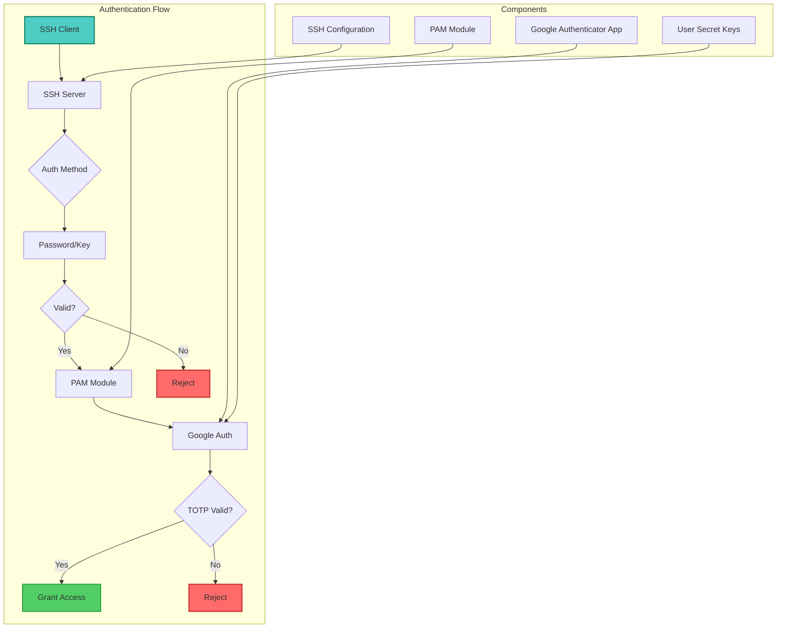
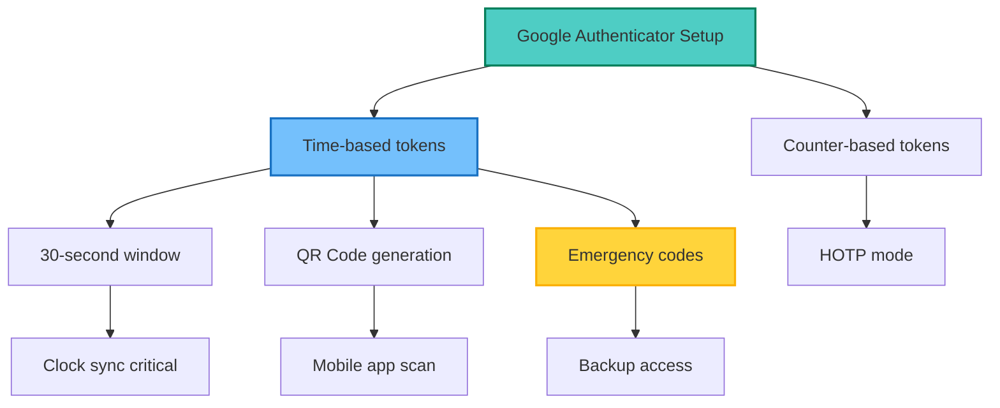
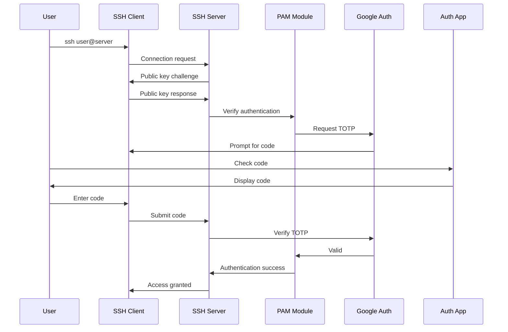
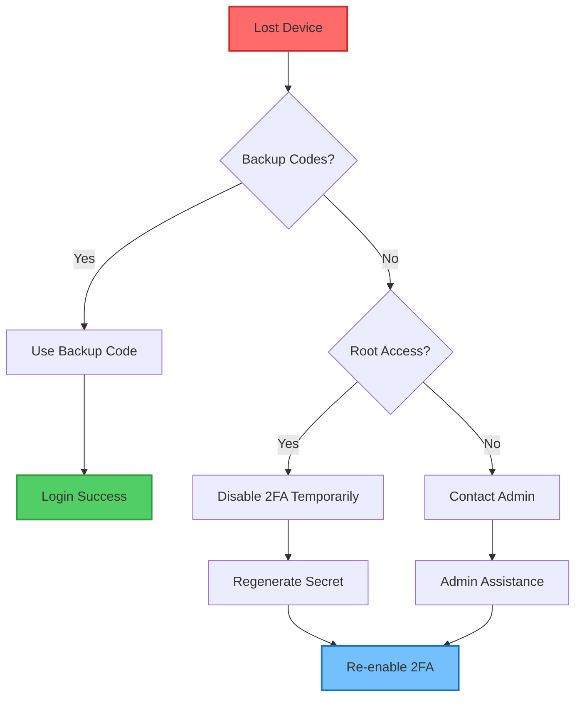
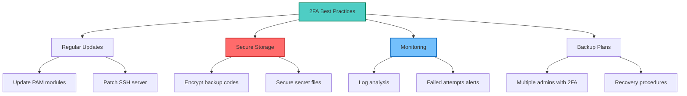

## Table of Contents

## Overview

Securing SSH access is crucial for protecting servers from unauthorized access. This guide demonstrates how to implement two-factor authentication (2FA) using Google Authenticator, adding an extra layer of security beyond traditional password or key-based authentication.

## Security Architecture



## Prerequisites

### System Requirements

```bash
# Check system information
cat /etc/os-release
uname -a

# Ensure SSH is installed
ssh -V

# Check PAM version
rpm -qa | grep pam  # RHEL/CentOS
dpkg -l | grep libpam  # Debian/Ubuntu
```

### Time Synchronization

```bash
# Install NTP client
sudo apt install ntp  # Debian/Ubuntu
sudo yum install ntp  # RHEL/CentOS

# Sync time
sudo ntpdate -s time.nist.gov

# Enable NTP service
sudo systemctl enable ntp
sudo systemctl start ntp

# Verify time
date
timedatectl status
```

## Installation

### Installing Google Authenticator

```bash
# Debian/Ubuntu
sudo apt update
sudo apt install libpam-google-authenticator

# RHEL/CentOS/Fedora
sudo yum install epel-release
sudo yum install google-authenticator

# From source (if packages unavailable)
git clone https://github.com/google/google-authenticator-libpam.git
cd google-authenticator-libpam
./bootstrap.sh
./configure
make
sudo make install
```

### Verify Installation

```bash
# Check PAM module
ls -la /lib/x86_64-linux-gnu/security/pam_google_authenticator.so
# or
ls -la /lib64/security/pam_google_authenticator.so

# Test command availability
which google-authenticator
```

## User Configuration

### Generate Secret Key

```bash
# Run as the user (not root)
google-authenticator

# Interactive prompts:
# Do you want authentication tokens to be time-based? yes
# Do you want me to update your ~/.google_authenticator file? yes
# Do you want to disallow multiple uses? yes
# Increase time window? no
# Enable rate-limiting? yes
```

### Configuration Options



### Non-Interactive Setup

```bash
#!/bin/bash
# generate-2fa.sh - Non-interactive 2FA setup

# Generate secret for a user
generate_2fa_secret() {
    local user=$1

    # Generate with specific options
    su - $user -c "google-authenticator \
        --time-based \
        --disallow-reuse \
        --force \
        --rate-limit=3 \
        --rate-time=30 \
        --window-size=3 \
        --secret=/home/$user/.google_authenticator"

    # Display QR code
    su - $user -c "google-authenticator \
        --time-based \
        --qr-mode=utf8"
}

# Usage
generate_2fa_secret "username"
```

## PAM Configuration

### Configure PAM for SSH

Edit `/etc/pam.d/sshd`:

```bash
# Backup original file
sudo cp /etc/pam.d/sshd /etc/pam.d/sshd.backup

# Edit PAM configuration
sudo nano /etc/pam.d/sshd
```

Add the following line:

```bash
# For required 2FA (must pass)
auth required pam_google_authenticator.so

# For optional 2FA (can bypass if not configured)
auth required pam_google_authenticator.so nullok

# With custom options
auth required pam_google_authenticator.so nullok grace_period=30 debug
```

### PAM Configuration Examples

```bash
# Standard configuration (password + 2FA)
@include common-auth
auth required pam_google_authenticator.so

# Public key + 2FA only
#@include common-auth
auth required pam_google_authenticator.so
```

### Advanced PAM Options

```bash
# Full options example
auth required pam_google_authenticator.so \
    secret=/home/${USER}/.google_authenticator \
    user=root \
    forward_pass \
    debug \
    authtok_prompt="Verification code: " \
    nullok \
    grace_period=30
```

## SSH Configuration

### Enable Challenge-Response

Edit `/etc/ssh/sshd_config`:

```bash
# Backup SSH config
sudo cp /etc/ssh/sshd_config /etc/ssh/sshd_config.backup

# Edit configuration
sudo nano /etc/ssh/sshd_config
```

Required settings:

```bash
# Enable challenge-response authentication
ChallengeResponseAuthentication yes

# For public key + 2FA
AuthenticationMethods publickey,keyboard-interactive

# For password + 2FA
AuthenticationMethods password,keyboard-interactive

# Or allow either method + 2FA
AuthenticationMethods publickey,keyboard-interactive password,keyboard-interactive

# Ensure PAM is enabled
UsePAM yes

# Optional: Disable password-only auth
PasswordAuthentication no
```

### Per-User Configuration

```bash
# Match specific users for 2FA
Match User admin,root
    AuthenticationMethods publickey,keyboard-interactive

Match Group sudo
    AuthenticationMethods publickey,keyboard-interactive

Match User serviceaccount
    AuthenticationMethods publickey
```

### Restart SSH Service

```bash
# Test configuration
sudo sshd -t

# Restart SSH service
sudo systemctl restart sshd

# Monitor logs
sudo journalctl -fu sshd
```

## Testing and Verification

### Test Authentication Flow



### Test Commands

```bash
# Test with verbose output
ssh -v user@server

# Test specific authentication method
ssh -o PreferredAuthentications=publickey,keyboard-interactive user@server

# Test from different terminal
# Keep current session open!
ssh user@localhost
```

## Advanced Configuration

### Backup Codes

```bash
# Generate additional backup codes
google-authenticator --emergency-codes=10

# Store securely
cat ~/.google_authenticator | grep -E "^[0-9]{8}$" > ~/backup-codes.txt
chmod 600 ~/backup-codes.txt
```

### Multiple Devices

```bash
#!/bin/bash
# share-2fa-secret.sh

# Extract secret key
SECRET=$(head -1 ~/.google_authenticator)

# Generate QR code URL
USER=$(whoami)
HOSTNAME=$(hostname)
URL="otpauth://totp/${USER}@${HOSTNAME}?secret=${SECRET}&issuer=SSH"

# Display QR code
qrencode -t UTF8 "$URL"

# Or save as image
qrencode -o ~/qr-code.png "$URL"
```

### Conditional 2FA

```bash
# Skip 2FA for certain conditions
# Create /etc/security/access-local.conf
+ : ALL : 192.168.1.0/24
+ : ALL : LOCAL
- : ALL : ALL

# Update PAM configuration
auth [success=1 default=ignore] pam_access.so accessfile=/etc/security/access-local.conf
auth required pam_google_authenticator.so
```

## Security Hardening

### SELinux Configuration

```bash
# Check SELinux status
getenforce

# Allow Google Authenticator in SELinux
sudo setsebool -P authlogin_yubikey on

# Create custom policy if needed
sudo ausearch -c 'sshd' --raw | audit2allow -M my-sshd-2fa
sudo semodule -i my-sshd-2fa.pp
```

### File Permissions

```bash
# Secure Google Authenticator files
chmod 600 ~/.google_authenticator
chmod 700 ~

# System-wide permissions
sudo chmod 644 /etc/pam.d/sshd
sudo chmod 644 /etc/ssh/sshd_config
```

### Audit Logging

```bash
# Enable detailed PAM logging
# Add to /etc/pam.d/sshd
auth required pam_google_authenticator.so debug

# Monitor authentication attempts
sudo tail -f /var/log/auth.log  # Debian/Ubuntu
sudo tail -f /var/log/secure    # RHEL/CentOS

# Configure rsyslog for 2FA events
echo "auth.*  /var/log/2fa.log" | sudo tee -a /etc/rsyslog.conf
sudo systemctl restart rsyslog
```

## Automation Scripts

### Bulk User Setup

```bash
#!/bin/bash
# bulk-2fa-setup.sh

USERS_FILE="users.txt"
QR_OUTPUT_DIR="/tmp/qr-codes"

mkdir -p "$QR_OUTPUT_DIR"

while IFS= read -r username; do
    echo "Setting up 2FA for $username..."

    # Generate secret
    su - "$username" -c "google-authenticator \
        --time-based \
        --disallow-reuse \
        --force \
        --rate-limit=3 \
        --rate-time=30 \
        --window-size=3"

    # Extract secret and generate QR
    SECRET=$(su - "$username" -c "head -1 ~/.google_authenticator")
    URL="otpauth://totp/${username}@$(hostname)?secret=${SECRET}"

    # Save QR code
    qrencode -o "$QR_OUTPUT_DIR/${username}-qr.png" "$URL"

    echo "QR code saved to: $QR_OUTPUT_DIR/${username}-qr.png"
done < "$USERS_FILE"
```

### Monitoring Script

```bash
#!/bin/bash
# monitor-2fa-auth.sh

LOG_FILE="/var/log/auth.log"
ALERT_EMAIL="admin@example.com"

# Monitor for 2FA failures
tail -F "$LOG_FILE" | while read line; do
    if echo "$line" | grep -q "Failed to authenticate"; then
        echo "2FA failure detected: $line" | \
            mail -s "2FA Authentication Failure" "$ALERT_EMAIL"
    fi
done
```

## Recovery Procedures

### Lost Device Recovery



### Emergency Access

```bash
# As root, temporarily disable 2FA for a user
# Option 1: Remove .google_authenticator file
sudo mv /home/user/.google_authenticator /home/user/.google_authenticator.disabled

# Option 2: Comment out PAM line
sudo sed -i 's/^auth required pam_google_authenticator.so/#&/' /etc/pam.d/sshd
sudo systemctl restart sshd

# Option 3: Add bypass for specific user
echo "auth sufficient pam_succeed_if.so user = emergencyuser" | \
    sudo tee -a /etc/pam.d/sshd
```

### Regenerate Secret

```bash
#!/bin/bash
# regenerate-2fa.sh

USER=$1

if [ -z "$USER" ]; then
    echo "Usage: $0 <username>"
    exit 1
fi

# Backup old secret
sudo mv /home/$USER/.google_authenticator \
       /home/$USER/.google_authenticator.old

# Generate new secret
sudo -u $USER google-authenticator \
    --time-based \
    --disallow-reuse \
    --force \
    --rate-limit=3 \
    --rate-time=30 \
    --window-size=3

echo "New 2FA secret generated for $USER"
```

## Troubleshooting

### Common Issues

1. **Time Sync Problems**

   ```bash
   # Check time difference
   ntpdate -q time.google.com

   # Force sync
   sudo ntpdate -s time.google.com

   # Increase time window
   auth required pam_google_authenticator.so window_size=10
   ```

2. **SELinux Denials**

   ```bash
   # Check SELinux logs
   sudo ausearch -m avc -ts recent

   # Generate policy
   sudo audit2allow -a -M google_auth
   sudo semodule -i google_auth.pp
   ```

3. **PAM Module Not Found**

   ```bash
   # Find PAM module
   find /lib* -name "pam_google_authenticator.so"

   # Create symlink if needed
   sudo ln -s /usr/lib64/security/pam_google_authenticator.so \
              /lib64/security/pam_google_authenticator.so
   ```

### Debug Mode

```bash
# Enable SSH debug
sudo /usr/sbin/sshd -d -p 2222

# Enable PAM debug
auth required pam_google_authenticator.so debug

# Check system logs
journalctl -xe | grep -i "pam\|ssh\|google"
```

## Best Practices

### Security Recommendations



### Implementation Checklist

- [ ] Time synchronization configured
- [ ] Google Authenticator installed
- [ ] PAM module configured
- [ ] SSH settings updated
- [ ] Test authentication working
- [ ] Backup codes generated
- [ ] Recovery procedures documented
- [ ] Monitoring configured
- [ ] Team training completed
- [ ] Documentation updated

## Integration Examples

### Ansible Playbook

```yaml
---
- name: Configure Google Authenticator 2FA
  hosts: all
  become: yes
  tasks:
    - name: Install Google Authenticator
      package:
        name: google-authenticator
        state: present

    - name: Configure PAM
      lineinfile:
        path: /etc/pam.d/sshd
        line: "auth required pam_google_authenticator.so nullok"
        insertafter: "@include common-auth"

    - name: Configure SSH
      lineinfile:
        path: /etc/ssh/sshd_config
        regexp: "^ChallengeResponseAuthentication"
        line: "ChallengeResponseAuthentication yes"
      notify: restart sshd

  handlers:
    - name: restart sshd
      service:
        name: sshd
        state: restarted
```

### Docker Container Support

```dockerfile
FROM ubuntu:22.04

RUN apt-get update && \
    apt-get install -y openssh-server google-authenticator

# Configure SSH for container
RUN mkdir /var/run/sshd && \
    echo 'ChallengeResponseAuthentication yes' >> /etc/ssh/sshd_config && \
    echo 'UsePAM yes' >> /etc/ssh/sshd_config

# Add PAM configuration
RUN echo "auth required pam_google_authenticator.so nullok" >> /etc/pam.d/sshd

EXPOSE 22
CMD ["/usr/sbin/sshd", "-D"]
```

## Conclusion

Implementing Google Authenticator for SSH provides robust two-factor authentication that significantly enhances server security. Key benefits include:

- **Strong Security**: Time-based tokens resistant to replay attacks
- **Easy Integration**: Works with existing SSH infrastructure
- **Flexible Configuration**: Supports various authentication combinations
- **Wide Compatibility**: Works with multiple authenticator apps
- **Cost-Effective**: Free and open-source solution

Best practices for deployment:

1. Always test in a non-production environment first
2. Keep backup codes in a secure location
3. Document recovery procedures
4. Monitor authentication logs
5. Regularly update security components
6. Train users on proper 2FA usage

With proper implementation, Google Authenticator provides enterprise-grade security for SSH access while maintaining usability.
