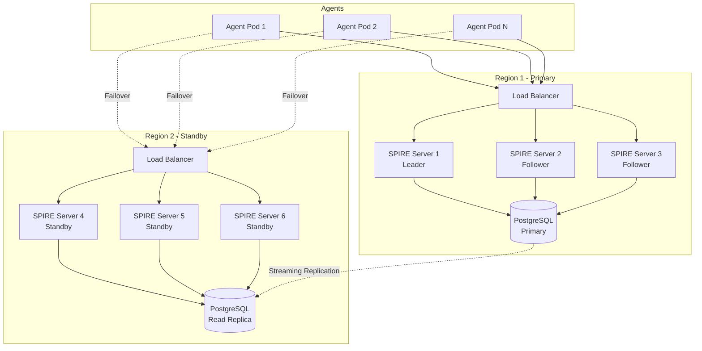
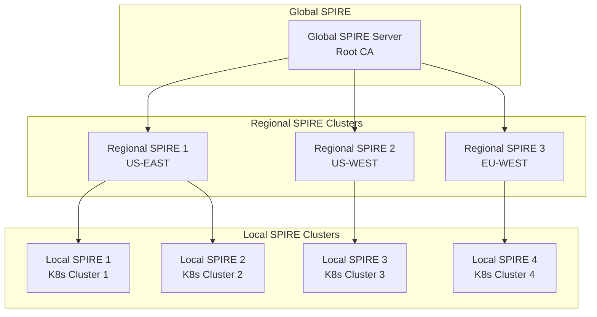

## Introduction: From Single Instance to Enterprise Scale

After deploying SPIFFE/SPIRE in development, the next challenge is scaling it for production. A single SPIRE server might work for proof-of-concepts, but enterprise environments demand high availability, disaster recovery, and the ability to handle thousands of workloads without becoming a single point of failure.

This guide covers everything you need to build a production-grade SPIFFE/SPIRE deployment: multi-server architectures, database selection and optimization, geographic distribution, zero-downtime operations, and disaster recovery strategies. We'll move beyond the basics to address real-world challenges I've encountered scaling SPIRE to handle 100,000+ workloads.

## Understanding SPIRE's Scalability Architecture

Before diving into HA configurations, let's understand SPIRE's architecture at scale:



### Key Scalability Factors

1. **Database Performance**: The #1 bottleneck in SPIRE deployments
2. **Agent Synchronization**: Each agent syncs every 5 seconds by default
3. **Entry Cache Size**: Impacts memory usage and query performance
4. **Network Latency**: Critical for multi-region deployments
5. **Certificate Rotation**: SVIDs expire and need renewal

## Step 1: Production Database Setup

### PostgreSQL Configuration

First, let's set up a production-grade PostgreSQL cluster:

```yaml
# postgres-ha.yaml
apiVersion: v1
kind: Secret
metadata:
  name: postgres-credentials
  namespace: spire-system
type: Opaque
stringData:
  POSTGRES_DB: spire
  POSTGRES_USER: spire
  POSTGRES_PASSWORD: "$(openssl rand -base64 32)"
  REPLICATION_USER: replicator
  REPLICATION_PASSWORD: "$(openssl rand -base64 32)"
---
apiVersion: v1
kind: ConfigMap
metadata:
  name: postgres-config
  namespace: spire-system
data:
  postgresql.conf: |
    # Connection settings
    listen_addresses = '*'
    max_connections = 500

    # Memory settings (adjust based on available RAM)
    shared_buffers = 2GB
    effective_cache_size = 6GB
    maintenance_work_mem = 512MB
    work_mem = 32MB

    # Write performance
    wal_buffers = 64MB
    checkpoint_completion_target = 0.9
    checkpoint_timeout = 15min
    max_wal_size = 4GB
    min_wal_size = 1GB

    # Query optimization
    random_page_cost = 1.1  # For SSD storage
    effective_io_concurrency = 200

    # Logging
    log_statement = 'mod'
    log_duration = on
    log_min_duration_statement = 100ms
    log_checkpoints = on
    log_connections = on
    log_disconnections = on
    log_lock_waits = on

    # Replication
    wal_level = replica
    max_wal_senders = 10
    max_replication_slots = 10
    hot_standby = on

    # SPIRE-specific optimizations
    # Increase autovacuum frequency for entries table
    autovacuum_vacuum_scale_factor = 0.05
    autovacuum_analyze_scale_factor = 0.02

  pg_hba.conf: |
    # TYPE  DATABASE        USER            ADDRESS                 METHOD
    local   all             all                                     trust
    host    all             all             127.0.0.1/32            trust
    host    all             all             ::1/128                 trust
    host    all             all             10.0.0.0/8              md5
    host    replication     replicator      10.0.0.0/8              md5
---
apiVersion: apps/v1
kind: StatefulSet
metadata:
  name: postgres-primary
  namespace: spire-system
spec:
  serviceName: postgres-primary
  replicas: 1
  selector:
    matchLabels:
      app: postgres-primary
  template:
    metadata:
      labels:
        app: postgres-primary
        postgres-role: primary
    spec:
      containers:
        - name: postgres
          image: postgres:15-alpine
          ports:
            - containerPort: 5432
              name: postgres
          env:
            - name: POSTGRES_DB
              valueFrom:
                secretKeyRef:
                  name: postgres-credentials
                  key: POSTGRES_DB
            - name: POSTGRES_USER
              valueFrom:
                secretKeyRef:
                  name: postgres-credentials
                  key: POSTGRES_USER
            - name: POSTGRES_PASSWORD
              valueFrom:
                secretKeyRef:
                  name: postgres-credentials
                  key: POSTGRES_PASSWORD
            - name: POSTGRES_REPLICATION_MODE
              value: "master"
            - name: POSTGRES_REPLICATION_USER
              valueFrom:
                secretKeyRef:
                  name: postgres-credentials
                  key: REPLICATION_USER
            - name: POSTGRES_REPLICATION_PASSWORD
              valueFrom:
                secretKeyRef:
                  name: postgres-credentials
                  key: REPLICATION_PASSWORD
          volumeMounts:
            - name: postgres-storage
              mountPath: /var/lib/postgresql/data
              subPath: postgres
            - name: postgres-config
              mountPath: /etc/postgresql/postgresql.conf
              subPath: postgresql.conf
            - name: postgres-config
              mountPath: /etc/postgresql/pg_hba.conf
              subPath: pg_hba.conf
            - name: init-scripts
              mountPath: /docker-entrypoint-initdb.d
          resources:
            requests:
              memory: "4Gi"
              cpu: "2"
            limits:
              memory: "8Gi"
              cpu: "4"
          livenessProbe:
            exec:
              command:
                - pg_isready
                - -U
                - spire
            initialDelaySeconds: 30
            periodSeconds: 10
          readinessProbe:
            exec:
              command:
                - pg_isready
                - -U
                - spire
            initialDelaySeconds: 5
            periodSeconds: 5
      volumes:
        - name: postgres-config
          configMap:
            name: postgres-config
        - name: init-scripts
          configMap:
            name: postgres-init
  volumeClaimTemplates:
    - metadata:
        name: postgres-storage
      spec:
        accessModes: ["ReadWriteOnce"]
        storageClassName: fast-ssd
        resources:
          requests:
            storage: 100Gi
---
apiVersion: v1
kind: ConfigMap
metadata:
  name: postgres-init
  namespace: spire-system
data:
  01-spire-optimizations.sql: |
    -- Create SPIRE database with optimizations
    \c spire;

    -- Optimize for SPIRE's access patterns
    ALTER DATABASE spire SET random_page_cost = 1.1;
    ALTER DATABASE spire SET effective_io_concurrency = 200;
    ALTER DATABASE spire SET work_mem = '64MB';

    -- Create indexes for common queries (after SPIRE creates tables)
    -- These will be created after first SPIRE server connection
    CREATE OR REPLACE FUNCTION create_spire_indexes()
    RETURNS void AS $$
    BEGIN
        -- Index for entry lookups by selectors
        IF NOT EXISTS (SELECT 1 FROM pg_indexes WHERE indexname = 'idx_entries_selectors') THEN
            CREATE INDEX CONCURRENTLY idx_entries_selectors 
            ON registered_entries USING gin(selectors);
        END IF;
        
        -- Index for entry lookups by SPIFFE ID
        IF NOT EXISTS (SELECT 1 FROM pg_indexes WHERE indexname = 'idx_entries_spiffe_id') THEN
            CREATE INDEX CONCURRENTLY idx_entries_spiffe_id 
            ON registered_entries(spiffe_id);
        END IF;
        
        -- Index for node lookups
        IF NOT EXISTS (SELECT 1 FROM pg_indexes WHERE indexname = 'idx_nodes_spiffe_id') THEN
            CREATE INDEX CONCURRENTLY idx_nodes_spiffe_id 
            ON attested_node_entries(spiffe_id);
        END IF;
        
        -- Partial index for active entries
        IF NOT EXISTS (SELECT 1 FROM pg_indexes WHERE indexname = 'idx_entries_active') THEN
            CREATE INDEX CONCURRENTLY idx_entries_active 
            ON registered_entries(expiry) 
            WHERE expiry > NOW();
        END IF;
    END;
    $$ LANGUAGE plpgsql;

    -- Create replication slot for standby
    SELECT pg_create_physical_replication_slot('standby_slot');
```

### Database Connection Pooling

For high-throughput environments, use PgBouncer:

```yaml
# pgbouncer.yaml
apiVersion: v1
kind: ConfigMap
metadata:
  name: pgbouncer-config
  namespace: spire-system
data:
  pgbouncer.ini: |
    [databases]
    spire = host=postgres-primary.spire-system.svc.cluster.local port=5432 dbname=spire

    [pgbouncer]
    listen_port = 6432
    listen_addr = *
    auth_type = md5
    auth_file = /etc/pgbouncer/userlist.txt
    pool_mode = transaction
    max_client_conn = 1000
    default_pool_size = 25
    min_pool_size = 10
    reserve_pool_size = 5
    reserve_pool_timeout = 3
    server_lifetime = 3600
    server_idle_timeout = 600
    log_connections = 1
    log_disconnections = 1
    log_pooler_errors = 1
    stats_period = 60

  userlist.txt: |
    "spire" "md5$(echo -n 'passwordspire' | md5sum | cut -d' ' -f1)"
---
apiVersion: apps/v1
kind: Deployment
metadata:
  name: pgbouncer
  namespace: spire-system
spec:
  replicas: 2
  selector:
    matchLabels:
      app: pgbouncer
  template:
    metadata:
      labels:
        app: pgbouncer
    spec:
      containers:
        - name: pgbouncer
          image: pgbouncer/pgbouncer:latest
          ports:
            - containerPort: 6432
              name: pgbouncer
          volumeMounts:
            - name: config
              mountPath: /etc/pgbouncer
          resources:
            requests:
              memory: "256Mi"
              cpu: "500m"
            limits:
              memory: "512Mi"
              cpu: "1"
      volumes:
        - name: config
          configMap:
            name: pgbouncer-config
```

## Step 2: Multi-Server SPIRE Deployment

### High Availability SPIRE Configuration

```yaml
# spire-ha-values.yaml
global:
  spire:
    trustDomain: "prod.example.com"
    bundleEndpoint:
      address: "0.0.0.0"
      port: 8443

spire-server:
  replicaCount: 3

  # Database configuration
  dataStore:
    sql:
      databaseType: postgres
      connectionString: "host=pgbouncer.spire-system.svc.cluster.local port=6432 dbname=spire user=spire password=${SPIRE_DB_PASSWORD} sslmode=require pool_max_conns=20"

  # Performance tuning
  config:
    server:
      # Increase cache size for large deployments
      cache_size: 50000

      # Agent synchronization settings
      agent_ttl: "1h"

      # Registration entry settings
      default_svid_ttl: "12h"

      # Audit logging
      audit_log_enabled: true

      # Experimental features for performance
      experimental:
        # Enable entry cache replication
        cache_reload_interval: "5s"

        # Prune expired entries more frequently
        events_based_cache: true

  # Leader election for certain operations
  controllerManager:
    enabled: true
    leaderElection: true

  # Pod disruption budget
  podDisruptionBudget:
    enabled: true
    minAvailable: 2

  # Anti-affinity to spread servers
  affinity:
    podAntiAffinity:
      requiredDuringSchedulingIgnoredDuringExecution:
        - labelSelector:
            matchExpressions:
              - key: app
                operator: In
                values:
                  - spire-server
          topologyKey: kubernetes.io/hostname

  # Resources for production
  resources:
    requests:
      memory: "2Gi"
      cpu: "1"
    limits:
      memory: "4Gi"
      cpu: "2"

  # Autoscaling
  autoscaling:
    enabled: true
    minReplicas: 3
    maxReplicas: 10
    targetCPUUtilizationPercentage: 70
    targetMemoryUtilizationPercentage: 80

  # Monitoring
  telemetry:
    prometheus:
      enabled: true
      port: 9988

  # Health checks with proper timeouts
  livenessProbe:
    httpGet:
      path: /live
      port: 8080
    initialDelaySeconds: 60
    periodSeconds: 30
    timeoutSeconds: 5
    failureThreshold: 3

  readinessProbe:
    httpGet:
      path: /ready
      port: 8080
    initialDelaySeconds: 30
    periodSeconds: 10
    timeoutSeconds: 5
    failureThreshold: 3

spire-agent:
  # Agent configuration for HA
  config:
    agent:
      # Increase sync interval to reduce load
      sync_interval: "30s"

      # Enable SDS for better performance
      sds:
        default_svid_name: "default"
        default_bundle_name: "ROOTCA"

  # Resources
  resources:
    requests:
      memory: "256Mi"
      cpu: "100m"
    limits:
      memory: "512Mi"
      cpu: "500m"

  # Host network for better performance
  hostNetwork: true
  dnsPolicy: ClusterFirstWithHostNet
```

Deploy the HA configuration:

```bash
# Create namespace and secrets
kubectl create namespace spire-system
kubectl create secret generic spire-db-password \
  --from-literal=SPIRE_DB_PASSWORD=$(openssl rand -base64 32) \
  -n spire-system

# Deploy SPIRE in HA mode
helm upgrade --install spire spiffe/spire \
  --namespace spire-system \
  --values spire-ha-values.yaml \
  --wait
```

## Step 3: Load Balancing and Service Discovery

### Internal Load Balancer for Agents

```yaml
# spire-server-lb.yaml
apiVersion: v1
kind: Service
metadata:
  name: spire-server-lb
  namespace: spire-system
  annotations:
    # For cloud providers
    service.beta.kubernetes.io/aws-load-balancer-type: "nlb"
    service.beta.kubernetes.io/aws-load-balancer-internal: "true"
spec:
  type: LoadBalancer
  sessionAffinity: ClientIP
  sessionAffinityConfig:
    clientIP:
      timeoutSeconds: 10800 # 3 hours
  selector:
    app: spire-server
  ports:
    - name: agent-api
      port: 8081
      targetPort: 8081
      protocol: TCP
    - name: bundle-endpoint
      port: 8443
      targetPort: 8443
      protocol: TCP
---
# Headless service for direct pod access
apiVersion: v1
kind: Service
metadata:
  name: spire-server-headless
  namespace: spire-system
spec:
  clusterIP: None
  selector:
    app: spire-server
  ports:
    - name: agent-api
      port: 8081
      targetPort: 8081
```

### Agent Configuration for HA

```yaml
# agent-ha-config.yaml
apiVersion: v1
kind: ConfigMap
metadata:
  name: spire-agent-ha-config
  namespace: spire-system
data:
  agent.conf: |
    agent {
      data_dir = "/run/spire"
      log_level = "INFO"
      server_address = "spire-server-lb.spire-system.svc.cluster.local"
      server_port = "8081"
      socket_path = "/run/spire/sockets/agent.sock"
      trust_bundle_path = "/run/spire/bundle/bundle.crt"
      trust_domain = "prod.example.com"
      
      # HA-specific settings
      # Enable automatic failover
      availability_target = "high"
      
      # Connection management
      retry_bootstrap = true
      bootstrap_timeout = "60s"
      
      # Performance tuning
      sync_interval = "30s"
      
      # Enable SDS
      sds {
        default_svid_name = "default"
        default_bundle_name = "ROOTCA"
      }
    }

    plugins {
      NodeAttestor "k8s_psat" {
        plugin_data {
          cluster = "production"
          
          # Use token projection for better security
          token_path = "/run/secrets/tokens/spire-agent"
        }
      }
      
      KeyManager "memory" {
        plugin_data {}
      }
      
      WorkloadAttestor "k8s" {
        plugin_data {
          # Increase pod info sync interval
          pod_info_sync_interval = "1m"
          
          # Skip validation for faster attestation
          skip_kubelet_verification = true
        }
      }
    }

    health_checks {
      listener_enabled = true
      bind_address = "0.0.0.0"
      bind_port = "8080"
      live_path = "/live"
      ready_path = "/ready"
    }

    telemetry {
      Prometheus {
        host = "0.0.0.0"
        port = 9988
      }
    }
```

## Step 4: Multi-Region Deployment

### Primary Region Configuration

```yaml
# primary-region-values.yaml
global:
  spire:
    trustDomain: "prod.example.com"
    region: "us-east-1"

spire-server:
  config:
    server:
      # Federation configuration for multi-region
      federation {
        bundle_endpoint {
          address = "0.0.0.0"
          port = 8443

          # Use DNS for external access
          acme {
            domain_name = "spire-east.example.com"
            email = "security@example.com"
            tos_accepted = true
          }
        }
      }

      # Configure for primary region
      ca_subject {
        country = ["US"]
        organization = ["Example Corp"]
        common_name = "SPIRE CA US-EAST-1"
      }

  # Expose bundle endpoint
  service:
    type: LoadBalancer
    annotations:
      external-dns.alpha.kubernetes.io/hostname: spire-east.example.com
    ports:
      bundle:
        port: 8443
        targetPort: 8443
        protocol: TCP
```

### Standby Region Configuration

```yaml
# standby-region-values.yaml
global:
  spire:
    trustDomain: "prod.example.com"
    region: "us-west-2"

spire-server:
  # Point to read replica
  dataStore:
    sql:
      connectionString: "host=postgres-replica-west.spire-system.svc.cluster.local port=5432 dbname=spire user=spire_read password=${SPIRE_DB_PASSWORD} sslmode=require"

  config:
    server:
      # Read-only mode for standby
      experimental:
        read_only_mode: true

      # Different CA subject for region
      ca_subject {
        country = ["US"]
        organization = ["Example Corp"]
        common_name = "SPIRE CA US-WEST-2"
      }

      # Federation with primary
      federation {
        bundle_endpoint {
          address = "0.0.0.0"
          port = 8443

          acme {
            domain_name = "spire-west.example.com"
            email = "security@example.com"
            tos_accepted = true
          }
        }

        federates_with {
          "prod.example.com" {
            bundle_endpoint_address = "spire-east.example.com"
            bundle_endpoint_port = 8443
            bundle_endpoint_spiffe_id = "spiffe://prod.example.com/spire/server"
          }
        }
      }
```

### Cross-Region Database Replication

```yaml
# postgres-replica.yaml
apiVersion: apps/v1
kind: StatefulSet
metadata:
  name: postgres-replica
  namespace: spire-system
spec:
  serviceName: postgres-replica
  replicas: 2 # Multiple read replicas
  selector:
    matchLabels:
      app: postgres-replica
  template:
    metadata:
      labels:
        app: postgres-replica
        postgres-role: replica
    spec:
      containers:
        - name: postgres
          image: postgres:15-alpine
          env:
            - name: POSTGRES_REPLICATION_MODE
              value: "slave"
            - name: POSTGRES_MASTER_SERVICE
              value: "postgres-primary.spire-system.svc.cluster.local"
            - name: POSTGRES_REPLICATION_USER
              valueFrom:
                secretKeyRef:
                  name: postgres-credentials
                  key: REPLICATION_USER
            - name: POSTGRES_REPLICATION_PASSWORD
              valueFrom:
                secretKeyRef:
                  name: postgres-credentials
                  key: REPLICATION_PASSWORD
          command:
            - /bin/bash
            - -c
            - |
              # Wait for master to be ready
              until pg_isready -h $POSTGRES_MASTER_SERVICE -U replicator; do
                echo "Waiting for master..."
                sleep 2
              done

              # Set up streaming replication
              pg_basebackup -h $POSTGRES_MASTER_SERVICE -D /var/lib/postgresql/data -U replicator -v -P -W

              # Configure recovery
              cat > /var/lib/postgresql/data/recovery.conf <<EOF
              standby_mode = 'on'
              primary_conninfo = 'host=$POSTGRES_MASTER_SERVICE port=5432 user=replicator password=$POSTGRES_REPLICATION_PASSWORD'
              trigger_file = '/tmp/postgresql.trigger'
              EOF

              # Start PostgreSQL
              postgres
          volumeMounts:
            - name: postgres-storage
              mountPath: /var/lib/postgresql/data
          resources:
            requests:
              memory: "2Gi"
              cpu: "1"
            limits:
              memory: "4Gi"
              cpu: "2"
  volumeClaimTemplates:
    - metadata:
        name: postgres-storage
      spec:
        accessModes: ["ReadWriteOnce"]
        storageClassName: fast-ssd
        resources:
          requests:
            storage: 100Gi
```

## Step 5: Zero-Downtime Operations

### Rolling Updates

```yaml
# update-strategy.yaml
apiVersion: v1
kind: ConfigMap
metadata:
  name: spire-update-strategy
  namespace: spire-system
data:
  update.sh: |
    #!/bin/bash
    set -e

    # Function to check SPIRE server health
    check_health() {
      local server=$1
      kubectl exec -n spire-system $server -- \
        /opt/spire/bin/spire-server healthcheck
    }

    # Function to drain connections from a server
    drain_server() {
      local server=$1
      echo "Draining connections from $server..."
      
      # Remove from load balancer
      kubectl label pod $server -n spire-system \
        serving=false --overwrite
      
      # Wait for connections to drain
      sleep 60
    }

    # Get all SPIRE server pods
    servers=$(kubectl get pods -n spire-system -l app=spire-server -o name)

    # Update one server at a time
    for server in $servers; do
      server_name=$(echo $server | cut -d'/' -f2)
      
      echo "Updating $server_name..."
      
      # Drain the server
      drain_server $server_name
      
      # Delete the pod (StatefulSet will recreate)
      kubectl delete pod $server_name -n spire-system
      
      # Wait for new pod to be ready
      kubectl wait --for=condition=ready pod/$server_name \
        -n spire-system --timeout=300s
      
      # Verify health
      check_health $server_name
      
      # Re-enable in load balancer
      kubectl label pod $server_name -n spire-system \
        serving=true --overwrite
      
      echo "$server_name updated successfully"
      sleep 30
    done
```

### Database Migration Strategy

```sql
-- migration-strategy.sql
-- Safe schema migrations for zero downtime

-- Step 1: Add new columns as nullable
ALTER TABLE registered_entries
ADD COLUMN IF NOT EXISTS new_field VARCHAR(255);

-- Step 2: Backfill data in batches
DO $$
DECLARE
    batch_size INTEGER := 1000;
    offset_val INTEGER := 0;
    total_rows INTEGER;
BEGIN
    SELECT COUNT(*) INTO total_rows FROM registered_entries;

    WHILE offset_val < total_rows LOOP
        UPDATE registered_entries
        SET new_field = 'default_value'
        WHERE id IN (
            SELECT id FROM registered_entries
            WHERE new_field IS NULL
            ORDER BY id
            LIMIT batch_size
        );

        offset_val := offset_val + batch_size;

        -- Pause between batches to avoid locking
        PERFORM pg_sleep(0.1);

        RAISE NOTICE 'Processed % of % rows', offset_val, total_rows;
    END LOOP;
END $$;

-- Step 3: Add constraints after backfill
ALTER TABLE registered_entries
ALTER COLUMN new_field SET NOT NULL;

-- Step 4: Create indexes concurrently
CREATE INDEX CONCURRENTLY idx_new_field
ON registered_entries(new_field);
```

## Step 6: Monitoring and Alerting

### Prometheus Configuration

```yaml
# prometheus-rules.yaml
apiVersion: monitoring.coreos.com/v1
kind: PrometheusRule
metadata:
  name: spire-alerts
  namespace: spire-system
spec:
  groups:
    - name: spire.rules
      interval: 30s
      rules:
        # Server availability
        - alert: SPIREServerDown
          expr: up{job="spire-server"} == 0
          for: 5m
          labels:
            severity: critical
          annotations:
            summary: "SPIRE Server is down"
            description: "SPIRE Server {{ $labels.instance }} has been down for more than 5 minutes."

        # High error rate
        - alert: SPIREHighErrorRate
          expr: |
            rate(spire_server_api_errors_total[5m]) > 0.05
          for: 10m
          labels:
            severity: warning
          annotations:
            summary: "High SPIRE API error rate"
            description: "SPIRE Server API error rate is {{ $value }} errors per second."

        # Database connection issues
        - alert: SPIREDatabaseConnectionFailure
          expr: |
            spire_server_datastore_connections_active == 0
          for: 5m
          labels:
            severity: critical
          annotations:
            summary: "SPIRE database connection failure"
            description: "SPIRE Server has no active database connections."

        # Entry cache size
        - alert: SPIREEntryCacheFull
          expr: |
            spire_server_entry_cache_size / spire_server_entry_cache_max_size > 0.9
          for: 15m
          labels:
            severity: warning
          annotations:
            summary: "SPIRE entry cache nearly full"
            description: "SPIRE entry cache is {{ $value | humanizePercentage }} full."

        # Agent sync failures
        - alert: SPIREAgentSyncFailures
          expr: |
            rate(spire_agent_sync_failures_total[5m]) > 0.1
          for: 10m
          labels:
            severity: warning
          annotations:
            summary: "High agent sync failure rate"
            description: "Agent {{ $labels.instance }} sync failure rate is {{ $value }} per second."

        # Certificate expiry
        - alert: SPIRECertificateExpiringSoon
          expr: |
            (spire_server_ca_certificate_expiry_timestamp - time()) / 86400 < 30
          for: 1h
          labels:
            severity: warning
          annotations:
            summary: "SPIRE CA certificate expiring soon"
            description: "SPIRE CA certificate will expire in {{ $value }} days."

        # High memory usage
        - alert: SPIREHighMemoryUsage
          expr: |
            container_memory_usage_bytes{pod=~"spire-server-.*"} 
            / container_spec_memory_limit_bytes{pod=~"spire-server-.*"} > 0.8
          for: 15m
          labels:
            severity: warning
          annotations:
            summary: "High memory usage on SPIRE server"
            description: "SPIRE Server {{ $labels.pod }} memory usage is {{ $value | humanizePercentage }}."
```

### Grafana Dashboard

```json
{
  "dashboard": {
    "title": "SPIRE High Availability Monitoring",
    "panels": [
      {
        "title": "SPIRE Server Availability",
        "targets": [
          {
            "expr": "up{job=\"spire-server\"}",
            "legendFormat": "{{ instance }}"
          }
        ],
        "gridPos": { "h": 8, "w": 12, "x": 0, "y": 0 }
      },
      {
        "title": "Registration Entries by Server",
        "targets": [
          {
            "expr": "spire_server_registration_entries",
            "legendFormat": "{{ instance }}"
          }
        ],
        "gridPos": { "h": 8, "w": 12, "x": 12, "y": 0 }
      },
      {
        "title": "API Request Rate",
        "targets": [
          {
            "expr": "rate(spire_server_api_requests_total[5m])",
            "legendFormat": "{{ instance }} - {{ method }}"
          }
        ],
        "gridPos": { "h": 8, "w": 12, "x": 0, "y": 8 }
      },
      {
        "title": "Database Query Performance",
        "targets": [
          {
            "expr": "histogram_quantile(0.95, rate(spire_server_datastore_query_duration_seconds_bucket[5m]))",
            "legendFormat": "p95 Query Time"
          }
        ],
        "gridPos": { "h": 8, "w": 12, "x": 12, "y": 8 }
      },
      {
        "title": "Agent Connections by Server",
        "targets": [
          {
            "expr": "spire_server_connected_agents",
            "legendFormat": "{{ instance }}"
          }
        ],
        "gridPos": { "h": 8, "w": 12, "x": 0, "y": 16 }
      },
      {
        "title": "Memory Usage",
        "targets": [
          {
            "expr": "container_memory_usage_bytes{pod=~\"spire-server-.*\"} / 1024 / 1024 / 1024",
            "legendFormat": "{{ pod }}"
          }
        ],
        "gridPos": { "h": 8, "w": 12, "x": 12, "y": 16 }
      }
    ]
  }
}
```

## Step 7: Disaster Recovery

### Backup Strategy

```yaml
# backup-cronjob.yaml
apiVersion: batch/v1
kind: CronJob
metadata:
  name: spire-backup
  namespace: spire-system
spec:
  schedule: "0 */6 * * *" # Every 6 hours
  jobTemplate:
    spec:
      template:
        spec:
          containers:
            - name: backup
              image: postgres:15-alpine
              env:
                - name: PGPASSWORD
                  valueFrom:
                    secretKeyRef:
                      name: postgres-credentials
                      key: POSTGRES_PASSWORD
              command:
                - /bin/bash
                - -c
                - |
                  set -e

                  # Create backup
                  BACKUP_FILE="/backup/spire-$(date +%Y%m%d-%H%M%S).sql"
                  pg_dump -h postgres-primary -U spire -d spire \
                    --verbose --no-owner --no-acl \
                    --format=custom --compress=9 \
                    > $BACKUP_FILE

                  # Upload to S3
                  aws s3 cp $BACKUP_FILE s3://example-spire-backups/

                  # Keep only last 30 days of backups
                  aws s3 ls s3://example-spire-backups/ | \
                    awk '{print $4}' | \
                    sort | \
                    head -n -30 | \
                    xargs -I {} aws s3 rm s3://example-spire-backups/{}

                  # Verify backup
                  pg_restore --list $BACKUP_FILE > /dev/null
                  echo "Backup completed successfully"
              volumeMounts:
                - name: backup
                  mountPath: /backup
          volumes:
            - name: backup
              emptyDir: {}
          restartPolicy: OnFailure
```

### Disaster Recovery Procedure

```bash
#!/bin/bash
# disaster-recovery.sh

# Step 1: Promote standby region
promote_standby() {
    echo "Promoting standby region to primary..."

    # Promote PostgreSQL replica
    kubectl exec -n spire-system postgres-replica-0 -- \
        touch /tmp/postgresql.trigger

    # Update SPIRE servers to write mode
    kubectl patch configmap spire-server-config -n spire-system \
        --type merge -p '{"data":{"experimental.read_only_mode":"false"}}'

    # Restart SPIRE servers
    kubectl rollout restart statefulset spire-server -n spire-system
}

# Step 2: Redirect traffic
redirect_traffic() {
    echo "Redirecting traffic to standby region..."

    # Update DNS
    aws route53 change-resource-record-sets \
        --hosted-zone-id Z123456789 \
        --change-batch '{
            "Changes": [{
                "Action": "UPSERT",
                "ResourceRecordSet": {
                    "Name": "spire.example.com",
                    "Type": "A",
                    "AliasTarget": {
                        "HostedZoneId": "Z098765432",
                        "DNSName": "spire-west.example.com",
                        "EvaluateTargetHealth": true
                    }
                }
            }]
        }'
}

# Step 3: Verify health
verify_health() {
    echo "Verifying system health..."

    # Check SPIRE servers
    for i in 0 1 2; do
        kubectl exec -n spire-system spire-server-$i -- \
            /opt/spire/bin/spire-server healthcheck
    done

    # Check database
    kubectl exec -n spire-system postgres-replica-0 -- \
        psql -U spire -d spire -c "SELECT COUNT(*) FROM registered_entries;"
}

# Main execution
case "$1" in
    promote)
        promote_standby
        ;;
    redirect)
        redirect_traffic
        ;;
    verify)
        verify_health
        ;;
    full)
        promote_standby
        redirect_traffic
        verify_health
        ;;
    *)
        echo "Usage: $0 {promote|redirect|verify|full}"
        exit 1
        ;;
esac
```

## Step 8: Performance Optimization

### Database Query Optimization

```sql
-- optimize-queries.sql
-- Analyze query performance
CREATE EXTENSION IF NOT EXISTS pg_stat_statements;

-- Most expensive queries
SELECT
    query,
    calls,
    total_time,
    mean_time,
    rows
FROM pg_stat_statements
WHERE query LIKE '%registered_entries%'
ORDER BY total_time DESC
LIMIT 10;

-- Create materialized view for complex queries
CREATE MATERIALIZED VIEW entry_selector_summary AS
SELECT
    e.id,
    e.spiffe_id,
    array_agg(s.type || ':' || s.value) as selectors,
    e.ttl,
    e.expiry
FROM registered_entries e
JOIN selectors s ON e.id = s.registered_entry_id
GROUP BY e.id, e.spiffe_id, e.ttl, e.expiry;

-- Create index on materialized view
CREATE INDEX idx_entry_selector_summary_selectors
ON entry_selector_summary USING gin(selectors);

-- Refresh materialized view periodically
CREATE OR REPLACE FUNCTION refresh_entry_selector_summary()
RETURNS void AS $$
BEGIN
    REFRESH MATERIALIZED VIEW CONCURRENTLY entry_selector_summary;
END;
$$ LANGUAGE plpgsql;

-- Schedule refresh
SELECT cron.schedule('refresh-entry-selectors', '*/5 * * * *',
    'SELECT refresh_entry_selector_summary()');
```

### SPIRE Server Tuning

```yaml
# performance-config.yaml
apiVersion: v1
kind: ConfigMap
metadata:
  name: spire-performance-config
  namespace: spire-system
data:
  server.conf: |
    server {
      bind_address = "0.0.0.0"
      bind_port = "8081"
      trust_domain = "prod.example.com"
      data_dir = "/run/spire/data"
      log_level = "INFO"
      
      # Performance optimizations
      
      # Increase cache size for large deployments
      cache_size = 100000
      
      # Experimental performance features
      experimental {
        # Enable events-based cache updates
        events_based_cache = true
        
        # Reduce cache reload interval
        cache_reload_interval = "5s"
        
        # Enable entry pruning
        prune_expired_entries = true
        prune_interval = "1h"
        
        # Batch registration updates
        batch_registration_updates = true
        batch_size = 100
      }
      
      # Connection pooling
      connection_pool {
        max_open_conns = 100
        max_idle_conns = 50
        conn_max_lifetime = "1h"
      }
      
      # Rate limiting
      rate_limit {
        attestation = 1000  # per second
        signing = 5000      # per second
        registration = 100  # per second
      }
    }
```

## Step 9: Scaling Strategies

### Nested SPIRE for Massive Scale



Configuration for nested deployment:

```yaml
# nested-spire-config.yaml
# Regional SPIRE server that acts as downstream
apiVersion: v1
kind: ConfigMap
metadata:
  name: regional-spire-config
  namespace: spire-system
data:
  server.conf: |
    server {
      bind_address = "0.0.0.0"
      bind_port = "8081"
      trust_domain = "prod.example.com"
      
      # Upstream authority - Global SPIRE
      upstream_authority {
        spire {
          server_address = "global-spire.example.com"
          server_port = "8081"
          workload_api_socket = "/run/spire/sockets/workload.sock"
        }
      }
      
      # This server can mint identities for downstream
      ca {
        subject {
          country = ["US"]
          organization = ["Example Corp"]
          common_name = "Regional SPIRE CA - US-EAST"
        }
      }
    }
```

## Conclusion and Best Practices

Building a production-grade SPIFFE/SPIRE deployment requires careful attention to:

1. **Database Performance**: Your deployment is only as fast as your database
2. **Network Architecture**: Minimize latency between components
3. **Monitoring**: You can't improve what you don't measure
4. **Disaster Recovery**: Plan for failure before it happens
5. **Scaling Strategy**: Choose between horizontal scaling or nested deployments

Key takeaways for production deployments:

- ✅ Use PostgreSQL with connection pooling for large deployments
- ✅ Deploy at least 3 SPIRE servers across availability zones
- ✅ Implement comprehensive monitoring and alerting
- ✅ Plan for zero-downtime updates and migrations
- ✅ Consider nested SPIRE for 100K+ workload deployments

In the next post, we'll explore observability in depth, building comprehensive Prometheus and Grafana dashboards for SPIFFE/SPIRE monitoring.

## Additional Resources

- [SPIRE Scaling Guide](https://spiffe.io/docs/latest/planning/scaling_spire/)
- [PostgreSQL Performance Tuning](https://www.postgresql.org/docs/current/performance-tips.html)
- [Kubernetes StatefulSet Best Practices](https://kubernetes.io/docs/concepts/workloads/controllers/statefulset/)
- [CNCF Case Studies](https://www.cncf.io/case-studies/) - Real-world SPIRE deployments

---

_Have you deployed SPIFFE/SPIRE at scale? Share your experiences and lessons learned in the comments or reach out on the [SPIFFE Slack](https://spiffe.slack.com)._
