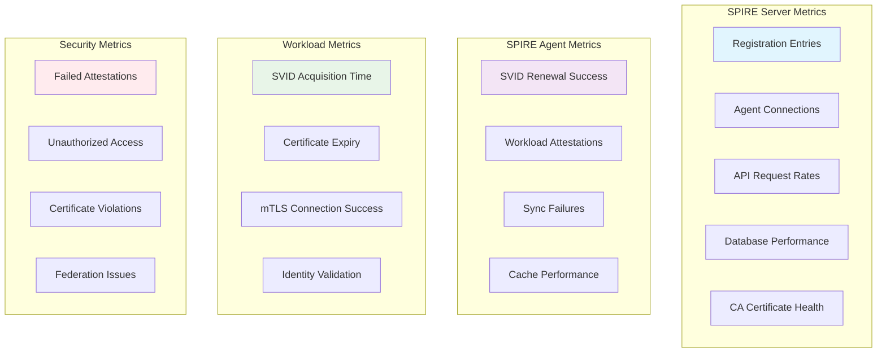
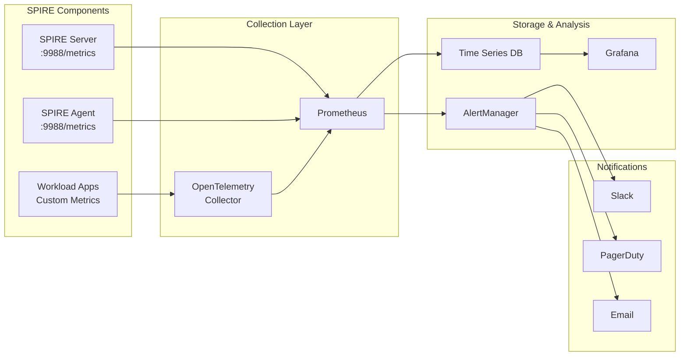

## Introduction: The Missing Observability Layer

One of the biggest gaps in SPIFFE/SPIRE deployments is comprehensive observability. While the system provides powerful identity management, understanding its health, performance, and security posture requires sophisticated monitoring. In this guide, we'll build a complete observability stack that provides visibility into every aspect of your SPIFFE/SPIRE deployment.

After years of operating SPIRE in production, I've learned that monitoring workload identity is fundamentally different from traditional infrastructure monitoring. We need to track identity lifecycle, attestation success rates, certificate rotation health, and federation status - metrics that don't exist in standard monitoring solutions.

## Understanding SPIFFE/SPIRE Observability Requirements

### Key Metrics Categories



### Observability Architecture



## Step 1: Enable SPIRE Telemetry

### SPIRE Server Telemetry Configuration

```yaml
# spire-server-telemetry.yaml
apiVersion: v1
kind: ConfigMap
metadata:
  name: spire-server-telemetry-config
  namespace: spire-system
data:
  server.conf: |
    server {
      bind_address = "0.0.0.0"
      bind_port = "8081"
      trust_domain = "prod.example.com"
      data_dir = "/run/spire/data"
      log_level = "INFO"
      
      # Enable detailed logging for monitoring
      log_format = "json"
      
      # Health check endpoints
      health_checks {
        listener_enabled = true
        bind_address = "0.0.0.0"
        bind_port = "8080"
        live_path = "/live"
        ready_path = "/ready"
      }
    }

    plugins {
      DataStore "sql" {
        plugin_data {
          database_type = "postgres"
          connection_string = "host=postgres port=5432 dbname=spire user=spire password=secret sslmode=require"
          
          # Enable connection pooling metrics
          connection_pool {
            max_open_conns = 100
            max_idle_conns = 50
            conn_max_lifetime = "1h"
          }
        }
      }
      
      NodeAttestor "k8s_psat" {
        plugin_data {
          cluster = "production"
        }
      }
      
      KeyManager "disk" {
        plugin_data {
          keys_path = "/run/spire/data/keys"
        }
      }
      
      UpstreamAuthority "disk" {
        plugin_data {
          cert_file_path = "/run/spire/ca/intermediate.crt"
          key_file_path = "/run/spire/ca/intermediate.key"
          bundle_file_path = "/run/spire/ca/root.crt"
        }
      }
    }

    # Comprehensive telemetry configuration
    telemetry {
      # Prometheus metrics
      Prometheus {
        host = "0.0.0.0"
        port = 9988
        
        # Include detailed labels
        include_labels = true
        
        # Custom metric prefixes
        prefix = "spire_server"
      }
      
      # StatsD for additional metrics aggregation
      Statsd {
        address = "statsd-exporter.monitoring:9125"
        prefix = "spire.server"
      }
      
      # Enable all available metrics
      AllowedPrefixes = []  # Allow all metrics
      BlockedPrefixes = []  # Block none
      
      # Include detailed labels for better filtering
      AllowedLabels = [
        "method",
        "status_code", 
        "error_type",
        "attestor_type",
        "selector_type",
        "trust_domain"
      ]
    }
---
# Update server deployment with telemetry
apiVersion: apps/v1
kind: StatefulSet
metadata:
  name: spire-server
  namespace: spire-system
spec:
  template:
    metadata:
      annotations:
        prometheus.io/scrape: "true"
        prometheus.io/port: "9988"
        prometheus.io/path: "/metrics"
    spec:
      containers:
        - name: spire-server
          ports:
            - containerPort: 9988
              name: telemetry
              protocol: TCP
            - containerPort: 8080
              name: health
              protocol: TCP
          livenessProbe:
            httpGet:
              path: /live
              port: 8080
            initialDelaySeconds: 30
            periodSeconds: 30
            timeoutSeconds: 5
          readinessProbe:
            httpGet:
              path: /ready
              port: 8080
            initialDelaySeconds: 15
            periodSeconds: 10
            timeoutSeconds: 5
```

### SPIRE Agent Telemetry Configuration

```yaml
# spire-agent-telemetry.yaml
apiVersion: v1
kind: ConfigMap
metadata:
  name: spire-agent-telemetry-config
  namespace: spire-system
data:
  agent.conf: |
    agent {
      data_dir = "/run/spire"
      log_level = "INFO"
      log_format = "json"
      server_address = "spire-server"
      server_port = "8081"
      socket_path = "/run/spire/sockets/agent.sock"
      trust_bundle_path = "/run/spire/bundle/bundle.crt"
      trust_domain = "prod.example.com"
      
      # Health check configuration
      health_checks {
        listener_enabled = true
        bind_address = "0.0.0.0"
        bind_port = "8080"
        live_path = "/live"
        ready_path = "/ready"
      }
      
      # Performance settings for monitoring
      sync_interval = "30s"
      
      # Enable SDS for better observability
      sds {
        default_svid_name = "default"
        default_bundle_name = "ROOTCA"
      }
    }

    plugins {
      NodeAttestor "k8s_psat" {
        plugin_data {
          cluster = "production"
          token_path = "/run/secrets/tokens/spire-agent"
        }
      }
      
      KeyManager "memory" {
        plugin_data {}
      }
      
      WorkloadAttestor "k8s" {
        plugin_data {
          # Increase sync interval for monitoring
          pod_info_sync_interval = "30s"
          skip_kubelet_verification = true
          
          # Enable detailed workload labeling
          use_new_container_locator = true
        }
      }
    }

    # Agent telemetry configuration
    telemetry {
      Prometheus {
        host = "0.0.0.0"
        port = 9988
        prefix = "spire_agent"
        include_labels = true
      }
      
      Statsd {
        address = "statsd-exporter.monitoring:9125"
        prefix = "spire.agent"
      }
      
      # Include node and pod information in metrics
      AllowedLabels = [
        "node_name",
        "pod_name", 
        "pod_namespace",
        "workload_selector",
        "attestor_type"
      ]
    }
---
# Update agent daemonset with telemetry
apiVersion: apps/v1
kind: DaemonSet
metadata:
  name: spire-agent
  namespace: spire-system
spec:
  template:
    metadata:
      annotations:
        prometheus.io/scrape: "true"
        prometheus.io/port: "9988"
        prometheus.io/path: "/metrics"
    spec:
      containers:
        - name: spire-agent
          ports:
            - containerPort: 9988
              name: telemetry
              protocol: TCP
              hostPort: 9988 # Allow direct access from Prometheus
            - containerPort: 8080
              name: health
              protocol: TCP
          livenessProbe:
            httpGet:
              path: /live
              port: 8080
            initialDelaySeconds: 30
            periodSeconds: 30
          readinessProbe:
            httpGet:
              path: /ready
              port: 8080
            initialDelaySeconds: 15
            periodSeconds: 10
```

## Step 2: Prometheus Configuration

### Service Discovery and Scrape Config

```yaml
# prometheus-config.yaml
apiVersion: v1
kind: ConfigMap
metadata:
  name: prometheus-config
  namespace: monitoring
data:
  prometheus.yml: |
    global:
      scrape_interval: 15s
      evaluation_interval: 15s
      external_labels:
        cluster: 'production'
        region: 'us-east-1'

    rule_files:
      - "/etc/prometheus/rules/*.yml"

    alerting:
      alertmanagers:
        - static_configs:
            - targets:
              - alertmanager:9093

    scrape_configs:
    # SPIRE Server metrics
    - job_name: 'spire-server'
      kubernetes_sd_configs:
      - role: pod
        namespaces:
          names: ['spire-system']
      
      relabel_configs:
      # Only scrape pods with the correct labels
      - source_labels: [__meta_kubernetes_pod_label_app]
        action: keep
        regex: spire-server
      
      # Add useful labels
      - source_labels: [__meta_kubernetes_pod_name]
        target_label: pod_name
      - source_labels: [__meta_kubernetes_pod_node_name]
        target_label: node_name
      - source_labels: [__meta_kubernetes_namespace]
        target_label: kubernetes_namespace
      
      # Set scrape parameters
      - source_labels: [__meta_kubernetes_pod_annotation_prometheus_io_port]
        action: replace
        target_label: __address__
        regex: (.+)
        replacement: ${1}:9988
      
      metric_relabel_configs:
      # Add server instance information
      - source_labels: [__name__]
        regex: 'spire_server_.*'
        target_label: component
        replacement: 'spire-server'
      
      # Keep only SPIRE-related metrics
      - source_labels: [__name__]
        regex: 'spire_server_.*|up|process_.*'
        action: keep

    # SPIRE Agent metrics
    - job_name: 'spire-agent'
      kubernetes_sd_configs:
      - role: pod
        namespaces:
          names: ['spire-system']
      
      relabel_configs:
      - source_labels: [__meta_kubernetes_pod_label_app]
        action: keep
        regex: spire-agent
      
      - source_labels: [__meta_kubernetes_pod_name]
        target_label: pod_name
      - source_labels: [__meta_kubernetes_pod_node_name]
        target_label: node_name
      - source_labels: [__meta_kubernetes_pod_host_ip]
        target_label: __address__
        replacement: ${1}:9988
      
      metric_relabel_configs:
      - source_labels: [__name__]
        regex: 'spire_agent_.*'
        target_label: component
        replacement: 'spire-agent'
      
      - source_labels: [__name__]
        regex: 'spire_agent_.*|up|process_.*'
        action: keep

    # Workload metrics (applications using SPIFFE)
    - job_name: 'spiffe-workloads'
      kubernetes_sd_configs:
      - role: pod
      
      relabel_configs:
      # Only scrape pods with SPIFFE annotation
      - source_labels: [__meta_kubernetes_pod_annotation_spiffe_io_enabled]
        action: keep
        regex: true
      
      - source_labels: [__meta_kubernetes_pod_annotation_prometheus_io_scrape]
        action: keep
        regex: true
      
      - source_labels: [__meta_kubernetes_pod_annotation_prometheus_io_path]
        action: replace
        target_label: __metrics_path__
        regex: (.+)
      
      - source_labels: [__address__, __meta_kubernetes_pod_annotation_prometheus_io_port]
        action: replace
        regex: ([^:]+)(?::\d+)?;(\d+)
        replacement: $1:$2
        target_label: __address__
      
      - source_labels: [__meta_kubernetes_namespace]
        action: replace
        target_label: kubernetes_namespace
      - source_labels: [__meta_kubernetes_pod_name]
        action: replace
        target_label: kubernetes_pod_name
      
      metric_relabel_configs:
      # Add workload identity information
      - source_labels: [__name__]
        regex: 'spiffe_.*'
        target_label: component
        replacement: 'spiffe-workload'

    # Node Exporter for infrastructure metrics
    - job_name: 'node-exporter'
      kubernetes_sd_configs:
      - role: pod
        namespaces:
          names: ['monitoring']
      
      relabel_configs:
      - source_labels: [__meta_kubernetes_pod_label_app]
        action: keep
        regex: node-exporter
      
      - source_labels: [__meta_kubernetes_pod_node_name]
        action: replace
        target_label: node
```

### Custom Metrics Collection

```yaml
# custom-metrics-collector.yaml
apiVersion: v1
kind: ConfigMap
metadata:
  name: spiffe-metrics-collector
  namespace: spire-system
data:
  collector.py: |
    #!/usr/bin/env python3
    import time
    import requests
    import json
    from prometheus_client import start_http_server, Gauge, Counter, Histogram
    from kubernetes import client, config
    import logging

    # Set up logging
    logging.basicConfig(level=logging.INFO)
    logger = logging.getLogger(__name__)

    # Custom metrics
    spiffe_identity_count = Gauge('spiffe_total_identities', 'Total number of SPIFFE identities')
    spiffe_expired_certs = Gauge('spiffe_expired_certificates', 'Number of expired certificates')
    spiffe_expiring_soon = Gauge('spiffe_certificates_expiring_soon', 'Certificates expiring within 24h')
    spiffe_attestation_failures = Counter('spiffe_attestation_failures_total', 'Total attestation failures')
    spiffe_svid_fetch_time = Histogram('spiffe_svid_fetch_duration_seconds', 'Time to fetch SVID')

    class SPIFFEMetricsCollector:
        def __init__(self):
            self.spire_server_url = "http://spire-server.spire-system:8081"
            
        def collect_registration_metrics(self):
            """Collect registration entry metrics"""
            try:
                # Use SPIRE Server API to get entries
                response = requests.get(f"{self.spire_server_url}/entries")
                if response.status_code == 200:
                    entries = response.json().get('entries', [])
                    spiffe_identity_count.set(len(entries))
                    
                    # Count expired and expiring certificates
                    now = time.time()
                    expired = 0
                    expiring_soon = 0
                    
                    for entry in entries:
                        expiry = entry.get('expiry', 0)
                        if expiry < now:
                            expired += 1
                        elif expiry < (now + 86400):  # 24 hours
                            expiring_soon += 1
                    
                    spiffe_expired_certs.set(expired)
                    spiffe_expiring_soon.set(expiring_soon)
                    
            except Exception as e:
                logger.error(f"Failed to collect registration metrics: {e}")
        
        def collect_workload_metrics(self):
            """Collect workload-specific metrics"""
            try:
                # Load Kubernetes config
                config.load_incluster_config()
                v1 = client.CoreV1Api()
                
                # Get all pods with SPIFFE annotations
                pods = v1.list_pod_for_all_namespaces(
                    label_selector="spiffe=enabled"
                )
                
                for pod in pods.items:
                    if pod.status.phase == "Running":
                        # Simulate SVID fetch time measurement
                        # In reality, this would be instrumented in the workload
                        fetch_time = self.measure_svid_fetch_time(pod)
                        if fetch_time:
                            spiffe_svid_fetch_time.observe(fetch_time)
                            
            except Exception as e:
                logger.error(f"Failed to collect workload metrics: {e}")
        
        def measure_svid_fetch_time(self, pod):
            """Measure time to fetch SVID for a pod"""
            # This is a placeholder - in production, instrument your workloads
            return 0.1  # Mock 100ms fetch time
        
        def run(self):
            logger.info("Starting SPIFFE metrics collector")
            while True:
                try:
                    self.collect_registration_metrics()
                    self.collect_workload_metrics()
                    time.sleep(30)  # Collect every 30 seconds
                except Exception as e:
                    logger.error(f"Error in collection cycle: {e}")
                    time.sleep(10)

    if __name__ == '__main__':
        # Start Prometheus metrics server
        start_http_server(8000)
        logger.info("Metrics server started on port 8000")
        
        # Start collector
        collector = SPIFFEMetricsCollector()
        collector.run()
---
apiVersion: apps/v1
kind: Deployment
metadata:
  name: spiffe-metrics-collector
  namespace: spire-system
spec:
  replicas: 1
  selector:
    matchLabels:
      app: spiffe-metrics-collector
  template:
    metadata:
      labels:
        app: spiffe-metrics-collector
      annotations:
        prometheus.io/scrape: "true"
        prometheus.io/port: "8000"
    spec:
      serviceAccountName: spiffe-metrics-collector
      containers:
        - name: collector
          image: python:3.9-slim
          command: ["python", "/app/collector.py"]
          ports:
            - containerPort: 8000
              name: metrics
          env:
            - name: PYTHONUNBUFFERED
              value: "1"
          volumeMounts:
            - name: app
              mountPath: /app
          resources:
            requests:
              memory: "128Mi"
              cpu: "100m"
            limits:
              memory: "256Mi"
              cpu: "200m"
      volumes:
        - name: app
          configMap:
            name: spiffe-metrics-collector
            defaultMode: 0755
```

## Step 3: Grafana Dashboards

### Comprehensive SPIRE Dashboard

```json
{
  "dashboard": {
    "id": null,
    "title": "SPIFFE/SPIRE Comprehensive Monitoring",
    "description": "Complete observability for SPIFFE/SPIRE deployment",
    "tags": ["spiffe", "spire", "security", "identity"],
    "timezone": "UTC",
    "refresh": "30s",
    "time": {
      "from": "now-1h",
      "to": "now"
    },
    "templating": {
      "list": [
        {
          "name": "cluster",
          "type": "query",
          "query": "label_values(up{job=\"spire-server\"}, cluster)",
          "refresh": 1
        },
        {
          "name": "server_instance",
          "type": "query",
          "query": "label_values(up{job=\"spire-server\", cluster=\"$cluster\"}, instance)",
          "refresh": 1,
          "multi": true,
          "includeAll": true
        }
      ]
    },
    "panels": [
      {
        "id": 1,
        "title": "SPIRE Server Health Overview",
        "type": "stat",
        "targets": [
          {
            "expr": "up{job=\"spire-server\", cluster=\"$cluster\"}",
            "legendFormat": "{{instance}}"
          }
        ],
        "fieldConfig": {
          "defaults": {
            "mappings": [
              {
                "type": "value",
                "value": "0",
                "text": "DOWN"
              },
              {
                "type": "value",
                "value": "1",
                "text": "UP"
              }
            ],
            "thresholds": {
              "steps": [
                { "color": "red", "value": 0 },
                { "color": "green", "value": 1 }
              ]
            }
          }
        },
        "gridPos": { "h": 4, "w": 6, "x": 0, "y": 0 }
      },
      {
        "id": 2,
        "title": "Registration Entries Count",
        "type": "stat",
        "targets": [
          {
            "expr": "sum(spire_server_registration_entries{cluster=\"$cluster\", instance=~\"$server_instance\"})",
            "legendFormat": "Total Entries"
          }
        ],
        "fieldConfig": {
          "defaults": {
            "unit": "short",
            "color": { "mode": "thresholds" },
            "thresholds": {
              "steps": [
                { "color": "green", "value": 0 },
                { "color": "yellow", "value": 1000 },
                { "color": "red", "value": 10000 }
              ]
            }
          }
        },
        "gridPos": { "h": 4, "w": 6, "x": 6, "y": 0 }
      },
      {
        "id": 3,
        "title": "Connected Agents",
        "type": "stat",
        "targets": [
          {
            "expr": "sum(spire_server_connected_agents{cluster=\"$cluster\", instance=~\"$server_instance\"})",
            "legendFormat": "Active Agents"
          }
        ],
        "gridPos": { "h": 4, "w": 6, "x": 12, "y": 0 }
      },
      {
        "id": 4,
        "title": "API Request Rate",
        "type": "stat",
        "targets": [
          {
            "expr": "sum(rate(spire_server_api_requests_total{cluster=\"$cluster\", instance=~\"$server_instance\"}[5m]))",
            "legendFormat": "Requests/sec"
          }
        ],
        "fieldConfig": {
          "defaults": {
            "unit": "reqps"
          }
        },
        "gridPos": { "h": 4, "w": 6, "x": 18, "y": 0 }
      },
      {
        "id": 5,
        "title": "API Request Latency",
        "type": "timeseries",
        "targets": [
          {
            "expr": "histogram_quantile(0.95, sum(rate(spire_server_api_request_duration_seconds_bucket{cluster=\"$cluster\", instance=~\"$server_instance\"}[5m])) by (le, method))",
            "legendFormat": "p95 - {{method}}"
          },
          {
            "expr": "histogram_quantile(0.50, sum(rate(spire_server_api_request_duration_seconds_bucket{cluster=\"$cluster\", instance=~\"$server_instance\"}[5m])) by (le, method))",
            "legendFormat": "p50 - {{method}}"
          }
        ],
        "fieldConfig": {
          "defaults": {
            "unit": "s"
          }
        },
        "gridPos": { "h": 8, "w": 12, "x": 0, "y": 4 }
      },
      {
        "id": 6,
        "title": "Error Rate by API Method",
        "type": "timeseries",
        "targets": [
          {
            "expr": "sum(rate(spire_server_api_errors_total{cluster=\"$cluster\", instance=~\"$server_instance\"}[5m])) by (method)",
            "legendFormat": "{{method}}"
          }
        ],
        "fieldConfig": {
          "defaults": {
            "unit": "reqps"
          }
        },
        "gridPos": { "h": 8, "w": 12, "x": 12, "y": 4 }
      },
      {
        "id": 7,
        "title": "Database Connection Pool",
        "type": "timeseries",
        "targets": [
          {
            "expr": "spire_server_datastore_connections_active{cluster=\"$cluster\", instance=~\"$server_instance\"}",
            "legendFormat": "Active - {{instance}}"
          },
          {
            "expr": "spire_server_datastore_connections_idle{cluster=\"$cluster\", instance=~\"$server_instance\"}",
            "legendFormat": "Idle - {{instance}}"
          }
        ],
        "gridPos": { "h": 8, "w": 12, "x": 0, "y": 12 }
      },
      {
        "id": 8,
        "title": "Database Query Performance",
        "type": "timeseries",
        "targets": [
          {
            "expr": "histogram_quantile(0.95, sum(rate(spire_server_datastore_query_duration_seconds_bucket{cluster=\"$cluster\", instance=~\"$server_instance\"}[5m])) by (le, operation))",
            "legendFormat": "p95 - {{operation}}"
          }
        ],
        "fieldConfig": {
          "defaults": {
            "unit": "s"
          }
        },
        "gridPos": { "h": 8, "w": 12, "x": 12, "y": 12 }
      },
      {
        "id": 9,
        "title": "Certificate Expiry Timeline",
        "type": "timeseries",
        "targets": [
          {
            "expr": "(spire_server_ca_certificate_expiry_timestamp{cluster=\"$cluster\", instance=~\"$server_instance\"} - time()) / 86400",
            "legendFormat": "CA Cert - {{instance}}"
          },
          {
            "expr": "spiffe_certificates_expiring_soon{cluster=\"$cluster\"}",
            "legendFormat": "Expiring Soon"
          }
        ],
        "fieldConfig": {
          "defaults": {
            "unit": "d"
          }
        },
        "gridPos": { "h": 8, "w": 12, "x": 0, "y": 20 }
      },
      {
        "id": 10,
        "title": "Agent Sync Success Rate",
        "type": "timeseries",
        "targets": [
          {
            "expr": "sum(rate(spire_agent_sync_success_total{cluster=\"$cluster\"}[5m])) / sum(rate(spire_agent_sync_attempts_total{cluster=\"$cluster\"}[5m])) * 100",
            "legendFormat": "Success Rate %"
          }
        ],
        "fieldConfig": {
          "defaults": {
            "unit": "percent",
            "min": 0,
            "max": 100
          }
        },
        "gridPos": { "h": 8, "w": 12, "x": 12, "y": 20 }
      },
      {
        "id": 11,
        "title": "Memory Usage by Component",
        "type": "timeseries",
        "targets": [
          {
            "expr": "process_resident_memory_bytes{job=\"spire-server\", cluster=\"$cluster\", instance=~\"$server_instance\"} / 1024 / 1024 / 1024",
            "legendFormat": "Server - {{instance}}"
          },
          {
            "expr": "process_resident_memory_bytes{job=\"spire-agent\", cluster=\"$cluster\"} / 1024 / 1024 / 1024",
            "legendFormat": "Agent - {{instance}}"
          }
        ],
        "fieldConfig": {
          "defaults": {
            "unit": "GB"
          }
        },
        "gridPos": { "h": 8, "w": 12, "x": 0, "y": 28 }
      },
      {
        "id": 12,
        "title": "CPU Usage by Component",
        "type": "timeseries",
        "targets": [
          {
            "expr": "rate(process_cpu_seconds_total{job=\"spire-server\", cluster=\"$cluster\", instance=~\"$server_instance\"}[5m]) * 100",
            "legendFormat": "Server - {{instance}}"
          },
          {
            "expr": "rate(process_cpu_seconds_total{job=\"spire-agent\", cluster=\"$cluster\"}[5m]) * 100",
            "legendFormat": "Agent - {{instance}}"
          }
        ],
        "fieldConfig": {
          "defaults": {
            "unit": "percent"
          }
        },
        "gridPos": { "h": 8, "w": 12, "x": 12, "y": 28 }
      }
    ]
  }
}
```

### Security-Focused Dashboard

```json
{
  "dashboard": {
    "title": "SPIFFE/SPIRE Security Monitoring",
    "description": "Security incidents, attestation failures, and threat detection",
    "panels": [
      {
        "id": 1,
        "title": "Failed Attestations by Type",
        "type": "timeseries",
        "targets": [
          {
            "expr": "sum(rate(spire_server_attestation_failures_total{cluster=\"$cluster\"}[5m])) by (attestor_type, error_type)",
            "legendFormat": "{{attestor_type}} - {{error_type}}"
          }
        ],
        "alert": {
          "conditions": [
            {
              "query": {
                "queryType": "",
                "refId": "A"
              },
              "reducer": {
                "type": "last",
                "params": []
              },
              "evaluator": {
                "params": [0.1],
                "type": "gt"
              }
            }
          ],
          "executionErrorState": "alerting",
          "noDataState": "no_data",
          "frequency": "60s",
          "handler": 1,
          "name": "High Attestation Failure Rate",
          "message": "Attestation failure rate exceeds threshold"
        }
      },
      {
        "id": 2,
        "title": "Unauthorized Access Attempts",
        "type": "timeseries",
        "targets": [
          {
            "expr": "sum(rate(spire_server_api_unauthorized_total{cluster=\"$cluster\"}[5m]))",
            "legendFormat": "Unauthorized Requests"
          }
        ]
      },
      {
        "id": 3,
        "title": "Certificate Validation Failures",
        "type": "stat",
        "targets": [
          {
            "expr": "sum(increase(spire_server_certificate_validation_failures_total{cluster=\"$cluster\"}[1h]))",
            "legendFormat": "Last Hour"
          }
        ],
        "fieldConfig": {
          "defaults": {
            "thresholds": {
              "steps": [
                { "color": "green", "value": 0 },
                { "color": "yellow", "value": 10 },
                { "color": "red", "value": 50 }
              ]
            }
          }
        }
      },
      {
        "id": 4,
        "title": "Anomalous Registration Patterns",
        "type": "timeseries",
        "targets": [
          {
            "expr": "rate(spire_server_registration_created_total{cluster=\"$cluster\"}[5m])",
            "legendFormat": "Registration Rate"
          },
          {
            "expr": "avg_over_time(rate(spire_server_registration_created_total{cluster=\"$cluster\"}[5m])[7d:1h])",
            "legendFormat": "7-day Average"
          }
        ]
      },
      {
        "id": 5,
        "title": "Top Error Sources",
        "type": "table",
        "targets": [
          {
            "expr": "topk(10, sum by (source_ip, error_type) (increase(spire_server_errors_total{cluster=\"$cluster\"}[1h])))",
            "format": "table",
            "instant": true
          }
        ],
        "transformations": [
          {
            "id": "organize",
            "options": {
              "excludeByName": {
                "Time": true
              },
              "renameByName": {
                "source_ip": "Source IP",
                "error_type": "Error Type",
                "Value": "Count"
              }
            }
          }
        ]
      }
    ]
  }
}
```

## Step 4: Intelligent Alerting

### Critical Alert Rules

```yaml
# spire-alert-rules.yaml
apiVersion: monitoring.coreos.com/v1
kind: PrometheusRule
metadata:
  name: spire-critical-alerts
  namespace: spire-system
spec:
  groups:
    - name: spire.critical
      interval: 30s
      rules:
        # Server Availability
        - alert: SPIREServerDown
          expr: up{job="spire-server"} == 0
          for: 2m
          labels:
            severity: critical
            component: spire-server
          annotations:
            summary: "SPIRE Server instance is down"
            description: "SPIRE Server {{ $labels.instance }} has been down for more than 2 minutes. This affects workload identity issuance."
            runbook_url: "https://wiki.company.com/spire-runbooks#server-down"

        # Database Connectivity
        - alert: SPIREDatabaseConnectionFailure
          expr: spire_server_datastore_connections_active == 0
          for: 5m
          labels:
            severity: critical
            component: datastore
          annotations:
            summary: "SPIRE Server cannot connect to database"
            description: "SPIRE Server {{ $labels.instance }} has no active database connections for 5 minutes."

        # High Error Rate
        - alert: SPIREHighErrorRate
          expr: |
            sum(rate(spire_server_api_errors_total[5m])) by (instance) 
            / sum(rate(spire_server_api_requests_total[5m])) by (instance) > 0.05
          for: 10m
          labels:
            severity: warning
            component: api
          annotations:
            summary: "High error rate in SPIRE Server API"
            description: "SPIRE Server {{ $labels.instance }} API error rate is {{ $value | humanizePercentage }} over the last 10 minutes."

        # Certificate Expiry
        - alert: SPIRECACertificateExpiringSoon
          expr: |
            (spire_server_ca_certificate_expiry_timestamp - time()) / 86400 < 30
          for: 1h
          labels:
            severity: warning
            component: certificates
          annotations:
            summary: "SPIRE CA certificate expiring soon"
            description: "SPIRE CA certificate will expire in {{ $value }} days. Plan for rotation."

        - alert: SPIRECACertificateExpired
          expr: |
            (spire_server_ca_certificate_expiry_timestamp - time()) < 0
          for: 1m
          labels:
            severity: critical
            component: certificates
          annotations:
            summary: "SPIRE CA certificate has expired"
            description: "SPIRE CA certificate has expired. Immediate action required."

        # Agent Issues
        - alert: SPIREAgentSyncFailures
          expr: |
            rate(spire_agent_sync_failures_total[5m]) > 0.1
          for: 15m
          labels:
            severity: warning
            component: agent
          annotations:
            summary: "High agent sync failure rate"
            description: "SPIRE Agent {{ $labels.instance }} sync failure rate is {{ $value }} failures/second."

        - alert: SPIREAgentDisconnected
          expr: |
            (time() - spire_agent_last_sync_timestamp) > 300
          for: 5m
          labels:
            severity: critical
            component: agent
          annotations:
            summary: "SPIRE Agent disconnected"
            description: "SPIRE Agent {{ $labels.instance }} hasn't synced for {{ $value }} seconds."

        # Security Alerts
        - alert: SPIREUnauthorizedAccessSpike
          expr: |
            sum(rate(spire_server_api_unauthorized_total[5m])) > 1
          for: 5m
          labels:
            severity: warning
            component: security
          annotations:
            summary: "Spike in unauthorized access attempts"
            description: "Unauthorized access attempts: {{ $value }} requests/second to SPIRE Server."

        - alert: SPIREAttestationFailureSpike
          expr: |
            sum(rate(spire_server_attestation_failures_total[5m])) by (attestor_type) > 0.5
          for: 10m
          labels:
            severity: warning
            component: security
          annotations:
            summary: "High attestation failure rate"
            description: "Attestation failures for {{ $labels.attestor_type }}: {{ $value }} failures/second."

        # Performance Alerts
        - alert: SPIREHighLatency
          expr: |
            histogram_quantile(0.95, 
              sum(rate(spire_server_api_request_duration_seconds_bucket[5m])) by (le, method)
            ) > 5
          for: 15m
          labels:
            severity: warning
            component: performance
          annotations:
            summary: "High API latency"
            description: "95th percentile latency for {{ $labels.method }} is {{ $value }}s."

        - alert: SPIREHighMemoryUsage
          expr: |
            process_resident_memory_bytes{job="spire-server"} / (1024*1024*1024) > 4
          for: 15m
          labels:
            severity: warning
            component: resources
          annotations:
            summary: "High memory usage"
            description: "SPIRE Server {{ $labels.instance }} using {{ $value }}GB of memory."

        # Capacity Planning
        - alert: SPIREEntryCountHigh
          expr: |
            spire_server_registration_entries > 50000
          for: 30m
          labels:
            severity: warning
            component: capacity
          annotations:
            summary: "High number of registration entries"
            description: "SPIRE Server has {{ $value }} registration entries. Consider capacity planning."
```

### AlertManager Configuration

```yaml
# alertmanager-config.yaml
apiVersion: v1
kind: ConfigMap
metadata:
  name: alertmanager-config
  namespace: monitoring
data:
  alertmanager.yml: |
    global:
      smtp_smarthost: 'smtp.company.com:587'
      smtp_from: 'alerts@company.com'
      slack_api_url: 'https://hooks.slack.com/services/YOUR/SLACK/WEBHOOK'

    route:
      group_by: ['alertname', 'cluster', 'component']
      group_wait: 10s
      group_interval: 10s
      repeat_interval: 12h
      receiver: 'default'
      routes:
      
      # Critical alerts go to multiple channels
      - match:
          severity: critical
        receiver: 'critical-alerts'
        routes:
        # SPIRE-specific critical alerts
        - match:
            component: spire-server
          receiver: 'spire-critical'
        - match:
            component: certificates
          receiver: 'security-team'
      
      # Security alerts
      - match:
          component: security
        receiver: 'security-alerts'
      
      # Performance warnings
      - match:
          component: performance
        receiver: 'performance-alerts'

    receivers:
    - name: 'default'
      slack_configs:
      - channel: '#alerts'
        title: 'SPIRE Alert: {{ .GroupLabels.alertname }}'
        text: |
          {{ range .Alerts }}
          {{ .Annotations.summary }}
          {{ .Annotations.description }}
          {{ end }}

    - name: 'critical-alerts'
      slack_configs:
      - channel: '#critical-alerts'
        color: 'danger'
        title: '🚨 CRITICAL: {{ .GroupLabels.alertname }}'
        text: |
          {{ range .Alerts }}
          *Summary:* {{ .Annotations.summary }}
          *Description:* {{ .Annotations.description }}
          *Cluster:* {{ .Labels.cluster }}
          *Instance:* {{ .Labels.instance }}
          {{ if .Annotations.runbook_url }}*Runbook:* {{ .Annotations.runbook_url }}{{ end }}
          {{ end }}
      pagerduty_configs:
      - routing_key: 'YOUR_PAGERDUTY_KEY'
        description: 'SPIRE Critical Alert: {{ .GroupLabels.alertname }}'
      
    - name: 'spire-critical'
      slack_configs:
      - channel: '#spire-ops'
        color: 'danger'
        title: '🔑 SPIRE CRITICAL: {{ .GroupLabels.alertname }}'
        text: |
          {{ range .Alerts }}
          {{ .Annotations.summary }}
          
          *Impact:* Workload identity operations may be affected
          *Action Required:* Immediate investigation needed
          
          {{ .Annotations.description }}
          {{ end }}

    - name: 'security-alerts'
      slack_configs:
      - channel: '#security-alerts'
        color: 'warning'
        title: '🛡️ Security Alert: {{ .GroupLabels.alertname }}'
        text: |
          {{ range .Alerts }}
          {{ .Annotations.summary }}
          {{ .Annotations.description }}
          {{ end }}
      email_configs:
      - to: 'security-team@company.com'
        subject: 'SPIRE Security Alert: {{ .GroupLabels.alertname }}'
        body: |
          {{ range .Alerts }}
          {{ .Annotations.description }}
          {{ end }}

    - name: 'performance-alerts'
      slack_configs:
      - channel: '#performance'
        color: 'warning'
        title: '📈 Performance Alert: {{ .GroupLabels.alertname }}'

    inhibit_rules:
    # Don't alert on agent issues if server is down
    - source_match:
        alertname: SPIREServerDown
      target_match:
        component: agent
      equal: ['cluster']

    # Don't alert on API errors if database is down
    - source_match:
        alertname: SPIREDatabaseConnectionFailure
      target_match:
        component: api
      equal: ['instance']
```

## Step 5: Custom Workload Instrumentation

### Go Application with SPIFFE Metrics

```go
// spiffe-metrics.go - Instrument Go applications with SPIFFE metrics
package main

import (
    "context"
    "crypto/tls"
    "net/http"
    "time"

    "github.com/prometheus/client_golang/prometheus"
    "github.com/prometheus/client_golang/prometheus/promauto"
    "github.com/prometheus/client_golang/prometheus/promhttp"
    "github.com/spiffe/go-spiffe/v2/spiffeid"
    "github.com/spiffe/go-spiffe/v2/spiffetls/tlsconfig"
    "github.com/spiffe/go-spiffe/v2/workloadapi"
)

var (
    // SPIFFE-specific metrics
    spiffeSVIDFetchDuration = promauto.NewHistogramVec(
        prometheus.HistogramOpts{
            Name: "spiffe_svid_fetch_duration_seconds",
            Help: "Time taken to fetch SVID from Workload API",
            Buckets: prometheus.DefBuckets,
        },
        []string{"result"},
    )

    spiffeSVIDRotations = promauto.NewCounterVec(
        prometheus.CounterOpts{
            Name: "spiffe_svid_rotations_total",
            Help: "Total number of SVID rotations",
        },
        []string{"result"},
    )

    spiffeMTLSConnections = promauto.NewCounterVec(
        prometheus.CounterOpts{
            Name: "spiffe_mtls_connections_total",
            Help: "Total mTLS connections made",
        },
        []string{"target_id", "result"},
    )

    spiffeSVIDExpiry = promauto.NewGaugeVec(
        prometheus.GaugeOpts{
            Name: "spiffe_svid_expiry_timestamp",
            Help: "SVID expiry timestamp",
        },
        []string{"spiffe_id"},
    )
)

type SPIFFEInstrumentedClient struct {
    client       *workloadapi.Client
    httpClient   *http.Client
    currentSVID  string
}

func NewSPIFFEInstrumentedClient(ctx context.Context) (*SPIFFEInstrumentedClient, error) {
    start := time.Now()

    client, err := workloadapi.New(ctx, workloadapi.WithAddr("unix:///spiffe-workload-api/spire-agent.sock"))
    if err != nil {
        spiffeSVIDFetchDuration.WithLabelValues("error").Observe(time.Since(start).Seconds())
        return nil, err
    }

    // Fetch initial SVID
    x509Context, err := client.FetchX509Context(ctx)
    if err != nil {
        spiffeSVIDFetchDuration.WithLabelValues("error").Observe(time.Since(start).Seconds())
        return nil, err
    }

    spiffeSVIDFetchDuration.WithLabelValues("success").Observe(time.Since(start).Seconds())

    svid := x509Context.DefaultSVID()
    spiffeSVIDExpiry.WithLabelValues(svid.ID.String()).Set(float64(svid.Certificates[0].NotAfter.Unix()))

    // Create HTTP client with mTLS
    tlsConfig := tlsconfig.MTLSClientConfig(client, client)
    httpClient := &http.Client{
        Transport: &http.Transport{
            TLSClientConfig: tlsConfig,
        },
    }

    sic := &SPIFFEInstrumentedClient{
        client:      client,
        httpClient:  httpClient,
        currentSVID: svid.ID.String(),
    }

    // Start SVID rotation monitoring
    go sic.monitorSVIDRotation(ctx)

    return sic, nil
}

func (s *SPIFFEInstrumentedClient) monitorSVIDRotation(ctx context.Context) {
    ticker := time.NewTicker(30 * time.Second)
    defer ticker.Stop()

    for {
        select {
        case <-ctx.Done():
            return
        case <-ticker.C:
            start := time.Now()

            x509Context, err := s.client.FetchX509Context(ctx)
            if err != nil {
                spiffeSVIDFetchDuration.WithLabelValues("error").Observe(time.Since(start).Seconds())
                continue
            }

            spiffeSVIDFetchDuration.WithLabelValues("success").Observe(time.Since(start).Seconds())

            svid := x509Context.DefaultSVID()
            currentID := svid.ID.String()

            // Check if SVID rotated
            if currentID != s.currentSVID {
                spiffeSVIDRotations.WithLabelValues("success").Inc()
                s.currentSVID = currentID
            }

            // Update expiry metric
            spiffeSVIDExpiry.WithLabelValues(currentID).Set(float64(svid.Certificates[0].NotAfter.Unix()))
        }
    }
}

func (s *SPIFFEInstrumentedClient) CallService(ctx context.Context, targetID, url string) (*http.Response, error) {
    start := time.Now()

    // Create specific client for target
    id := spiffeid.RequireFromString(targetID)
    tlsConfig := tlsconfig.MTLSClientConfig(s.client, s.client, tlsconfig.AuthorizeID(id))

    client := &http.Client{
        Transport: &http.Transport{
            TLSClientConfig: tlsConfig,
        },
    }

    req, err := http.NewRequestWithContext(ctx, "GET", url, nil)
    if err != nil {
        return nil, err
    }

    resp, err := client.Do(req)

    // Record metrics
    if err != nil {
        spiffeMTLSConnections.WithLabelValues(targetID, "error").Inc()
    } else {
        spiffeMTLSConnections.WithLabelValues(targetID, "success").Inc()
    }

    return resp, err
}

func main() {
    ctx := context.Background()

    client, err := NewSPIFFEInstrumentedClient(ctx)
    if err != nil {
        panic(err)
    }
    defer client.client.Close()

    // Expose metrics
    http.Handle("/metrics", promhttp.Handler())

    // Health check
    http.HandleFunc("/health", func(w http.ResponseWriter, r *http.Request) {
        w.WriteHeader(http.StatusOK)
        w.Write([]byte("healthy"))
    })

    // Example business logic
    http.HandleFunc("/", func(w http.ResponseWriter, r *http.Request) {
        // Call another service
        resp, err := client.CallService(ctx, "spiffe://prod.example.com/backend", "https://backend:8443/data")
        if err != nil {
            http.Error(w, err.Error(), http.StatusInternalServerError)
            return
        }
        defer resp.Body.Close()

        w.WriteHeader(http.StatusOK)
        w.Write([]byte("Request successful"))
    })

    // Start server
    if err := http.ListenAndServe(":8080", nil); err != nil {
        panic(err)
    }
}
```

## Step 6: Log Analysis and Correlation

### Structured Logging with ELK Stack

```yaml
# fluentd-spire-config.yaml
apiVersion: v1
kind: ConfigMap
metadata:
  name: fluentd-spire-config
  namespace: logging
data:
  fluent.conf: |
    <source>
      @type tail
      path /var/log/containers/spire-server-*.log
      pos_file /var/log/fluentd-spire-server.log.pos
      tag kubernetes.spire.server
      format json
      time_key timestamp
      time_format %Y-%m-%dT%H:%M:%S.%NZ
    </source>

    <source>
      @type tail
      path /var/log/containers/spire-agent-*.log
      pos_file /var/log/fluentd-spire-agent.log.pos
      tag kubernetes.spire.agent
      format json
      time_key timestamp
      time_format %Y-%m-%dT%H:%M:%S.%NZ
    </source>

    # Parse SPIRE structured logs
    <filter kubernetes.spire.**>
      @type parser
      key_name log
      reserve_data true
      <parse>
        @type json
        json_parser yajl
      </parse>
    </filter>

    # Extract security events
    <filter kubernetes.spire.**>
      @type grep
      <regexp>
        key level
        pattern ^(ERROR|WARN)$
      </regexp>
    </filter>

    # Enrich with Kubernetes metadata
    <filter kubernetes.spire.**>
      @type kubernetes_metadata
      kubernetes_url https://kubernetes.default.svc
      bearer_token_file /var/run/secrets/kubernetes.io/serviceaccount/token
      ca_file /var/run/secrets/kubernetes.io/serviceaccount/ca.crt
    </filter>

    # Send to Elasticsearch
    <match kubernetes.spire.**>
      @type elasticsearch
      host elasticsearch.logging.svc.cluster.local
      port 9200
      index_name spire-logs
      type_name _doc
      
      <buffer>
        @type file
        path /var/log/fluentd-buffers/spire.buffer
        flush_mode interval
        flush_interval 5s
        chunk_limit_size 2M
        queue_limit_length 8
        retry_max_interval 30
        retry_forever true
      </buffer>
    </match>
```

### Elasticsearch Index Templates

```json
{
  "index_patterns": ["spire-logs-*"],
  "template": {
    "settings": {
      "number_of_shards": 3,
      "number_of_replicas": 1,
      "index.refresh_interval": "5s",
      "index.max_result_window": 50000
    },
    "mappings": {
      "properties": {
        "@timestamp": {
          "type": "date"
        },
        "level": {
          "type": "keyword"
        },
        "msg": {
          "type": "text",
          "analyzer": "standard"
        },
        "component": {
          "type": "keyword"
        },
        "spiffe_id": {
          "type": "keyword"
        },
        "attestor_type": {
          "type": "keyword"
        },
        "error": {
          "type": "text"
        },
        "kubernetes": {
          "properties": {
            "pod_name": {
              "type": "keyword"
            },
            "namespace_name": {
              "type": "keyword"
            },
            "node_name": {
              "type": "keyword"
            }
          }
        },
        "metrics": {
          "properties": {
            "duration_ms": {
              "type": "long"
            },
            "count": {
              "type": "long"
            }
          }
        }
      }
    }
  }
}
```

## Conclusion

Comprehensive observability for SPIFFE/SPIRE requires:

1. **Multi-Layer Monitoring**: Server, agent, and workload metrics
2. **Security Focus**: Track attestation failures and unauthorized access
3. **Performance Insights**: API latency, database performance, resource usage
4. **Intelligent Alerting**: Context-aware alerts with proper escalation
5. **Log Correlation**: Structured logging for security incident analysis

Key takeaways:

- ✅ Enable telemetry on all SPIRE components
- ✅ Use custom metrics for workload-specific monitoring
- ✅ Implement layered alerting with proper escalation
- ✅ Monitor security events and attestation health
- ✅ Track certificate lifecycle and rotation

In the next post, we'll explore advanced workload attestation using TPM hardware roots of trust and cloud provider attestors.

## Additional Resources

- [Prometheus SPIRE Metrics](https://spiffe.io/docs/latest/deploying/telemetry_config/)
- [Grafana Dashboard Templates](https://grafana.com/grafana/dashboards/)
- [AlertManager Configuration](https://prometheus.io/docs/alerting/latest/configuration/)

---

_Building comprehensive observability for identity infrastructure is crucial for production success. Share your monitoring strategies and lessons learned in the comments._
