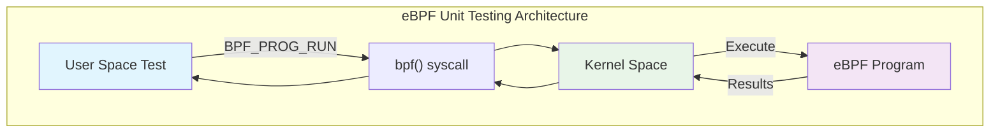
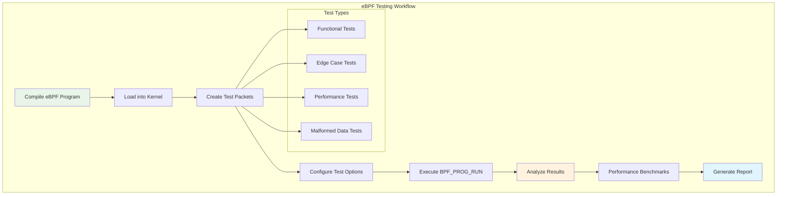

# Unit Testing eBPF Programs: A Comprehensive Guide with XDP Examples

In large software projects with contributions from dozens of developers, changes can unexpectedly disrupt related functionalities. eBPF programs, being kernel-level code that operates in a critical execution environment, require thorough testing to detect issues before they could impact production applications.

This comprehensive guide demonstrates how to effectively unit test eBPF programs, with a focus on XDP (eXpress Data Path) programs, using the `BPF_PROG_RUN` command and libbpf utilities.

## Understanding eBPF Unit Testing

### The BPF_PROG_RUN Command

The core functionality for unit testing eBPF programs is the `BPF_PROG_RUN` command (previously named `BPF_PROG_TEST_RUN`). This command is invoked via the `bpf()` syscall to execute an eBPF program in a controlled environment and return its results to user-space.



### Supported Program Types

As of the current kernel version, `BPF_PROG_RUN` supports testing the following eBPF program types:

- `BPF_PROG_TYPE_SOCKET_FILTER`
- `BPF_PROG_TYPE_SCHED_CLS`
- `BPF_PROG_TYPE_SCHED_ACT`
- `BPF_PROG_TYPE_XDP`
- `BPF_PROG_TYPE_SK_LOOKUP`
- `BPF_PROG_TYPE_CGROUP_SKB`
- `BPF_PROG_TYPE_LWT_IN`
- `BPF_PROG_TYPE_LWT_OUT`
- `BPF_PROG_TYPE_LWT_XMIT`
- `BPF_PROG_TYPE_LWT_SEG6LOCAL`
- `BPF_PROG_TYPE_FLOW_DISSECTOR`
- `BPF_PROG_TYPE_STRUCT_OPS`
- `BPF_PROG_TYPE_RAW_TRACEPOINT`
- `BPF_PROG_TYPE_SYSCALL`

## The libbpf Testing Framework

### Understanding libbpf

**libbpf** is a C library that provides essential tools and abstractions for loading, managing, and interacting with eBPF programs in the Linux kernel. It simplifies the complex process of working with eBPF by providing high-level APIs.

### bpf_prog_test_run_opts Function

Instead of directly invoking the syscall, libbpf offers the `bpf_prog_test_run_opts` wrapper function that streamlines the testing process:

```c
int bpf_prog_test_run_opts(int prog_fd, struct bpf_test_run_opts *opts);
```

The function takes two arguments:

- `prog_fd`: eBPF program file descriptor
- `opts`: Pointer to `bpf_test_run_opts` structure containing test parameters

### bpf_test_run_opts Structure

The `bpf_test_run_opts` structure contains various fields for configuring the test execution:

```c
struct bpf_test_run_opts {
    size_t sz;              /* Size of this structure */
    const void *data_in;    /* Input data */
    void *data_out;         /* Output data buffer */
    __u32 data_size_in;     /* Size of input data */
    __u32 data_size_out;    /* Size of output buffer */
    __u32 retval;           /* Program return value */
    __u32 duration;         /* Execution duration */
    __u32 repeat;           /* Number of repetitions */
    const void *ctx_in;     /* Input context */
    void *ctx_out;          /* Output context buffer */
    __u32 ctx_size_in;      /* Size of input context */
    __u32 ctx_size_out;     /* Size of output context buffer */
};
```

## XDP Program Testing Example

Let's create a comprehensive example of testing an XDP program that filters packets based on protocol type.

### Sample XDP Program

First, let's look at a simple XDP program that drops ICMP packets:

```c
// xdp_filter.bpf.c
#include <linux/bpf.h>
#include <linux/if_ether.h>
#include <linux/ip.h>
#include <linux/in.h>
#include <bpf/bpf_helpers.h>

SEC("xdp")
int xdp_icmp_filter(struct xdp_md *ctx) {
    void *data_end = (void *)(long)ctx->data_end;
    void *data = (void *)(long)ctx->data;

    // Check if we have enough space for Ethernet header
    struct ethhdr *eth = data;
    if ((void *)(eth + 1) > data_end)
        return XDP_PASS;

    // Only process IPv4 packets
    if (eth->h_proto != __constant_htons(ETH_P_IP))
        return XDP_PASS;

    // Check if we have enough space for IP header
    struct iphdr *ip = (void *)(eth + 1);
    if ((void *)(ip + 1) > data_end)
        return XDP_PASS;

    // Drop ICMP packets
    if (ip->protocol == IPPROTO_ICMP) {
        return XDP_DROP;
    }

    return XDP_PASS;
}

char _license[] SEC("license") = "GPL";
```

### Unit Test Implementation

Now, let's create a comprehensive unit test for our XDP program:

```c
// test_xdp_filter.c
#include <stdio.h>
#include <stdlib.h>
#include <string.h>
#include <unistd.h>
#include <errno.h>
#include <linux/if_ether.h>
#include <linux/ip.h>
#include <linux/in.h>
#include <arpa/inet.h>
#include <bpf/libbpf.h>
#include <bpf/bpf.h>

#define PACKET_SIZE 64

// Test result structure
struct test_result {
    const char *test_name;
    int expected_action;
    int actual_action;
    bool passed;
};

// Create a mock IPv4 packet
static void create_ipv4_packet(char *packet, __u8 protocol,
                              const char *src_ip, const char *dst_ip) {
    struct ethhdr *eth = (struct ethhdr *)packet;
    struct iphdr *ip = (struct iphdr *)(eth + 1);

    // Clear packet
    memset(packet, 0, PACKET_SIZE);

    // Ethernet header
    eth->h_proto = htons(ETH_P_IP);

    // IP header
    ip->version = 4;
    ip->ihl = 5;
    ip->tot_len = htons(PACKET_SIZE - sizeof(struct ethhdr));
    ip->protocol = protocol;
    ip->saddr = inet_addr(src_ip);
    ip->daddr = inet_addr(dst_ip);
}

// Execute a single test case
static struct test_result run_test_case(int prog_fd, const char *test_name,
                                       __u8 protocol, int expected_action) {
    struct test_result result = {
        .test_name = test_name,
        .expected_action = expected_action,
        .passed = false
    };

    char packet[PACKET_SIZE];
    create_ipv4_packet(packet, protocol, "192.168.1.1", "192.168.1.2");

    // Configure test options
    LIBBPF_OPTS(bpf_test_run_opts, opts,
        .data_in = packet,
        .data_size_in = PACKET_SIZE,
        .repeat = 1,
    );

    // Run the test
    int err = bpf_prog_test_run_opts(prog_fd, &opts);
    if (err) {
        fprintf(stderr, "Failed to run test %s: %s\n",
                test_name, strerror(errno));
        return result;
    }

    result.actual_action = opts.retval;
    result.passed = (result.actual_action == result.expected_action);

    return result;
}

// Performance benchmark
static void benchmark_program(int prog_fd) {
    char packet[PACKET_SIZE];
    create_ipv4_packet(packet, IPPROTO_TCP, "192.168.1.1", "192.168.1.2");

    const int iterations = 1000000;

    LIBBPF_OPTS(bpf_test_run_opts, opts,
        .data_in = packet,
        .data_size_in = PACKET_SIZE,
        .repeat = iterations,
    );

    printf("Running performance benchmark (%d iterations)...\n", iterations);

    int err = bpf_prog_test_run_opts(prog_fd, &opts);
    if (err) {
        fprintf(stderr, "Benchmark failed: %s\n", strerror(errno));
        return;
    }

    printf("Total duration: %u ns\n", opts.duration);
    printf("Average per iteration: %.2f ns\n",
           (double)opts.duration / iterations);
}

int main(int argc, char **argv) {
    if (argc != 2) {
        fprintf(stderr, "Usage: %s <path_to_xdp_object>\n", argv[0]);
        return 1;
    }

    // Load the eBPF object
    struct bpf_object *obj = bpf_object__open_file(argv[1], NULL);
    if (libbpf_get_error(obj)) {
        fprintf(stderr, "Failed to open eBPF object file\n");
        return 1;
    }

    // Load the program into the kernel
    if (bpf_object__load(obj)) {
        fprintf(stderr, "Failed to load eBPF object\n");
        bpf_object__close(obj);
        return 1;
    }

    // Find the XDP program
    struct bpf_program *prog = bpf_object__find_program_by_name(obj, "xdp_icmp_filter");
    if (!prog) {
        fprintf(stderr, "Failed to find XDP program\n");
        bpf_object__close(obj);
        return 1;
    }

    int prog_fd = bpf_program__fd(prog);

    printf("=== XDP ICMP Filter Unit Tests ===\n\n");

    // Define test cases
    struct {
        const char *name;
        __u8 protocol;
        int expected_action;
    } test_cases[] = {
        {"ICMP packet should be dropped", IPPROTO_ICMP, XDP_DROP},
        {"TCP packet should pass", IPPROTO_TCP, XDP_PASS},
        {"UDP packet should pass", IPPROTO_UDP, XDP_PASS},
        {"SCTP packet should pass", IPPROTO_SCTP, XDP_PASS},
    };

    int passed_tests = 0;
    int total_tests = sizeof(test_cases) / sizeof(test_cases[0]);

    // Run all test cases
    for (int i = 0; i < total_tests; i++) {
        struct test_result result = run_test_case(
            prog_fd,
            test_cases[i].name,
            test_cases[i].protocol,
            test_cases[i].expected_action
        );

        printf("Test: %s\n", result.test_name);
        printf("  Expected: %s (%d)\n",
               result.expected_action == XDP_DROP ? "XDP_DROP" : "XDP_PASS",
               result.expected_action);
        printf("  Actual:   %s (%d)\n",
               result.actual_action == XDP_DROP ? "XDP_DROP" : "XDP_PASS",
               result.actual_action);
        printf("  Result:   %s\n\n", result.passed ? "PASS" : "FAIL");

        if (result.passed) {
            passed_tests++;
        }
    }

    printf("=== Test Summary ===\n");
    printf("Passed: %d/%d tests\n", passed_tests, total_tests);
    printf("Success rate: %.2f%%\n\n",
           (double)passed_tests / total_tests * 100);

    // Run performance benchmark
    benchmark_program(prog_fd);

    // Cleanup
    bpf_object__close(obj);

    return (passed_tests == total_tests) ? 0 : 1;
}
```

### Build Script and Makefile

Create a `Makefile` to build both the eBPF program and the test:

```makefile
# Makefile
CC = clang
CFLAGS = -O2 -g -Wall
BPF_CFLAGS = -target bpf -O2 -g

# Libbpf paths (adjust as needed)
LIBBPF_DIR = /usr/lib/x86_64-linux-gnu
LIBBPF_INCLUDE = /usr/include

.PHONY: all clean test

all: xdp_filter.bpf.o test_xdp_filter

# Compile eBPF program
xdp_filter.bpf.o: xdp_filter.bpf.c
	$(CC) $(BPF_CFLAGS) -I$(LIBBPF_INCLUDE) -c $< -o $@

# Compile test program
test_xdp_filter: test_xdp_filter.c
	$(CC) $(CFLAGS) -I$(LIBBPF_INCLUDE) $< -L$(LIBBPF_DIR) -lbpf -o $@

# Run tests
test: all
	sudo ./test_xdp_filter xdp_filter.bpf.o

clean:
	rm -f *.o test_xdp_filter
```

## Advanced Testing Patterns

### Testing with Different Packet Sizes

```c
// Test with various packet sizes
static void test_packet_sizes(int prog_fd) {
    int sizes[] = {64, 128, 256, 512, 1024, 1500};
    int num_sizes = sizeof(sizes) / sizeof(sizes[0]);

    for (int i = 0; i < num_sizes; i++) {
        char *packet = malloc(sizes[i]);
        if (!packet) continue;

        create_ipv4_packet(packet, IPPROTO_TCP, "10.0.0.1", "10.0.0.2");

        LIBBPF_OPTS(bpf_test_run_opts, opts,
            .data_in = packet,
            .data_size_in = sizes[i],
            .repeat = 1,
        );

        int err = bpf_prog_test_run_opts(prog_fd, &opts);
        printf("Packet size %d: %s (action: %d)\n",
               sizes[i],
               err ? "FAILED" : "SUCCESS",
               opts.retval);

        free(packet);
    }
}
```

### Testing with Malformed Packets

```c
// Test with malformed packets
static void test_malformed_packets(int prog_fd) {
    printf("=== Malformed Packet Tests ===\n");

    // Test with truncated Ethernet header
    char small_packet[10] = {0};
    LIBBPF_OPTS(bpf_test_run_opts, opts1,
        .data_in = small_packet,
        .data_size_in = 10,
        .repeat = 1,
    );

    int err = bpf_prog_test_run_opts(prog_fd, &opts1);
    printf("Truncated packet test: %s (action: %d)\n",
           err ? "FAILED" : "SUCCESS", opts1.retval);

    // Test with invalid IP header
    char packet[PACKET_SIZE];
    memset(packet, 0, PACKET_SIZE);
    struct ethhdr *eth = (struct ethhdr *)packet;
    eth->h_proto = htons(ETH_P_IP);
    // Leave IP header invalid

    LIBBPF_OPTS(bpf_test_run_opts, opts2,
        .data_in = packet,
        .data_size_in = PACKET_SIZE,
        .repeat = 1,
    );

    err = bpf_prog_test_run_opts(prog_fd, &opts2);
    printf("Invalid IP header test: %s (action: %d)\n",
           err ? "FAILED" : "SUCCESS", opts2.retval);
}
```

## Testing Flow Visualization



## Best Practices for eBPF Testing

### 1. Comprehensive Test Coverage

```c
// Example of comprehensive test matrix
struct test_matrix {
    const char *description;
    __u8 protocol;
    __u16 sport;
    __u16 dport;
    __u32 saddr;
    __u32 daddr;
    int expected_action;
};

static struct test_matrix comprehensive_tests[] = {
    {"ICMP from localhost", IPPROTO_ICMP, 0, 0,
     inet_addr("127.0.0.1"), inet_addr("127.0.0.1"), XDP_DROP},
    {"ICMP from external", IPPROTO_ICMP, 0, 0,
     inet_addr("8.8.8.8"), inet_addr("192.168.1.1"), XDP_DROP},
    {"HTTP traffic", IPPROTO_TCP, 12345, 80,
     inet_addr("192.168.1.100"), inet_addr("192.168.1.1"), XDP_PASS},
    {"HTTPS traffic", IPPROTO_TCP, 12345, 443,
     inet_addr("192.168.1.100"), inet_addr("192.168.1.1"), XDP_PASS},
    // Add more test cases...
};
```

### 2. Automated Testing Integration

Create a testing script that can be integrated into CI/CD pipelines:

```bash
#!/bin/bash
# run_tests.sh

set -e

echo "Building eBPF programs..."
make clean && make

echo "Running unit tests..."
sudo ./test_xdp_filter xdp_filter.bpf.o

echo "Running integration tests..."
# Add integration test commands here

echo "Generating coverage report..."
# Add coverage analysis if available

echo "All tests completed successfully!"
```

### 3. Error Handling and Validation

```c
// Robust error handling in tests
static bool validate_test_environment(void) {
    // Check if running as root
    if (geteuid() != 0) {
        fprintf(stderr, "Tests must be run as root\n");
        return false;
    }

    // Check kernel version
    struct utsname uts;
    if (uname(&uts) != 0) {
        perror("uname");
        return false;
    }

    printf("Running on kernel: %s\n", uts.release);

    // Add more environment checks...
    return true;
}
```

### 4. Performance Testing and Benchmarking

```c
// Detailed performance analysis
static void detailed_performance_test(int prog_fd) {
    struct perf_results {
        __u32 min_duration;
        __u32 max_duration;
        __u32 avg_duration;
        __u32 total_duration;
    };

    const int test_iterations = 10000;
    struct perf_results results = {0};

    char packet[PACKET_SIZE];
    create_ipv4_packet(packet, IPPROTO_TCP, "192.168.1.1", "192.168.1.2");

    // Individual test runs for statistics
    for (int i = 0; i < 100; i++) {
        LIBBPF_OPTS(bpf_test_run_opts, opts,
            .data_in = packet,
            .data_size_in = PACKET_SIZE,
            .repeat = test_iterations / 100,
        );

        int err = bpf_prog_test_run_opts(prog_fd, &opts);
        if (err) continue;

        __u32 avg_per_iteration = opts.duration / (test_iterations / 100);

        if (results.min_duration == 0 || avg_per_iteration < results.min_duration)
            results.min_duration = avg_per_iteration;
        if (avg_per_iteration > results.max_duration)
            results.max_duration = avg_per_iteration;

        results.total_duration += opts.duration;
    }

    results.avg_duration = results.total_duration / (test_iterations);

    printf("Performance Results:\n");
    printf("  Min duration per packet: %u ns\n", results.min_duration);
    printf("  Max duration per packet: %u ns\n", results.max_duration);
    printf("  Avg duration per packet: %u ns\n", results.avg_duration);
    printf("  Total test duration: %u ns\n", results.total_duration);
}
```

## Troubleshooting Common Issues

### 1. Permission Problems

```bash
# Ensure proper permissions
sudo ./test_program

# Check if eBPF is enabled
cat /boot/config-$(uname -r) | grep CONFIG_BPF

# Verify cgroup v2 mount (if needed)
mount | grep cgroup2
```

### 2. Program Loading Issues

```c
// Add detailed error reporting
if (bpf_object__load(obj)) {
    char buf[256];
    int err = libbpf_get_error(obj);
    libbpf_strerror(err, buf, sizeof(buf));
    fprintf(stderr, "Failed to load eBPF object: %s\n", buf);
    return 1;
}
```

### 3. Verifier Errors

```bash
# Enable verifier logs for debugging
echo 1 | sudo tee /proc/sys/kernel/bpf_stats_enabled

# Check kernel logs for verifier messages
sudo dmesg | tail -20
```

## Integration with Testing Frameworks

### Using Google Test (C++)

```cpp
// test_xdp_gtest.cpp
#include <gtest/gtest.h>
extern "C" {
    #include <bpf/libbpf.h>
    #include <bpf/bpf.h>
}

class XDPFilterTest : public ::testing::Test {
protected:
    void SetUp() override {
        obj = bpf_object__open_file("xdp_filter.bpf.o", nullptr);
        ASSERT_FALSE(libbpf_get_error(obj));
        ASSERT_EQ(bpf_object__load(obj), 0);

        prog = bpf_object__find_program_by_name(obj, "xdp_icmp_filter");
        ASSERT_NE(prog, nullptr);
        prog_fd = bpf_program__fd(prog);
    }

    void TearDown() override {
        if (obj) bpf_object__close(obj);
    }

    struct bpf_object *obj = nullptr;
    struct bpf_program *prog = nullptr;
    int prog_fd = -1;
};

TEST_F(XDPFilterTest, DropsICMPPackets) {
    char packet[64];
    create_ipv4_packet(packet, IPPROTO_ICMP, "192.168.1.1", "192.168.1.2");

    LIBBPF_OPTS(bpf_test_run_opts, opts,
        .data_in = packet,
        .data_size_in = 64,
        .repeat = 1,
    );

    ASSERT_EQ(bpf_prog_test_run_opts(prog_fd, &opts), 0);
    EXPECT_EQ(opts.retval, XDP_DROP);
}

TEST_F(XDPFilterTest, PassesTCPPackets) {
    char packet[64];
    create_ipv4_packet(packet, IPPROTO_TCP, "192.168.1.1", "192.168.1.2");

    LIBBPF_OPTS(bpf_test_run_opts, opts,
        .data_in = packet,
        .data_size_in = 64,
        .repeat = 1,
    );

    ASSERT_EQ(bpf_prog_test_run_opts(prog_fd, &opts), 0);
    EXPECT_EQ(opts.retval, XDP_PASS);
}
```

## Conclusion

Unit testing eBPF programs is essential for maintaining code quality and ensuring reliable operation in production environments. The `BPF_PROG_RUN` command, combined with libbpf's testing utilities, provides a powerful framework for comprehensive testing.

Key takeaways:

- **Systematic Testing**: Use structured test cases covering normal, edge, and error conditions
- **Performance Awareness**: Include benchmarking in your test suite
- **Error Handling**: Implement robust error checking and reporting
- **Automation**: Integrate tests into CI/CD pipelines for continuous validation
- **Documentation**: Maintain clear test documentation and expected behaviors

By following these practices and using the examples provided, you can build robust, well-tested eBPF programs that perform reliably in production environments.

## Resources and Further Reading

### Official Documentation

- [libbpf Documentation](https://github.com/libbpf/libbpf)
- [eBPF Documentation](https://ebpf.io/)
- [Kernel BPF Documentation](https://www.kernel.org/doc/html/latest/bpf/index.html)

### Testing Frameworks

- [Google Test for C++](https://github.com/google/googletest)
- [Unity for C](https://github.com/ThrowTheSwitch/Unity)
- [Check Framework](https://libcheck.github.io/check/)

### Books and Tutorials

- [Learning eBPF by Liz Rice](https://www.oreilly.com/library/view/learning-ebpf/9781098135119/)
- [BPF Performance Tools by Brendan Gregg](https://www.brendangregg.com/bpf-performance-tools-book.html)

---

_Inspired by the original article by Teodor J. Podobnik on [eBPFChirp](https://ebpfchirp.substack.com/)_
