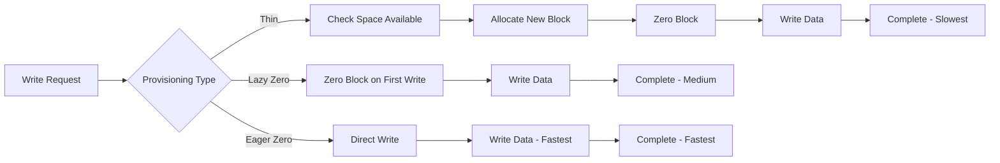

# VMware Disk Provisioning Types: Complete Comparison Guide

When creating virtual machines in VMware environments, choosing the right disk provisioning type is crucial for optimizing storage efficiency, performance, and security. This guide provides a comprehensive comparison of the three main provisioning types available in VMware.

## Overview of Disk Provisioning Types

VMware offers three primary disk provisioning options:

1. **Thin Provisioned**
2. **Thick Provisioned, Lazily Zeroed**
3. **Thick Provisioned, Eagerly Zeroed**

Each type has distinct characteristics that make it suitable for different use cases and requirements.

## Detailed Comparison Table

| Feature                       | Thin Provisioned                                         | Thick Provisioned, Lazily Zeroed                       | Thick Provisioned, Eagerly Zeroed                        |
| ----------------------------- | -------------------------------------------------------- | ------------------------------------------------------ | -------------------------------------------------------- |
| **Storage Efficiency**        | ✅ Best (allocates space as needed)                      | ⚠️ Moderate (pre-allocates space but doesn't zero out) | ❌ Worst (pre-allocates and zeroes out space)            |
| **Performance**               | ⚠️ Can slow down over time due to on-demand allocation   | 👍 Better than thin, but slower on first write         | ✅ Best, since all space is allocated and zeroed upfront |
| **Security (Data Wiping)**    | ❌ No guarantee of old data being wiped                  | ⚠️ Old data remains until overwritten                  | ✅ Fully zeroed, ensuring no residual data               |
| **VM Creation Time**          | ✅ Fastest                                               | ⚠️ Moderate                                            | ❌ Slowest (due to zeroing)                              |
| **Snapshot & Cloning Impact** | ⚠️ Snapshots grow dynamically, consuming space over time | 👍 More predictable than thin                          | 👍 More predictable than thin                            |
| **Disk Space Reclamation**    | ✅ Automatic space reclamation when files deleted        | ❌ No automatic reclamation                            | ❌ No automatic reclamation                              |
| **Storage Overcommit**        | ✅ Allows overcommitment of storage                      | ❌ Prevents overcommitment                             | ❌ Prevents overcommitment                               |
| **I/O Overhead**              | ⚠️ Higher I/O overhead for new block allocation          | 👍 Moderate I/O overhead                               | ✅ Minimal I/O overhead                                  |
| **vMotion Performance**       | ⚠️ May be slower due to sparse files                     | 👍 Good performance                                    | ✅ Best performance                                      |

## Thin Provisioned

### How It Works

- Allocates storage space **on-demand** as the guest OS writes data
- Initially creates a small VMDK file that grows as needed
- Returns unused space to the datastore when files are deleted (with proper tools)

### Advantages

- **Maximum storage efficiency** - only uses space actually needed
- **Fast VM deployment** - minimal initial storage allocation
- **Storage overcommitment** - provision more VMs than physical storage
- **Automatic space reclamation** - can return unused space

### Disadvantages

- **Performance degradation** - slower performance as disk fills up
- **Storage monitoring required** - risk of running out of space
- **Fragmentation** - may lead to disk fragmentation over time
- **No data security** - previous data may still exist on storage blocks

### Best Use Cases

```
✅ Development and testing environments
✅ VDI deployments with many similar desktops
✅ Environments with limited storage
✅ Non-critical workloads
✅ Template VMs and rapid deployment scenarios
```

## Thick Provisioned, Lazily Zeroed

### How It Works

- **Pre-allocates** all storage space at VM creation time
- Does **not zero out** the allocated blocks initially
- Zeros blocks **on first write** by the guest OS

### Advantages

- **Predictable storage usage** - known disk space consumption
- **Better performance than thin** - no need for space allocation during writes
- **Good for capacity planning** - clear storage requirements
- **Faster than eagerly zeroed** - quicker VM creation

### Disadvantages

- **Storage inefficiency** - allocates full disk space even if unused
- **First write penalty** - slower performance on initial writes
- **No space reclamation** - cannot return unused space
- **Security concerns** - old data remains until overwritten

### Best Use Cases

```
✅ Production environments with predictable storage needs
✅ Applications requiring consistent performance
✅ Environments where storage planning is critical
✅ Medium-performance database workloads
✅ Backup and archival systems
```

## Thick Provisioned, Eagerly Zeroed

### How It Works

- **Pre-allocates** all storage space at VM creation time
- **Immediately zeros out** all allocated blocks
- Provides the highest level of security and performance

### Advantages

- **Best performance** - no allocation or zeroing overhead during runtime
- **Maximum security** - all blocks are zeroed, eliminating data remnants
- **Predictable behavior** - consistent performance characteristics
- **Compliance friendly** - meets strict security requirements
- **Optimal for clustering** - best choice for clustered environments

### Disadvantages

- **Longest creation time** - significant time to zero all blocks
- **Storage inefficiency** - uses full allocated space immediately
- **No flexibility** - cannot overcommit storage
- **Resource intensive** - high I/O during creation process

### Best Use Cases

```
✅ High-performance databases (Oracle, SQL Server, MySQL)
✅ Security-sensitive environments
✅ Mission-critical applications
✅ High-IOPS workloads
✅ VMware vSphere clusters (vMotion, HA)
✅ Environments requiring data compliance (HIPAA, PCI-DSS)
✅ Production email servers
✅ ERP systems
```

## Decision Matrix

### Choose **Thin Provisioned** when:

- Storage efficiency is the primary concern
- Working with development/test environments
- Need to maximize VM density
- Storage budget is constrained
- Performance requirements are flexible

### Choose **Thick Provisioned (Lazily Zeroed)** when:

- Need predictable storage usage
- Performance is important but not critical
- Want faster VM creation than eagerly zeroed
- Don't need the highest security level
- Working with standard production workloads

### Choose **Thick Provisioned (Eagerly Zeroed)** when:

- Performance is the top priority
- Security requirements are strict
- Working with mission-critical applications
- Need compliance with data security standards
- Budget allows for premium storage usage
- Using VMware clustering features extensively

## Performance Impact Analysis

### I/O Patterns Comparison



### Performance Benchmarks (Typical Results)

| Operation            | Thin Provisioned | Thick Lazy      | Thick Eager   |
| -------------------- | ---------------- | --------------- | ------------- |
| **VM Creation**      | ~1 minute        | ~5 minutes      | ~20 minutes   |
| **First Boot**       | Normal           | Slower          | Normal        |
| **Sequential Write** | 70-80% baseline  | 85-90% baseline | 100% baseline |
| **Random Write**     | 60-70% baseline  | 80-85% baseline | 100% baseline |
| **vMotion Time**     | +20-30%          | +10-15%         | Baseline      |

## Security Considerations

### Data Remnant Analysis

| Provisioning Type | Data Security Level                      | Compliance Suitability                      |
| ----------------- | ---------------------------------------- | ------------------------------------------- |
| **Thin**          | ⚠️ Low - Previous data may be accessible | ❌ Not suitable for sensitive data          |
| **Thick Lazy**    | ⚠️ Medium - Data cleared on first write  | ⚠️ Limited compliance scenarios             |
| **Thick Eager**   | ✅ High - All blocks zeroed immediately  | ✅ Suitable for all compliance requirements |

### Security Best Practices

1. **For Sensitive Data**: Always use Thick Provisioned, Eagerly Zeroed
2. **Multi-tenant Environments**: Avoid thin provisioning for security isolation
3. **Decommissioning**: Proper disk wiping procedures regardless of provisioning type
4. **Encryption**: Consider vSAN encryption or VM-level encryption for additional security

## Storage Management Best Practices

### Monitoring and Alerts

```bash
# PowerCLI script to monitor thin provisioned disks
Get-VM | Get-HardDisk | Where-Object {$_.StorageFormat -eq "Thin"} |
Select-Object Parent, Name, CapacityGB, @{N="UsedSpaceGB";E={[math]::Round($_.ExtensionData.Summary.Committed/1GB,2)}}
```

### Capacity Planning

1. **Thin Provisioning**: Monitor at 70% utilization, plan for 2-3x overcommit ratio
2. **Thick Provisioning**: Standard 1:1 ratio, plan for growth
3. **Mixed Environments**: Separate storage tiers for different provisioning types

### Migration Strategies

```powershell
# Convert thin to thick eager using PowerCLI
Get-VM "VMName" | Get-HardDisk | Set-HardDisk -StorageFormat EagerZeroedThick -Confirm:$false
```

## Cost Analysis

### Total Cost of Ownership Factors

| Factor                  | Thin    | Thick Lazy | Thick Eager |
| ----------------------- | ------- | ---------- | ----------- |
| **Storage Hardware**    | Lowest  | Medium     | Highest     |
| **Performance Impact**  | Medium  | Low        | Lowest      |
| **Management Overhead** | Highest | Medium     | Lowest      |
| **Backup Storage**      | Lowest  | Medium     | Highest     |

## Conclusion and Recommendations

### Best Overall Recommendation:

- **If you need maximum performance and have adequate storage** → **Thick Provisioned (Eagerly Zeroed)**
- **If you want a balance of performance and space efficiency** → **Thick Provisioned (Lazily Zeroed)**
- **If storage efficiency is critical and performance is flexible** → **Thin Provisioned**

### Enterprise Environment Strategy:

1. **Tier 1 Applications**: Thick Eager
2. **Tier 2 Applications**: Thick Lazy
3. **Development/Test**: Thin Provisioned
4. **VDI**: Thin Provisioned with linked clones
5. **Archive/Backup**: Thick Lazy

The choice ultimately depends on your specific requirements for performance, security, storage efficiency, and budget constraints. Consider implementing a tiered approach using different provisioning types for different workload categories to optimize your VMware environment.
