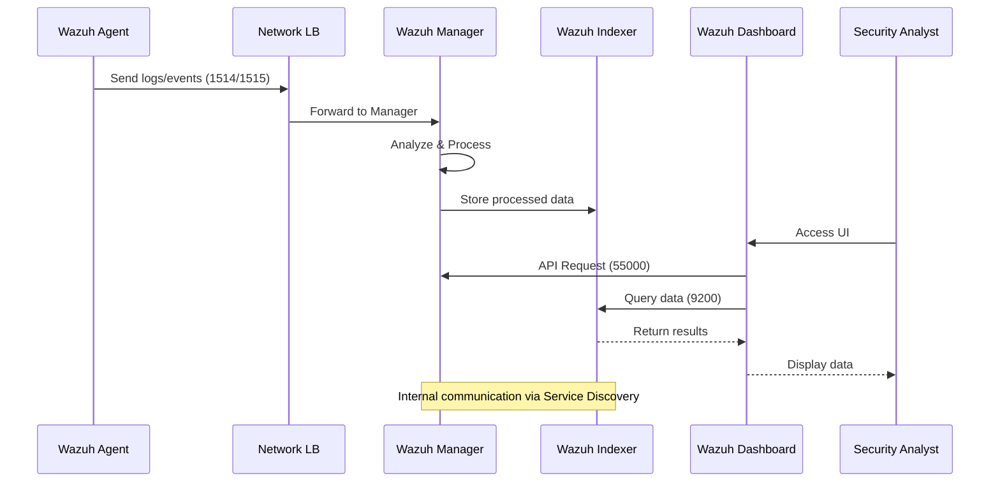
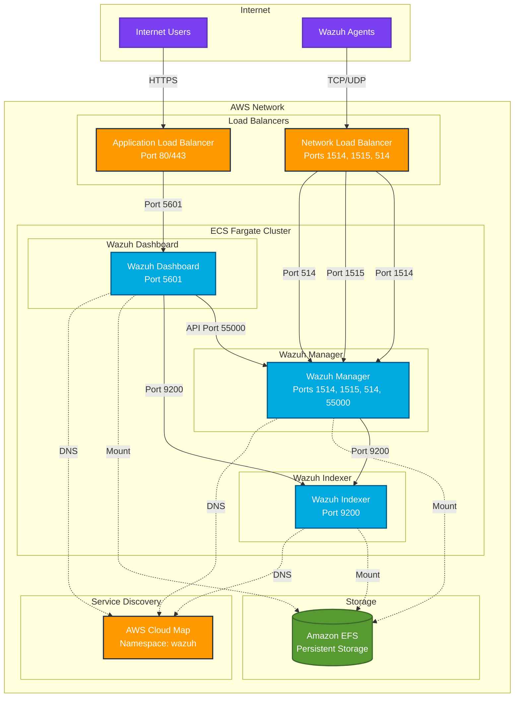
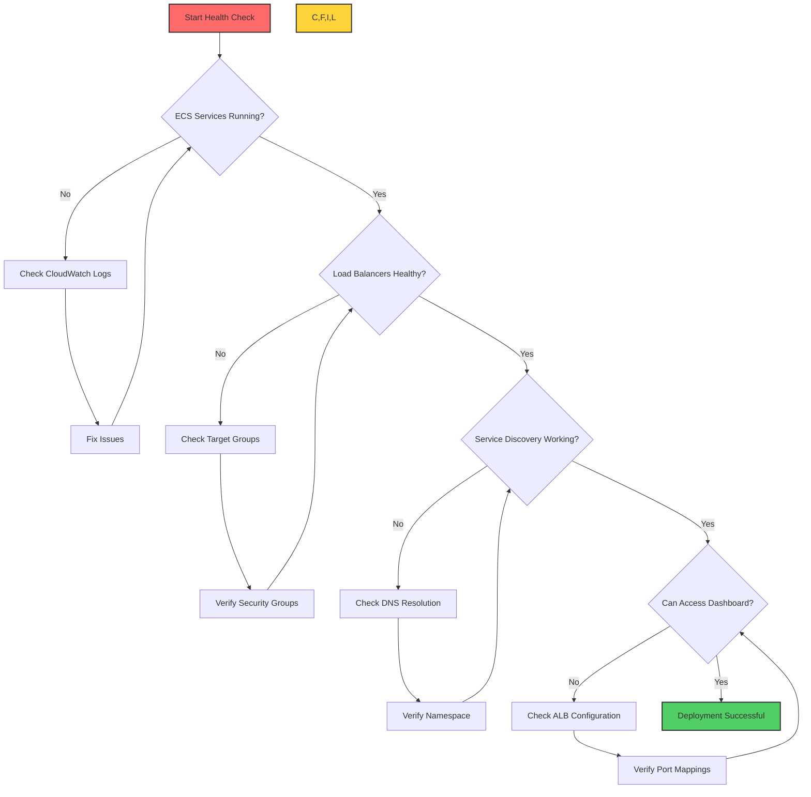
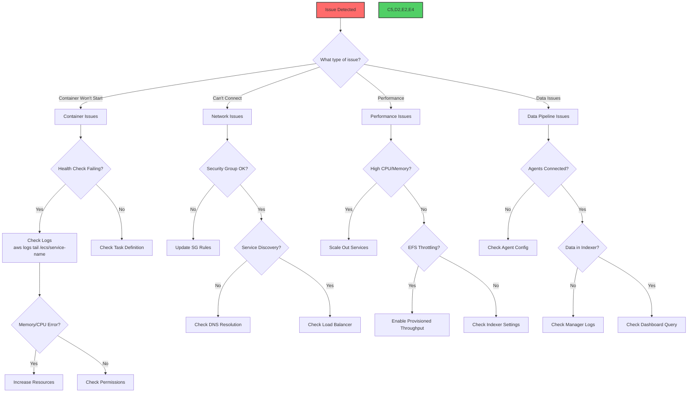
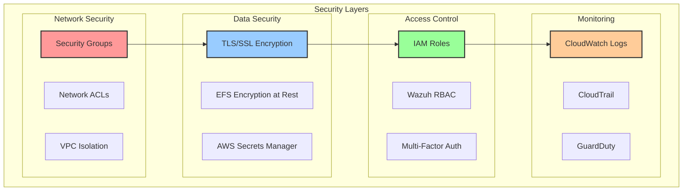
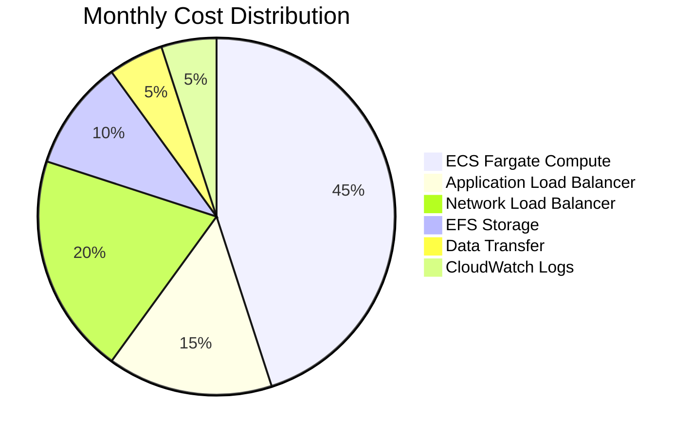
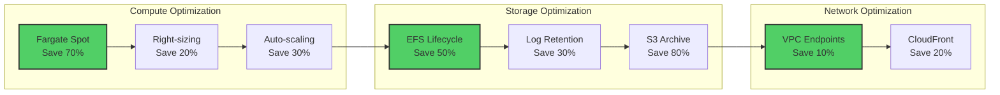

## Table of Contents

## Introduction

Deploying Wazuh on AWS ECS Fargate can be challenging due to its multi-container architecture and complex networking requirements. This comprehensive guide provides a complete, production-ready deployment of Wazuh SIEM (Security Information and Event Management) on AWS ECS Fargate.

Wazuh is an open-source security platform that provides:

- Intrusion detection
- Log data analysis
- File integrity monitoring
- Vulnerability detection
- Configuration assessment
- Incident response
- Regulatory compliance

This guide will deploy:

- **Wazuh Indexer**: Based on OpenSearch, stores and indexes security data
- **Wazuh Manager**: Central component that analyzes data from agents
- **Wazuh Dashboard**: Web interface for visualization and management

### Component Communication Flow



## Prerequisites

Before starting, ensure you have:

1. **AWS Account** with the following permissions:
   - ECS Full Access
   - EC2 (for networking)
   - EFS Access
   - IAM (for roles)
   - CloudWatch Logs
   - Application Load Balancer
   - Service Discovery

2. **AWS CLI** installed and configured:

   ```bash
   aws --version
   aws configure
   ```

3. **Required AWS Resources**:
   - VPC with public and private subnets
   - Internet Gateway attached to VPC
   - NAT Gateway for private subnets (if using private deployment)

4. **Tools**:
   - `jq` for JSON parsing
   - `openssl` for certificate generation
   - Text editor for configuration files

## Architecture Overview

Here's the complete architecture we'll be building:



## Deployment Process Overview

```mermaid
flowchart LR
    subgraph "Phase 1: Infrastructure"
        A[Create VPC & Subnets] --> B[Create ECS Cluster]
        B --> C[Set up EFS Storage]
        C --> D[Generate SSL Certificates]
    end

    subgraph "Phase 2: Networking"
        D --> E[Create Security Groups]
        E --> F[Create Load Balancers]
        F --> G[Set up Service Discovery]
    end

    subgraph "Phase 3: Deployment"
        G --> H[Deploy Wazuh Indexer]
        H --> I[Deploy Wazuh Manager]
        I --> J[Deploy Wazuh Dashboard]
    end

    subgraph "Phase 4: Configuration"
        J --> K[Configure Agents]
        K --> L[Set up Monitoring]
        L --> M[Enable Auto-scaling]
    end

    style A fill:#f9f,stroke:#333,stroke-width:2px
    style M fill:#9f9,stroke:#333,stroke-width:2px
```



## Step 1: Create ECS Fargate Cluster

Let's start by creating the ECS cluster:

```bash
# Create ECS cluster using AWS CLI
aws ecs create-cluster \
  --cluster-name wazuh-prod-cluster \
  --capacity-providers FARGATE FARGATE_SPOT \
  --default-capacity-provider-strategy capacityProvider=FARGATE,weight=1 \
  --region us-west-2

# Verify cluster creation
aws ecs describe-clusters --clusters wazuh-prod-cluster --region us-west-2
```

Or use the AWS Console:

1. Navigate to ECS → Clusters
2. Click "Create Cluster"
3. Choose "Networking only" template
4. Name: `wazuh-prod-cluster`
5. Enable Container Insights
6. Create

## Step 2: Set Up EFS for Persistent Storage

### Create EFS File System

```bash
# Create security group for EFS
aws ec2 create-security-group \
  --group-name wazuh-efs-sg \
  --description "Security group for Wazuh EFS" \
  --vpc-id vpc-xxxxxxxxx \
  --region us-west-2

# Get security group ID
EFS_SG_ID=$(aws ec2 describe-security-groups \
  --group-names wazuh-efs-sg \
  --query 'SecurityGroups[0].GroupId' \
  --output text \
  --region us-west-2)

# Allow NFS traffic from VPC CIDR
aws ec2 authorize-security-group-ingress \
  --group-id $EFS_SG_ID \
  --protocol tcp \
  --port 2049 \
  --cidr 10.0.0.0/16 \
  --region us-west-2

# Create EFS file system
aws efs create-file-system \
  --creation-token wazuh-efs \
  --performance-mode generalPurpose \
  --throughput-mode bursting \
  --encrypted \
  --tags Key=Name,Value=wazuh-efs \
  --region us-west-2

# Get EFS ID
EFS_ID=$(aws efs describe-file-systems \
  --creation-token wazuh-efs \
  --query 'FileSystems[0].FileSystemId' \
  --output text \
  --region us-west-2)

echo "EFS ID: $EFS_ID"

# Create mount targets for each subnet
SUBNET_IDS=$(aws ec2 describe-subnets \
  --filters "Name=vpc-id,Values=vpc-xxxxxxxxx" \
  --query 'Subnets[*].SubnetId' \
  --output text \
  --region us-west-2)

for subnet in $SUBNET_IDS; do
  aws efs create-mount-target \
    --file-system-id $EFS_ID \
    --subnet-id $subnet \
    --security-groups $EFS_SG_ID \
    --region us-west-2
done
```

### Prepare EFS Directories

To create the required directories, we need to mount EFS temporarily on an EC2 instance:

```bash
# Launch a temporary EC2 instance in the same VPC
aws ec2 run-instances \
  --image-id ami-0c94855ba95c71c0a \
  --instance-type t3.micro \
  --key-name your-key-pair \
  --security-group-ids $EFS_SG_ID \
  --subnet-id subnet-xxxxxxxxx \
  --tag-specifications 'ResourceType=instance,Tags=[{Key=Name,Value=wazuh-efs-setup}]' \
  --region us-west-2

# SSH into the instance and run:
sudo yum install -y amazon-efs-utils
sudo mkdir /efs
sudo mount -t efs $EFS_ID:/ /efs

# Create all required directories
sudo mkdir -p /efs/{filebeat_etc,wazuh-indexer-data,wazuh_etc,wazuh_var_multigroups,filebeat_var,wazuh_active_response,wazuh_integrations,wazuh_wodles,wazuh-dashboard-config,wazuh_agentless,wazuh_logs,wazuh-dashboard-custom,wazuh_api_configuration,wazuh_queue}

# Set proper permissions
sudo chmod -R 755 /efs
sudo chown -R 1000:1000 /efs/wazuh-indexer-data
sudo chown -R 999:999 /efs/wazuh_*
sudo chown -R 1000:1000 /efs/wazuh-dashboard-*

# Create initial certificate files (we'll update these later)
sudo mkdir -p /efs/wazuh_etc/ssl
sudo mkdir -p /efs/filebeat_etc/ssl

# Unmount and terminate instance when done
sudo umount /efs
```

## Step 3: Generate SSL/TLS Certificates

Before creating task definitions, we need to generate SSL certificates for secure communication between components.

### Create Certificate Generation Script

Create a file named `generate-wazuh-certs.sh`:

```bash
#!/bin/bash
# generate-wazuh-certs.sh

# Variables
CERT_DIR="./wazuh-certificates"
DAYS_VALID=3650

# Create certificate directory
mkdir -p $CERT_DIR
cd $CERT_DIR

# Generate Root CA private key
openssl genrsa -out root-ca.key 2048

# Generate Root CA certificate
openssl req -new -x509 -days $DAYS_VALID -key root-ca.key -out root-ca.pem -subj "/C=US/ST=CA/L=California/O=Wazuh/OU=Security/CN=Wazuh Root CA"

# Generate admin certificate
openssl genrsa -out admin.key 2048
openssl req -new -key admin.key -out admin.csr -subj "/C=US/ST=CA/L=California/O=Wazuh/OU=Security/CN=admin"
openssl x509 -req -in admin.csr -CA root-ca.pem -CAkey root-ca.key -CAcreateserial -out admin.pem -days $DAYS_VALID

# Generate node certificates
for node in wazuh-indexer wazuh-manager filebeat wazuh-dashboard; do
    openssl genrsa -out ${node}.key 2048
    openssl req -new -key ${node}.key -out ${node}.csr -subj "/C=US/ST=CA/L=California/O=Wazuh/OU=Security/CN=${node}.wazuh"

    # Create extensions file for SAN
    cat > ${node}.ext <<EOF
subjectAltName = DNS:${node}.wazuh, DNS:${node}, DNS:localhost, IP:127.0.0.1
EOF

    openssl x509 -req -in ${node}.csr -CA root-ca.pem -CAkey root-ca.key -CAcreateserial -out ${node}.pem -days $DAYS_VALID -extfile ${node}.ext
    rm ${node}.ext ${node}.csr
done

# Create kibanaserver certificate
openssl genrsa -out kibanaserver.key 2048
openssl req -new -key kibanaserver.key -out kibanaserver.csr -subj "/C=US/ST=CA/L=California/O=Wazuh/OU=Security/CN=kibanaserver"
openssl x509 -req -in kibanaserver.csr -CA root-ca.pem -CAkey root-ca.key -CAcreateserial -out kibanaserver.pem -days $DAYS_VALID

echo "Certificates generated successfully in $CERT_DIR"
ls -la $CERT_DIR
```

Run the script:

```bash
chmod +x generate-wazuh-certs.sh
./generate-wazuh-certs.sh
```

### Upload Certificates to EFS

```bash
# Mount EFS on temporary instance again and copy certificates
sudo mount -t efs $EFS_ID:/ /efs

# Copy certificates to appropriate directories
sudo cp wazuh-certificates/root-ca.pem /efs/wazuh_etc/ssl/
sudo cp wazuh-certificates/wazuh-manager.* /efs/wazuh_etc/ssl/
sudo cp wazuh-certificates/filebeat.* /efs/filebeat_etc/ssl/
sudo cp wazuh-certificates/root-ca.pem /efs/filebeat_etc/ssl/
sudo cp wazuh-certificates/admin.* /efs/wazuh-indexer-data/

# Set permissions
sudo chmod 400 /efs/wazuh_etc/ssl/*
sudo chmod 400 /efs/filebeat_etc/ssl/*
```

## Step 4: Create Security Groups

### Create Security Groups for Each Service

```bash
# Create security group for ECS tasks
aws ec2 create-security-group \
  --group-name wazuh-ecs-sg \
  --description "Security group for Wazuh ECS tasks" \
  --vpc-id vpc-xxxxxxxxx \
  --region us-west-2

ECS_SG_ID=$(aws ec2 describe-security-groups \
  --group-names wazuh-ecs-sg \
  --query 'SecurityGroups[0].GroupId' \
  --output text \
  --region us-west-2)

# Configure security group rules
# Wazuh Indexer
aws ec2 authorize-security-group-ingress \
  --group-id $ECS_SG_ID \
  --protocol tcp \
  --port 9200 \
  --source-group $ECS_SG_ID \
  --region us-west-2

# Wazuh Manager API
aws ec2 authorize-security-group-ingress \
  --group-id $ECS_SG_ID \
  --protocol tcp \
  --port 55000 \
  --source-group $ECS_SG_ID \
  --region us-west-2

# Wazuh Manager - Agent registration
aws ec2 authorize-security-group-ingress \
  --group-id $ECS_SG_ID \
  --protocol tcp \
  --port 1514 \
  --cidr 0.0.0.0/0 \
  --region us-west-2

# Wazuh Manager - Agent communication
aws ec2 authorize-security-group-ingress \
  --group-id $ECS_SG_ID \
  --protocol tcp \
  --port 1515 \
  --cidr 0.0.0.0/0 \
  --region us-west-2

# Syslog
aws ec2 authorize-security-group-ingress \
  --group-id $ECS_SG_ID \
  --protocol udp \
  --port 514 \
  --cidr 0.0.0.0/0 \
  --region us-west-2

# Wazuh Dashboard
aws ec2 authorize-security-group-ingress \
  --group-id $ECS_SG_ID \
  --protocol tcp \
  --port 5601 \
  --cidr 0.0.0.0/0 \
  --region us-west-2
```

## Step 5: Create IAM Execution Role

```bash
# Create IAM policy for ECS task execution
cat > ecs-task-execution-policy.json <<EOF
{
    "Version": "2012-10-17",
    "Statement": [
        {
            "Effect": "Allow",
            "Action": [
                "ecr:GetAuthorizationToken",
                "ecr:BatchCheckLayerAvailability",
                "ecr:GetDownloadUrlForLayer",
                "ecr:BatchGetImage",
                "logs:CreateLogStream",
                "logs:PutLogEvents",
                "logs:CreateLogGroup"
            ],
            "Resource": "*"
        }
    ]
}
EOF

# Create IAM role
aws iam create-role \
  --role-name ecsTaskExecutionRole \
  --assume-role-policy-document '{
    "Version": "2012-10-17",
    "Statement": [
      {
        "Effect": "Allow",
        "Principal": {
          "Service": "ecs-tasks.amazonaws.com"
        },
        "Action": "sts:AssumeRole"
      }
    ]
  }' \
  --region us-west-2

# Attach policy
aws iam attach-role-policy \
  --role-name ecsTaskExecutionRole \
  --policy-arn arn:aws:iam::aws:policy/service-role/AmazonECSTaskExecutionRolePolicy \
  --region us-west-2
```

## Step 6: Create Task Definitions

### Wazuh Indexer Task Definition

Create a file named `wazuh-indexer-task-definition.json`:

```json
{
  "family": "wazuh-prod-indexer",
  "containerDefinitions": [
    {
      "name": "wazuh-indexer",
      "image": "wazuh/wazuh-indexer:4.8.0",
      "cpu": 0,
      "portMappings": [
        {
          "name": "wazuh-indexer",
          "containerPort": 9200,
          "hostPort": 9200,
          "protocol": "tcp",
          "appProtocol": "http"
        }
      ],
      "essential": true,
      "environment": [
        {
          "name": "OPENSEARCH_JAVA_OPTS",
          "value": "-Xms2g -Xmx2g"
        },
        {
          "name": "bootstrap.memory_lock",
          "value": "true"
        },
        {
          "name": "discovery.type",
          "value": "single-node"
        },
        {
          "name": "cluster.name",
          "value": "wazuh-cluster"
        },
        {
          "name": "node.name",
          "value": "wazuh-indexer"
        },
        {
          "name": "network.host",
          "value": "0.0.0.0"
        },
        {
          "name": "DISABLE_SECURITY_PLUGIN",
          "value": "false"
        }
      ],
      "environmentFiles": [],
      "mountPoints": [
        {
          "sourceVolume": "wazuh-indexer-data",
          "containerPath": "/var/lib/wazuh-indexer",
          "readOnly": false
        },
        {
          "sourceVolume": "wazuh-indexer-certs",
          "containerPath": "/usr/share/wazuh-indexer/config/certs",
          "readOnly": true
        }
      ],
      "volumesFrom": [],
      "ulimits": [
        {
          "name": "memlock",
          "softLimit": -1,
          "hardLimit": -1
        },
        {
          "name": "nofile",
          "softLimit": 65536,
          "hardLimit": 65536
        }
      ],
      "logConfiguration": {
        "logDriver": "awslogs",
        "options": {
          "awslogs-group": "/ecs/wazuh-prod-indexer",
          "mode": "non-blocking",
          "awslogs-create-group": "true",
          "max-buffer-size": "25m",
          "awslogs-region": "us-west-2",
          "awslogs-stream-prefix": "ecs"
        },
        "secretOptions": []
      },
      "healthCheck": {
        "command": [
          "CMD-SHELL",
          "curl -k -u admin:SecretPassword https://localhost:9200/_cluster/health || exit 1"
        ],
        "interval": 30,
        "timeout": 10,
        "retries": 5,
        "startPeriod": 120
      },
      "systemControls": []
    }
  ],
  "taskRoleArn": "arn:aws:iam::ACCOUNT_ID:role/ecsTaskExecutionRole",
  "executionRoleArn": "arn:aws:iam::ACCOUNT_ID:role/ecsTaskExecutionRole",
  "networkMode": "awsvpc",
  "volumes": [
    {
      "name": "wazuh-indexer-data",
      "efsVolumeConfiguration": {
        "fileSystemId": "fs-XXXXXXXXX",
        "rootDirectory": "/wazuh-indexer-data",
        "transitEncryption": "ENABLED",
        "authorizationConfig": {
          "accessPointId": "",
          "iam": "DISABLED"
        }
      }
    },
    {
      "name": "wazuh-indexer-certs",
      "efsVolumeConfiguration": {
        "fileSystemId": "fs-XXXXXXXXX",
        "rootDirectory": "/wazuh_etc/ssl",
        "transitEncryption": "ENABLED"
      }
    }
  ],
  "placementConstraints": [],
  "requiresCompatibilities": ["FARGATE"],
  "cpu": "4096",
  "memory": "8192",
  "runtimePlatform": {
    "cpuArchitecture": "X86_64",
    "operatingSystemFamily": "LINUX"
  },
  "enableFaultInjection": false
}
```

Register the task definition:

```bash
# Replace ACCOUNT_ID and fs-XXXXXXXXX with your values
sed -i 's/ACCOUNT_ID/YOUR_ACCOUNT_ID/g' wazuh-indexer-task-definition.json
sed -i 's/fs-XXXXXXXXX/YOUR_EFS_ID/g' wazuh-indexer-task-definition.json

aws ecs register-task-definition \
  --cli-input-json file://wazuh-indexer-task-definition.json \
  --region us-west-2
```

### Wazuh Manager Task Definition

Create a file named `wazuh-manager-task-definition.json`:

```json
{
  "family": "wazuh-prod-manager",
  "containerDefinitions": [
    {
      "name": "wazuh-manager",
      "image": "wazuh/wazuh-manager:4.8.0",
      "cpu": 0,
      "portMappings": [
        {
          "name": "1514-tcp",
          "containerPort": 1514,
          "hostPort": 1514,
          "protocol": "tcp",
          "appProtocol": "http"
        },
        {
          "name": "1515-tcp",
          "containerPort": 1515,
          "hostPort": 1515,
          "protocol": "tcp",
          "appProtocol": "http"
        },
        {
          "name": "514-udp",
          "containerPort": 514,
          "hostPort": 514,
          "protocol": "udp"
        },
        {
          "name": "55000-tcp",
          "containerPort": 55000,
          "hostPort": 55000,
          "protocol": "tcp",
          "appProtocol": "http"
        }
      ],
      "essential": true,
      "environment": [
        {
          "name": "INDEXER_URL",
          "value": "https://wazuh-indexer.wazuh:9200"
        },
        {
          "name": "INDEXER_USERNAME",
          "value": "admin"
        },
        {
          "name": "INDEXER_PASSWORD",
          "value": "SecretPassword"
        },
        {
          "name": "FILEBEAT_SSL_VERIFICATION_MODE",
          "value": "full"
        },
        {
          "name": "SSL_CERTIFICATE_AUTHORITIES",
          "value": "/etc/ssl/root-ca.pem"
        },
        {
          "name": "SSL_CERTIFICATE",
          "value": "/etc/ssl/filebeat.pem"
        },
        {
          "name": "SSL_KEY",
          "value": "/etc/ssl/filebeat.key"
        },
        {
          "name": "API_USERNAME",
          "value": "wazuh-wui"
        },
        {
          "name": "API_PASSWORD",
          "value": "MyS3cr37P450r.*-"
        }
      ],
      "environmentFiles": [],
      "mountPoints": [
        {
          "sourceVolume": "wazuh_api_configuration",
          "containerPath": "/var/ossec/api/configuration",
          "readOnly": false
        },
        {
          "sourceVolume": "wazuh_etc",
          "containerPath": "/var/ossec/etc",
          "readOnly": false
        },
        {
          "sourceVolume": "wazuh_logs",
          "containerPath": "/var/ossec/logs",
          "readOnly": false
        },
        {
          "sourceVolume": "wazuh_queue",
          "containerPath": "/var/ossec/queue",
          "readOnly": false
        },
        {
          "sourceVolume": "wazuh_var_multigroups",
          "containerPath": "/var/ossec/var/multigroups",
          "readOnly": false
        },
        {
          "sourceVolume": "wazuh_integrations",
          "containerPath": "/var/ossec/integrations",
          "readOnly": false
        },
        {
          "sourceVolume": "wazuh_active_response",
          "containerPath": "/var/ossec/active-response/bin",
          "readOnly": false
        },
        {
          "sourceVolume": "wazuh_agentless",
          "containerPath": "/var/ossec/agentless",
          "readOnly": false
        },
        {
          "sourceVolume": "wazuh_wodles",
          "containerPath": "/var/ossec/wodles",
          "readOnly": false
        },
        {
          "sourceVolume": "filebeat_etc",
          "containerPath": "/etc/filebeat",
          "readOnly": false
        },
        {
          "sourceVolume": "filebeat_var",
          "containerPath": "/var/lib/filebeat",
          "readOnly": false
        }
      ],
      "volumesFrom": [],
      "logConfiguration": {
        "logDriver": "awslogs",
        "options": {
          "awslogs-group": "/ecs/wazuh-prod-manager",
          "mode": "non-blocking",
          "awslogs-create-group": "true",
          "max-buffer-size": "25m",
          "awslogs-region": "us-west-2",
          "awslogs-stream-prefix": "ecs"
        }
      },
      "healthCheck": {
        "command": ["CMD", "/var/ossec/bin/wazuh-control", "status"],
        "interval": 30,
        "timeout": 10,
        "retries": 5,
        "startPeriod": 300
      },
      "systemControls": []
    }
  ],
  "taskRoleArn": "arn:aws:iam::ACCOUNT_ID:role/ecsTaskExecutionRole",
  "executionRoleArn": "arn:aws:iam::ACCOUNT_ID:role/ecsTaskExecutionRole",
  "networkMode": "awsvpc",
  "volumes": [
    {
      "name": "wazuh_api_configuration",
      "efsVolumeConfiguration": {
        "fileSystemId": "fs-XXXXXXXXX",
        "rootDirectory": "/wazuh_api_configuration",
        "transitEncryption": "ENABLED"
      }
    },
    {
      "name": "wazuh_etc",
      "efsVolumeConfiguration": {
        "fileSystemId": "fs-XXXXXXXXX",
        "rootDirectory": "/wazuh_etc",
        "transitEncryption": "ENABLED"
      }
    },
    {
      "name": "wazuh_logs",
      "efsVolumeConfiguration": {
        "fileSystemId": "fs-XXXXXXXXX",
        "rootDirectory": "/wazuh_logs",
        "transitEncryption": "ENABLED"
      }
    },
    {
      "name": "wazuh_queue",
      "efsVolumeConfiguration": {
        "fileSystemId": "fs-XXXXXXXXX",
        "rootDirectory": "/wazuh_queue",
        "transitEncryption": "ENABLED"
      }
    },
    {
      "name": "wazuh_var_multigroups",
      "efsVolumeConfiguration": {
        "fileSystemId": "fs-XXXXXXXXX",
        "rootDirectory": "/wazuh_var_multigroups",
        "transitEncryption": "ENABLED"
      }
    },
    {
      "name": "wazuh_integrations",
      "efsVolumeConfiguration": {
        "fileSystemId": "fs-XXXXXXXXX",
        "rootDirectory": "/wazuh_integrations",
        "transitEncryption": "ENABLED"
      }
    },
    {
      "name": "wazuh_active_response",
      "efsVolumeConfiguration": {
        "fileSystemId": "fs-XXXXXXXXX",
        "rootDirectory": "/wazuh_active_response",
        "transitEncryption": "ENABLED"
      }
    },
    {
      "name": "wazuh_agentless",
      "efsVolumeConfiguration": {
        "fileSystemId": "fs-XXXXXXXXX",
        "rootDirectory": "/wazuh_agentless",
        "transitEncryption": "ENABLED"
      }
    },
    {
      "name": "wazuh_wodles",
      "efsVolumeConfiguration": {
        "fileSystemId": "fs-XXXXXXXXX",
        "rootDirectory": "/wazuh_wodles",
        "transitEncryption": "ENABLED"
      }
    },
    {
      "name": "filebeat_etc",
      "efsVolumeConfiguration": {
        "fileSystemId": "fs-XXXXXXXXX",
        "rootDirectory": "/filebeat_etc",
        "transitEncryption": "ENABLED"
      }
    },
    {
      "name": "filebeat_var",
      "efsVolumeConfiguration": {
        "fileSystemId": "fs-XXXXXXXXX",
        "rootDirectory": "/filebeat_var",
        "transitEncryption": "ENABLED"
      }
    }
  ],
  "placementConstraints": [],
  "requiresCompatibilities": ["FARGATE"],
  "cpu": "2048",
  "memory": "4096",
  "runtimePlatform": {
    "cpuArchitecture": "X86_64",
    "operatingSystemFamily": "LINUX"
  },
  "enableFaultInjection": false
}
```

Register the task definition:

```bash
# Replace values and register
sed -i 's/ACCOUNT_ID/YOUR_ACCOUNT_ID/g' wazuh-manager-task-definition.json
sed -i 's/fs-XXXXXXXXX/YOUR_EFS_ID/g' wazuh-manager-task-definition.json

aws ecs register-task-definition \
  --cli-input-json file://wazuh-manager-task-definition.json \
  --region us-west-2
```

### Wazuh Dashboard Task Definition

Create a file named `wazuh-dashboard-task-definition.json`:

```json
{
  "family": "wazuh-prod-dashboard",
  "containerDefinitions": [
    {
      "name": "wazuh-dashboard",
      "image": "wazuh/wazuh-dashboard:4.8.0",
      "cpu": 0,
      "portMappings": [
        {
          "name": "5601-tcp",
          "containerPort": 5601,
          "hostPort": 5601,
          "protocol": "tcp",
          "appProtocol": "http"
        }
      ],
      "essential": true,
      "environment": [
        {
          "name": "INDEXER_USERNAME",
          "value": "admin"
        },
        {
          "name": "INDEXER_PASSWORD",
          "value": "SecretPassword"
        },
        {
          "name": "WAZUH_API_URL",
          "value": "https://wazuh-manager.wazuh"
        },
        {
          "name": "API_USERNAME",
          "value": "wazuh-wui"
        },
        {
          "name": "API_PASSWORD",
          "value": "MyS3cr37P450r.*-"
        },
        {
          "name": "DASHBOARD_USERNAME",
          "value": "kibanaserver"
        },
        {
          "name": "DASHBOARD_PASSWORD",
          "value": "kibanaserver"
        },
        {
          "name": "SERVER_HOST",
          "value": "0.0.0.0"
        },
        {
          "name": "OPENSEARCH_HOSTS",
          "value": "https://wazuh-indexer.wazuh:9200"
        }
      ],
      "environmentFiles": [],
      "mountPoints": [
        {
          "sourceVolume": "wazuh-dashboard-config",
          "containerPath": "/usr/share/wazuh-dashboard/data/wazuh/config",
          "readOnly": false
        },
        {
          "sourceVolume": "wazuh-dashboard-custom",
          "containerPath": "/usr/share/wazuh-dashboard/plugins/wazuh/public/assets/custom",
          "readOnly": false
        }
      ],
      "volumesFrom": [],
      "ulimits": [],
      "logConfiguration": {
        "logDriver": "awslogs",
        "options": {
          "awslogs-group": "/ecs/wazuh-prod-dashboard",
          "mode": "non-blocking",
          "awslogs-create-group": "true",
          "max-buffer-size": "25m",
          "awslogs-region": "us-west-2",
          "awslogs-stream-prefix": "ecs"
        },
        "secretOptions": []
      },
      "healthCheck": {
        "command": [
          "CMD-SHELL",
          "curl -s http://localhost:5601/api/status | grep -q '\"state\":\"green\"' || exit 1"
        ],
        "interval": 30,
        "timeout": 10,
        "retries": 5,
        "startPeriod": 300
      },
      "systemControls": []
    }
  ],
  "taskRoleArn": "arn:aws:iam::ACCOUNT_ID:role/ecsTaskExecutionRole",
  "executionRoleArn": "arn:aws:iam::ACCOUNT_ID:role/ecsTaskExecutionRole",
  "networkMode": "awsvpc",
  "volumes": [
    {
      "name": "wazuh-dashboard-config",
      "efsVolumeConfiguration": {
        "fileSystemId": "fs-XXXXXXXXX",
        "rootDirectory": "/wazuh-dashboard-config",
        "transitEncryption": "ENABLED"
      }
    },
    {
      "name": "wazuh-dashboard-custom",
      "efsVolumeConfiguration": {
        "fileSystemId": "fs-XXXXXXXXX",
        "rootDirectory": "/wazuh-dashboard-custom",
        "transitEncryption": "ENABLED"
      }
    }
  ],
  "placementConstraints": [],
  "requiresCompatibilities": ["FARGATE"],
  "cpu": "2048",
  "memory": "4096",
  "runtimePlatform": {
    "cpuArchitecture": "X86_64",
    "operatingSystemFamily": "LINUX"
  },
  "enableFaultInjection": false
}
```

Register the task definition:

```bash
# Replace values and register
sed -i 's/ACCOUNT_ID/YOUR_ACCOUNT_ID/g' wazuh-dashboard-task-definition.json
sed -i 's/fs-XXXXXXXXX/YOUR_EFS_ID/g' wazuh-dashboard-task-definition.json

aws ecs register-task-definition \
  --cli-input-json file://wazuh-dashboard-task-definition.json \
  --region us-west-2
```

## Step 7: Create Load Balancers

### Create Application Load Balancer (ALB)

```bash
# Create ALB for HTTP/HTTPS traffic
aws elbv2 create-load-balancer \
  --name wazuh-alb \
  --subnets subnet-xxxxx subnet-yyyyy \
  --security-groups $ECS_SG_ID \
  --region us-west-2

# Get ALB ARN
ALB_ARN=$(aws elbv2 describe-load-balancers \
  --names wazuh-alb \
  --query 'LoadBalancers[0].LoadBalancerArn' \
  --output text \
  --region us-west-2)

# Create target group for Wazuh Dashboard
aws elbv2 create-target-group \
  --name wazuh-dashboard-tg \
  --protocol HTTP \
  --port 5601 \
  --vpc-id vpc-xxxxxxxxx \
  --target-type ip \
  --health-check-path /api/status \
  --health-check-interval-seconds 30 \
  --health-check-timeout-seconds 10 \
  --healthy-threshold-count 3 \
  --unhealthy-threshold-count 2 \
  --region us-west-2

# Create listener for ALB
aws elbv2 create-listener \
  --load-balancer-arn $ALB_ARN \
  --protocol HTTP \
  --port 80 \
  --default-actions Type=forward,TargetGroupArn=$(aws elbv2 describe-target-groups --names wazuh-dashboard-tg --query 'TargetGroups[0].TargetGroupArn' --output text --region us-west-2) \
  --region us-west-2
```

### Create Network Load Balancer (NLB)

```bash
# Create NLB for TCP/UDP traffic
aws elbv2 create-load-balancer \
  --name wazuh-nlb \
  --subnets subnet-xxxxx subnet-yyyyy \
  --type network \
  --scheme internet-facing \
  --region us-west-2

# Get NLB ARN
NLB_ARN=$(aws elbv2 describe-load-balancers \
  --names wazuh-nlb \
  --query 'LoadBalancers[0].LoadBalancerArn' \
  --output text \
  --region us-west-2)

# Create target groups for Wazuh Manager
# Target group for agent registration (1514)
aws elbv2 create-target-group \
  --name wazuh-manager-1514-tg \
  --protocol TCP \
  --port 1514 \
  --vpc-id vpc-xxxxxxxxx \
  --target-type ip \
  --health-check-protocol TCP \
  --health-check-port 1514 \
  --region us-west-2

# Target group for agent communication (1515)
aws elbv2 create-target-group \
  --name wazuh-manager-1515-tg \
  --protocol TCP \
  --port 1515 \
  --vpc-id vpc-xxxxxxxxx \
  --target-type ip \
  --health-check-protocol TCP \
  --health-check-port 1515 \
  --region us-west-2

# Target group for syslog (514)
aws elbv2 create-target-group \
  --name wazuh-manager-514-tg \
  --protocol UDP \
  --port 514 \
  --vpc-id vpc-xxxxxxxxx \
  --target-type ip \
  --region us-west-2

# Create listeners for NLB
# Listener for 1514
aws elbv2 create-listener \
  --load-balancer-arn $NLB_ARN \
  --protocol TCP \
  --port 1514 \
  --default-actions Type=forward,TargetGroupArn=$(aws elbv2 describe-target-groups --names wazuh-manager-1514-tg --query 'TargetGroups[0].TargetGroupArn' --output text --region us-west-2) \
  --region us-west-2

# Listener for 1515
aws elbv2 create-listener \
  --load-balancer-arn $NLB_ARN \
  --protocol TCP \
  --port 1515 \
  --default-actions Type=forward,TargetGroupArn=$(aws elbv2 describe-target-groups --names wazuh-manager-1515-tg --query 'TargetGroups[0].TargetGroupArn' --output text --region us-west-2) \
  --region us-west-2

# Listener for 514 UDP
aws elbv2 create-listener \
  --load-balancer-arn $NLB_ARN \
  --protocol UDP \
  --port 514 \
  --default-actions Type=forward,TargetGroupArn=$(aws elbv2 describe-target-groups --names wazuh-manager-514-tg --query 'TargetGroups[0].TargetGroupArn' --output text --region us-west-2) \
  --region us-west-2
```

## Step 8: Create Service Discovery Namespace

```bash
# Create private DNS namespace
aws servicediscovery create-private-dns-namespace \
  --name wazuh \
  --vpc vpc-xxxxxxxxx \
  --region us-west-2

# Get namespace ID
NAMESPACE_ID=$(aws servicediscovery list-namespaces \
  --filters Name=NAME,Values=wazuh \
  --query 'Namespaces[0].Id' \
  --output text \
  --region us-west-2)
```

## Step 9: Create ECS Services

### Deploy Wazuh Indexer Service

```bash
# Create service discovery service for indexer
aws servicediscovery create-service \
  --name wazuh-indexer \
  --namespace-id $NAMESPACE_ID \
  --dns-config "NamespaceId=$NAMESPACE_ID,DnsRecords=[{Type=A,TTL=10}]" \
  --region us-west-2

# Get service discovery ARN
SD_INDEXER_ARN=$(aws servicediscovery list-services \
  --filters Name=NAMESPACE_ID,Values=$NAMESPACE_ID \
  --query "Services[?Name=='wazuh-indexer'].Arn | [0]" \
  --output text \
  --region us-west-2)

# Create ECS service for Wazuh Indexer
aws ecs create-service \
  --cluster wazuh-prod-cluster \
  --service-name wazuh-indexer \
  --task-definition wazuh-prod-indexer:1 \
  --desired-count 1 \
  --launch-type FARGATE \
  --network-configuration "awsvpcConfiguration={subnets=[subnet-xxxxx,subnet-yyyyy],securityGroups=[$ECS_SG_ID],assignPublicIp=ENABLED}" \
  --service-registries "registryArn=$SD_INDEXER_ARN" \
  --region us-west-2
```

Wait for the indexer to be healthy before proceeding:

```bash
# Check service status
aws ecs describe-services \
  --cluster wazuh-prod-cluster \
  --services wazuh-indexer \
  --query 'services[0].runningCount' \
  --region us-west-2
```

### Deploy Wazuh Manager Service

```bash
# Create service discovery service for manager
aws servicediscovery create-service \
  --name wazuh-manager \
  --namespace-id $NAMESPACE_ID \
  --dns-config "NamespaceId=$NAMESPACE_ID,DnsRecords=[{Type=A,TTL=10}]" \
  --region us-west-2

# Get service discovery ARN
SD_MANAGER_ARN=$(aws servicediscovery list-services \
  --filters Name=NAMESPACE_ID,Values=$NAMESPACE_ID \
  --query "Services[?Name=='wazuh-manager'].Arn | [0]" \
  --output text \
  --region us-west-2)

# Get target group ARNs
TG_1514_ARN=$(aws elbv2 describe-target-groups \
  --names wazuh-manager-1514-tg \
  --query 'TargetGroups[0].TargetGroupArn' \
  --output text \
  --region us-west-2)

TG_1515_ARN=$(aws elbv2 describe-target-groups \
  --names wazuh-manager-1515-tg \
  --query 'TargetGroups[0].TargetGroupArn' \
  --output text \
  --region us-west-2)

TG_514_ARN=$(aws elbv2 describe-target-groups \
  --names wazuh-manager-514-tg \
  --query 'TargetGroups[0].TargetGroupArn' \
  --output text \
  --region us-west-2)
```

Create the ECS service with multiple load balancers:

```bash
# Create the service with all load balancers
aws ecs create-service \
  --cluster wazuh-prod-cluster \
  --service-name wazuh-manager \
  --task-definition wazuh-prod-manager:1 \
  --desired-count 1 \
  --launch-type FARGATE \
  --network-configuration "awsvpcConfiguration={subnets=[subnet-xxxxx,subnet-yyyyy],securityGroups=[$ECS_SG_ID],assignPublicIp=ENABLED}" \
  --load-balancers "[
    {
      \"targetGroupArn\": \"$TG_1514_ARN\",
      \"containerName\": \"wazuh-manager\",
      \"containerPort\": 1514
    },
    {
      \"targetGroupArn\": \"$TG_1515_ARN\",
      \"containerName\": \"wazuh-manager\",
      \"containerPort\": 1515
    },
    {
      \"targetGroupArn\": \"$TG_514_ARN\",
      \"containerName\": \"wazuh-manager\",
      \"containerPort\": 514
    }
  ]" \
  --service-registries "registryArn=$SD_MANAGER_ARN" \
  --region us-west-2
```

### Deploy Wazuh Dashboard Service

```bash
# Create service discovery service for dashboard
aws servicediscovery create-service \
  --name wazuh-dashboard \
  --namespace-id $NAMESPACE_ID \
  --dns-config "NamespaceId=$NAMESPACE_ID,DnsRecords=[{Type=A,TTL=10}]" \
  --region us-west-2

# Get service discovery ARN
SD_DASHBOARD_ARN=$(aws servicediscovery list-services \
  --filters Name=NAMESPACE_ID,Values=$NAMESPACE_ID \
  --query "Services[?Name=='wazuh-dashboard'].Arn | [0]" \
  --output text \
  --region us-west-2)

# Get dashboard target group ARN
TG_DASHBOARD_ARN=$(aws elbv2 describe-target-groups \
  --names wazuh-dashboard-tg \
  --query 'TargetGroups[0].TargetGroupArn' \
  --output text \
  --region us-west-2)

# Create ECS service for Wazuh Dashboard
aws ecs create-service \
  --cluster wazuh-prod-cluster \
  --service-name wazuh-dashboard \
  --task-definition wazuh-prod-dashboard:1 \
  --desired-count 1 \
  --launch-type FARGATE \
  --network-configuration "awsvpcConfiguration={subnets=[subnet-xxxxx,subnet-yyyyy],securityGroups=[$ECS_SG_ID],assignPublicIp=ENABLED}" \
  --load-balancers "[{
    \"targetGroupArn\": \"$TG_DASHBOARD_ARN\",
    \"containerName\": \"wazuh-dashboard\",
    \"containerPort\": 5601
  }]" \
  --service-registries "registryArn=$SD_DASHBOARD_ARN" \
  --region us-west-2
```

## Step 10: Verify Deployment

### Deployment Health Check Flow



### Check Service Status

```bash
# Check all services
for service in wazuh-indexer wazuh-manager wazuh-dashboard; do
  echo "Checking $service..."
  aws ecs describe-services \
    --cluster wazuh-prod-cluster \
    --services $service \
    --query 'services[0].{Status:status,Running:runningCount,Desired:desiredCount}' \
    --region us-west-2
done

# Check CloudWatch logs
for log_group in /ecs/wazuh-prod-indexer /ecs/wazuh-prod-manager /ecs/wazuh-prod-dashboard; do
  echo "Recent logs from $log_group:"
  aws logs tail $log_group --since 5m --region us-west-2 | head -20
done
```

### Access Wazuh Dashboard

```bash
# Get ALB DNS name
ALB_DNS=$(aws elbv2 describe-load-balancers \
  --names wazuh-alb \
  --query 'LoadBalancers[0].DNSName' \
  --output text \
  --region us-west-2)

echo "Access Wazuh Dashboard at: http://$ALB_DNS"
echo "Default credentials: admin / admin"
```

## Step 11: Configure Wazuh Agents

### Install Wazuh Agent on Linux

```bash
# Get NLB DNS for agent registration
NLB_DNS=$(aws elbv2 describe-load-balancers \
  --names wazuh-nlb \
  --query 'LoadBalancers[0].DNSName' \
  --output text \
  --region us-west-2)

# Download and install agent
curl -s https://packages.wazuh.com/4.x/apt/key/GPG-KEY-WAZUH | apt-key add -
echo "deb https://packages.wazuh.com/4.x/apt/ stable main" | tee /etc/apt/sources.list.d/wazuh.list
apt-get update
apt-get install wazuh-agent

# Configure agent
sed -i "s/MANAGER_IP/$NLB_DNS/g" /var/ossec/etc/ossec.conf

# Start agent
systemctl daemon-reload
systemctl enable wazuh-agent
systemctl start wazuh-agent
```

### Install Wazuh Agent on Windows

```powershell
# Download agent
Invoke-WebRequest -Uri https://packages.wazuh.com/4.x/windows/wazuh-agent-4.8.0-1.msi -OutFile wazuh-agent.msi

# Install with manager address
msiexec.exe /i wazuh-agent.msi /q WAZUH_MANAGER="NLB_DNS_HERE" WAZUH_REGISTRATION_PORT="1514"

# Start service
Start-Service -Name WazuhSvc
```

## Step 12: Post-Deployment Configuration

### Configure SSL/TLS

1. **Generate proper SSL certificates** for production use
2. **Update load balancer listeners** to use HTTPS
3. **Configure certificate validation** in agents

### Set Up Monitoring

```bash
# Create CloudWatch dashboard
aws cloudwatch put-dashboard \
  --dashboard-name WazuhMonitoring \
  --dashboard-body file://wazuh-dashboard.json \
  --region us-west-2

# Create SNS topic for alerts
aws sns create-topic --name wazuh-alerts --region us-west-2

# Create CloudWatch alarms
for service in wazuh-indexer wazuh-manager wazuh-dashboard; do
  aws cloudwatch put-metric-alarm \
    --alarm-name "$service-health" \
    --alarm-description "Alert when $service is unhealthy" \
    --metric-name ServiceHealthy \
    --namespace AWS/ECS \
    --statistic Average \
    --period 300 \
    --threshold 1 \
    --comparison-operator LessThanThreshold \
    --evaluation-periods 2 \
    --dimensions Name=ServiceName,Value=$service Name=ClusterName,Value=wazuh-prod-cluster \
    --region us-west-2
done
```

### Enable Auto Scaling

```bash
# Register scalable targets
for service in wazuh-indexer wazuh-manager wazuh-dashboard; do
  aws application-autoscaling register-scalable-target \
    --service-namespace ecs \
    --resource-id service/wazuh-prod-cluster/$service \
    --scalable-dimension ecs:service:DesiredCount \
    --min-capacity 1 \
    --max-capacity 3 \
    --region us-west-2
done

# Create scaling policies
for service in wazuh-indexer wazuh-manager wazuh-dashboard; do
  aws application-autoscaling put-scaling-policy \
    --policy-name $service-scale-out \
    --service-namespace ecs \
    --resource-id service/wazuh-prod-cluster/$service \
    --scalable-dimension ecs:service:DesiredCount \
    --policy-type TargetTrackingScaling \
    --target-tracking-scaling-policy-configuration '{
      "TargetValue": 70.0,
      "PredefinedMetricSpecification": {
        "PredefinedMetricType": "ECSServiceAverageCPUUtilization"
      },
      "ScaleOutCooldown": 300,
      "ScaleInCooldown": 300
    }' \
    --region us-west-2
done
```

## Troubleshooting Guide

### Troubleshooting Decision Tree



### Common Issues and Solutions

#### 1. Container Health Checks Failing

```bash
# Check container logs
aws logs tail /ecs/wazuh-prod-indexer --follow --region us-west-2

# Common issues:
# - Certificate permissions: Ensure certificates have 400 permissions
# - Memory issues: Increase container memory allocation
# - Network connectivity: Verify security group rules
```

#### 2. Service Discovery Issues

```bash
# Test DNS resolution
nslookup wazuh-indexer.wazuh
nslookup wazuh-manager.wazuh

# Verify service registration
aws servicediscovery list-instances \
  --service-id $(aws servicediscovery list-services --filters Name=NAMESPACE_ID,Values=$NAMESPACE_ID --query "Services[?Name=='wazuh-indexer'].Id | [0]" --output text) \
  --region us-west-2
```

#### 3. Agent Connection Issues

```bash
# On the agent, test connectivity
telnet NLB_DNS_HERE 1514
telnet NLB_DNS_HERE 1515

# Check agent logs
tail -f /var/ossec/logs/ossec.log

# Common fixes:
# - Ensure NLB security group allows agent IPs
# - Verify agent authentication keys
# - Check firewall rules on agent systems
```

#### 4. EFS Performance Issues

```bash
# Monitor EFS metrics
aws cloudwatch get-metric-statistics \
  --namespace AWS/EFS \
  --metric-name BurstCreditBalance \
  --dimensions Name=FileSystemId,Value=$EFS_ID \
  --start-time $(date -u -d '1 hour ago' +%Y-%m-%dT%H:%M:%S) \
  --end-time $(date -u +%Y-%m-%dT%H:%M:%S) \
  --period 300 \
  --statistics Average \
  --region us-west-2

# If burst credits are low, consider:
# - Provisioned throughput mode
# - Multiple EFS file systems
# - EFS performance mode change
```

### Performance Optimization

#### 1. Optimize Wazuh Indexer

```bash
# Update indexer settings via API
curl -k -u admin:SecretPassword -X PUT "https://wazuh-indexer.wazuh:9200/_cluster/settings" -H 'Content-Type: application/json' -d'
{
  "persistent": {
    "cluster.routing.allocation.disk.watermark.low": "85%",
    "cluster.routing.allocation.disk.watermark.high": "90%",
    "cluster.routing.allocation.disk.watermark.flood_stage": "95%"
  }
}'

# Optimize shard allocation
curl -k -u admin:SecretPassword -X PUT "https://wazuh-indexer.wazuh:9200/_template/wazuh" -H 'Content-Type: application/json' -d'
{
  "index_patterns": ["wazuh-*"],
  "settings": {
    "number_of_shards": 1,
    "number_of_replicas": 0,
    "index.refresh_interval": "30s"
  }
}'
```

#### 2. Optimize Wazuh Manager

Edit `/var/ossec/etc/ossec.conf` on the manager:

```xml
<ossec_config>
  <!-- Increase worker threads for better performance -->
  <global>
    <logall>no</logall>
    <logall_json>no</logall_json>
    <email_notification>no</email_notification>
    <smtp_server>localhost</smtp_server>
    <email_from>wazuh@example.com</email_from>
    <email_to>admin@example.com</email_to>
    <email_maxperhour>12</email_maxperhour>
    <queue_size>131072</queue_size>
  </global>

  <!-- Optimize memory buffer -->
  <remote>
    <connection>secure</connection>
    <port>1514</port>
    <protocol>tcp</protocol>
    <queue_size>131072</queue_size>
  </remote>
</ossec_config>
```

### Backup and Recovery

#### Create EFS Backup

```bash
# Create backup using AWS Backup
aws backup create-backup-plan \
  --backup-plan '{
    "BackupPlanName": "WazuhEFSBackup",
    "Rules": [{
      "RuleName": "DailyBackup",
      "TargetBackupVaultName": "Default",
      "ScheduleExpression": "cron(0 5 ? * * *)",
      "StartWindowMinutes": 60,
      "CompletionWindowMinutes": 120,
      "Lifecycle": {
        "DeleteAfterDays": 30
      }
    }]
  }' \
  --region us-west-2

# Assign EFS to backup plan
aws backup create-backup-selection \
  --backup-plan-id BACKUP_PLAN_ID \
  --backup-selection '{
    "SelectionName": "WazuhEFS",
    "IamRoleArn": "arn:aws:iam::ACCOUNT_ID:role/service-role/AWSBackupDefaultServiceRole",
    "Resources": ["arn:aws:elasticfilesystem:us-west-2:ACCOUNT_ID:file-system/fs-XXXXXXXXX"]
  }' \
  --region us-west-2
```

#### Disaster Recovery

```bash
# Export configuration for DR
# On manager container
tar -czf /tmp/wazuh-config-backup.tar.gz \
  /var/ossec/etc \
  /var/ossec/rules \
  /var/ossec/decoders

# Copy to S3
aws s3 cp /tmp/wazuh-config-backup.tar.gz \
  s3://your-backup-bucket/wazuh-backups/$(date +%Y%m%d)/
```

## Security Architecture



## Security Hardening

### 1. Enable AWS Secrets Manager

```bash
# Create secrets
aws secretsmanager create-secret \
  --name wazuh/indexer/admin \
  --secret-string '{"username":"admin","password":"YourSecurePassword"}' \
  --region us-west-2

aws secretsmanager create-secret \
  --name wazuh/api/credentials \
  --secret-string '{"username":"wazuh-wui","password":"YourSecureAPIPassword"}' \
  --region us-west-2

# Update task definitions to use secrets
# Add to container definition:
"secrets": [
  {
    "name": "INDEXER_PASSWORD",
    "valueFrom": "arn:aws:secretsmanager:us-west-2:ACCOUNT_ID:secret:wazuh/indexer/admin:password::"
  }
]
```

### 2. Enable VPC Endpoints

```bash
# Create VPC endpoints for AWS services
for service in s3 ecr.dkr ecr.api logs ecs ecs-agent ecs-telemetry; do
  aws ec2 create-vpc-endpoint \
    --vpc-id vpc-xxxxxxxxx \
    --service-name com.amazonaws.us-west-2.$service \
    --route-table-ids rtb-xxxxxxxxx \
    --region us-west-2
done
```

### 3. Implement Network Segmentation

```bash
# Create separate security groups for each tier
# Frontend SG (Dashboard)
aws ec2 create-security-group \
  --group-name wazuh-frontend-sg \
  --description "Wazuh Dashboard security group" \
  --vpc-id vpc-xxxxxxxxx \
  --region us-west-2

# Backend SG (Manager/Indexer)
aws ec2 create-security-group \
  --group-name wazuh-backend-sg \
  --description "Wazuh backend security group" \
  --vpc-id vpc-xxxxxxxxx \
  --region us-west-2

# Configure rules to allow only required traffic
```

## Monitoring and Alerting

### CloudWatch Dashboard JSON

Create a file `wazuh-dashboard.json`:

```json
{
  "widgets": [
    {
      "type": "metric",
      "properties": {
        "metrics": [
          [
            "AWS/ECS",
            "CPUUtilization",
            "ServiceName",
            "wazuh-indexer",
            "ClusterName",
            "wazuh-prod-cluster"
          ],
          ["...", "wazuh-manager", ".", "."],
          ["...", "wazuh-dashboard", ".", "."]
        ],
        "period": 300,
        "stat": "Average",
        "region": "us-west-2",
        "title": "ECS CPU Utilization"
      }
    },
    {
      "type": "metric",
      "properties": {
        "metrics": [
          [
            "AWS/ECS",
            "MemoryUtilization",
            "ServiceName",
            "wazuh-indexer",
            "ClusterName",
            "wazuh-prod-cluster"
          ],
          ["...", "wazuh-manager", ".", "."],
          ["...", "wazuh-dashboard", ".", "."]
        ],
        "period": 300,
        "stat": "Average",
        "region": "us-west-2",
        "title": "ECS Memory Utilization"
      }
    },
    {
      "type": "metric",
      "properties": {
        "metrics": [
          ["AWS/EFS", "BurstCreditBalance", "FileSystemId", "fs-XXXXXXXXX"]
        ],
        "period": 300,
        "stat": "Average",
        "region": "us-west-2",
        "title": "EFS Burst Credits"
      }
    }
  ]
}
```

### Custom Metrics

```bash
# Send custom metrics from Wazuh Manager
# Create a script on the manager to send metrics

cat > /var/ossec/bin/send-cloudwatch-metrics.sh << 'EOF'
#!/bin/bash
NAMESPACE="Wazuh/Custom"
REGION="us-west-2"

# Get connected agents count
AGENT_COUNT=$(/var/ossec/bin/agent_control -l | grep -c "Active")

# Send metric
aws cloudwatch put-metric-data \
  --namespace "$NAMESPACE" \
  --metric-name ConnectedAgents \
  --value $AGENT_COUNT \
  --region $REGION

# Get alerts per hour
ALERTS_COUNT=$(find /var/ossec/logs/alerts -name "*.json" -mmin -60 | wc -l)

aws cloudwatch put-metric-data \
  --namespace "$NAMESPACE" \
  --metric-name AlertsPerHour \
  --value $ALERTS_COUNT \
  --region $REGION
EOF

chmod +x /var/ossec/bin/send-cloudwatch-metrics.sh

# Add to crontab
echo "*/5 * * * * /var/ossec/bin/send-cloudwatch-metrics.sh" | crontab -
```

## Cost Optimization

### Cost Breakdown by Component



### Cost Optimization Strategy



### 1. Use Fargate Spot

```bash
# Update capacity provider strategy
aws ecs put-cluster-capacity-providers \
  --cluster wazuh-prod-cluster \
  --capacity-providers FARGATE FARGATE_SPOT \
  --default-capacity-provider-strategy \
    capacityProvider=FARGATE,weight=1,base=1 \
    capacityProvider=FARGATE_SPOT,weight=4,base=0 \
  --region us-west-2
```

### 2. Implement Lifecycle Policies

```bash
# Create lifecycle policy for logs
aws logs put-retention-policy \
  --log-group-name /ecs/wazuh-prod-indexer \
  --retention-in-days 7 \
  --region us-west-2

# Create S3 lifecycle for archived data
aws s3api put-bucket-lifecycle-configuration \
  --bucket wazuh-archive-bucket \
  --lifecycle-configuration '{
    "Rules": [{
      "ID": "ArchiveOldAlerts",
      "Status": "Enabled",
      "Transitions": [{
        "Days": 30,
        "StorageClass": "GLACIER"
      }],
      "NoncurrentVersionTransitions": [{
        "NoncurrentDays": 7,
        "StorageClass": "GLACIER"
      }],
      "AbortIncompleteMultipartUpload": {
        "DaysAfterInitiation": 7
      }
    }]
  }'
```

## Conclusion

This comprehensive guide provides a production-ready deployment of Wazuh on AWS ECS Fargate. The setup includes:

- **High Availability**: Multi-AZ deployment with load balancing
- **Security**: SSL/TLS encryption, network isolation, and secrets management
- **Scalability**: Auto-scaling policies and Fargate Spot integration
- **Monitoring**: CloudWatch dashboards and custom metrics
- **Cost Optimization**: Lifecycle policies and spot instances
- **Disaster Recovery**: Automated backups and configuration exports

With this deployment, you have a robust, scalable, and secure SIEM platform ready for enterprise use. Remember to:

1. Regularly update Wazuh components
2. Monitor costs and optimize resources
3. Review security configurations periodically
4. Test disaster recovery procedures
5. Keep documentation updated

For additional support and updates, refer to the [official Wazuh documentation](https://documentation.wazuh.com/) and AWS best practices guides.
