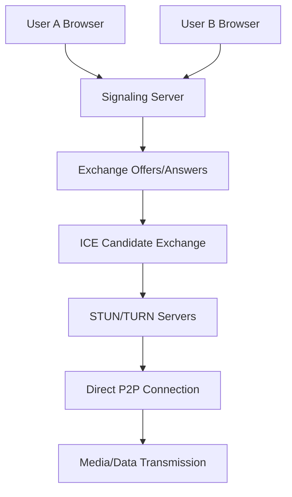

## Introduction: Understanding WebRTC

Web Real-Time Communication (WebRTC) is a powerful technology that enables peer-to-peer audio, video, and data transmission directly between browsers without requiring plugins or external software. This comprehensive guide explores WebRTC fundamentals using practical examples from the official WebRTC samples repository.

## WebRTC Architecture Overview

### Core Components

1. **MediaStream API**: Capture audio and video from user devices
2. **RTCPeerConnection**: Establish P2P connections between browsers
3. **RTCDataChannel**: Send arbitrary data between peers
4. **Signaling Server**: Coordinate connection establishment
5. **STUN/TURN Servers**: Handle NAT traversal and relay traffic

### WebRTC Connection Flow



## Getting Started with getUserMedia

### Example 1: Basic Camera and Microphone Access

**Scenario**: Access user's camera and microphone with constraints and error handling.

```html
<!DOCTYPE html>
<html>
<head>
    <title>getUserMedia Basic Example</title>
    <style>
        .container {
            display: flex;
            flex-direction: column;
            align-items: center;
            padding: 20px;
        }
        video {
            width: 640px;
            height: 480px;
            border: 2px solid #333;
            border-radius: 8px;
            margin: 10px 0;
        }
        .controls {
            display: flex;
            gap: 10px;
            margin: 20px 0;
        }
        button {
            padding: 10px 20px;
            font-size: 16px;
            border: none;
            border-radius: 5px;
            cursor: pointer;
            transition: background-color 0.3s;
        }
        .start-btn {
            background-color: #4CAF50;
            color: white;
        }
        .stop-btn {
            background-color: #f44336;
            color: white;
        }
        .info {
            margin: 10px 0;
            padding: 10px;
            background-color: #f0f0f0;
            border-radius: 5px;
            max-width: 640px;
        }
    </style>
</head>
<body>
    <div class="container">
        <h1>WebRTC getUserMedia Example</h1>
        
        <video id="localVideo" autoplay muted></video>
        
        <div class="controls">
            <button id="startBtn" class="start-btn">Start Camera</button>
            <button id="stopBtn" class="stop-btn" disabled>Stop Camera</button>
            <button id="screenshareBtn" class="start-btn">Share Screen</button>
        </div>
        
        <div class="info">
            <h3>Stream Information</h3>
            <div id="streamInfo"></div>
        </div>
        
        <div class="info">
            <h3>Supported Constraints</h3>
            <div id="constraintsInfo"></div>
        </div>
    </div>

    <script>
        class WebRTCManager {
            constructor() {
                this.localVideo = document.getElementById('localVideo');
                this.startBtn = document.getElementById('startBtn');
                this.stopBtn = document.getElementById('stopBtn');
                this.screenshareBtn = document.getElementById('screenshareBtn');
                this.streamInfo = document.getElementById('streamInfo');
                this.constraintsInfo = document.getElementById('constraintsInfo');
                
                this.localStream = null;
                this.isScreenSharing = false;
                
                this.initializeEventListeners();
                this.displaySupportedConstraints();
            }
            
            initializeEventListeners() {
                this.startBtn.addEventListener('click', () => this.startCamera());
                this.stopBtn.addEventListener('click', () => this.stopStream());
                this.screenshareBtn.addEventListener('click', () => this.toggleScreenShare());
            }
            
            async startCamera() {
                try {
                    // Define comprehensive media constraints
                    const constraints = {
                        audio: {
                            echoCancellation: true,
                            noiseSuppression: true,
                            autoGainControl: true,
                            sampleRate: 44100,
                            channelCount: 2
                        },
                        video: {
                            width: { min: 640, ideal: 1280, max: 1920 },
                            height: { min: 480, ideal: 720, max: 1080 },
                            frameRate: { min: 15, ideal: 30, max: 60 },
                            facingMode: 'user' // 'user' for front camera, 'environment' for back
                        }
                    };
                    
                    // Request user media with constraints
                    this.localStream = await navigator.mediaDevices.getUserMedia(constraints);
                    
                    // Display stream in video element
                    this.localVideo.srcObject = this.localStream;
                    
                    // Update UI
                    this.updateUI(true);
                    this.displayStreamInformation();
                    
                    // Handle stream events
                    this.setupStreamEventHandlers();
                    
                    console.log('Camera started successfully:', this.localStream);
                    
                } catch (error) {
                    this.handleMediaError(error);
                }
            }
            
            async toggleScreenShare() {
                if (this.isScreenSharing) {
                    // Stop screen sharing, return to camera
                    await this.startCamera();
                    this.screenshareBtn.textContent = 'Share Screen';
                    this.isScreenSharing = false;
                } else {
                    // Start screen sharing
                    await this.startScreenShare();
                    this.screenshareBtn.textContent = 'Stop Sharing';
                    this.isScreenSharing = true;
                }
            }
            
            async startScreenShare() {
                try {
                    const constraints = {
                        audio: {
                            echoCancellation: true,
                            noiseSuppression: true,
                            autoGainControl: true
                        },
                        video: {
                            width: { ideal: 1920 },
                            height: { ideal: 1080 },
                            frameRate: { ideal: 30 }
                        }
                    };
                    
                    // Request screen capture
                    const screenStream = await navigator.mediaDevices.getDisplayMedia(constraints);
                    
                    // Stop previous stream
                    if (this.localStream) {
                        this.localStream.getTracks().forEach(track => track.stop());
                    }
                    
                    this.localStream = screenStream;
                    this.localVideo.srcObject = screenStream;
                    
                    this.updateUI(true);
                    this.displayStreamInformation();
                    this.setupStreamEventHandlers();
                    
                    // Handle screen share ending
                    screenStream.getVideoTracks()[0].addEventListener('ended', () => {
                        this.isScreenSharing = false;
                        this.screenshareBtn.textContent = 'Share Screen';
                        this.startCamera(); // Return to camera
                    });
                    
                } catch (error) {
                    console.error('Screen share failed:', error);
                    this.handleMediaError(error);
                }
            }
            
            stopStream() {
                if (this.localStream) {
                    // Stop all tracks
                    this.localStream.getTracks().forEach(track => {
                        track.stop();
                        console.log('Stopped track:', track.kind, track.label);
                    });
                    
                    this.localStream = null;
                    this.localVideo.srcObject = null;
                    
                    this.updateUI(false);
                    this.clearStreamInformation();
                    
                    if (this.isScreenSharing) {
                        this.screenshareBtn.textContent = 'Share Screen';
                        this.isScreenSharing = false;
                    }
                }
            }
            
            setupStreamEventHandlers() {
                if (!this.localStream) return;
                
                this.localStream.getTracks().forEach(track => {
                    track.addEventListener('ended', () => {
                        console.log('Track ended:', track.kind, track.label);
                        this.displayStreamInformation();
                    });
                    
                    track.addEventListener('mute', () => {
                        console.log('Track muted:', track.kind, track.label);
                        this.displayStreamInformation();
                    });
                    
                    track.addEventListener('unmute', () => {
                        console.log('Track unmuted:', track.kind, track.label);
                        this.displayStreamInformation();
                    });
                });
            }
            
            displayStreamInformation() {
                if (!this.localStream) {
                    this.clearStreamInformation();
                    return;
                }
                
                const info = [];
                
                info.push(`<strong>Stream ID:</strong> ${this.localStream.id}`);
                info.push(`<strong>Active:</strong> ${this.localStream.active}`);
                
                // Video tracks information
                const videoTracks = this.localStream.getVideoTracks();
                if (videoTracks.length > 0) {
                    const videoTrack = videoTracks[0];
                    const settings = videoTrack.getSettings();
                    const capabilities = videoTrack.getCapabilities();
                    
                    info.push(`<h4>Video Track:</h4>`);
                    info.push(`<strong>Label:</strong> ${videoTrack.label}`);
                    info.push(`<strong>State:</strong> ${videoTrack.readyState}`);
                    info.push(`<strong>Muted:</strong> ${videoTrack.muted}`);
                    info.push(`<strong>Resolution:</strong> ${settings.width}x${settings.height}`);
                    info.push(`<strong>Frame Rate:</strong> ${settings.frameRate} fps`);
                    
                    if (capabilities.facingMode) {
                        info.push(`<strong>Facing Mode:</strong> ${settings.facingMode || 'Not specified'}`);
                    }
                }
                
                // Audio tracks information
                const audioTracks = this.localStream.getAudioTracks();
                if (audioTracks.length > 0) {
                    const audioTrack = audioTracks[0];
                    const settings = audioTrack.getSettings();
                    
                    info.push(`<h4>Audio Track:</h4>`);
                    info.push(`<strong>Label:</strong> ${audioTrack.label}`);
                    info.push(`<strong>State:</strong> ${audioTrack.readyState}`);
                    info.push(`<strong>Muted:</strong> ${audioTrack.muted}`);
                    info.push(`<strong>Sample Rate:</strong> ${settings.sampleRate} Hz`);
                    info.push(`<strong>Channel Count:</strong> ${settings.channelCount}`);
                    info.push(`<strong>Echo Cancellation:</strong> ${settings.echoCancellation}`);
                    info.push(`<strong>Noise Suppression:</strong> ${settings.noiseSuppression}`);
                }
                
                this.streamInfo.innerHTML = info.join('<br>');
            }
            
            clearStreamInformation() {
                this.streamInfo.innerHTML = 'No active stream';
            }
            
            async displaySupportedConstraints() {
                try {
                    // Get supported constraints
                    const supportedConstraints = navigator.mediaDevices.getSupportedConstraints();
                    
                    // Get available devices
                    const devices = await navigator.mediaDevices.enumerateDevices();
                    
                    const info = [];
                    
                    info.push(`<h4>Supported Constraints:</h4>`);
                    info.push(Object.keys(supportedConstraints).join(', '));
                    
                    info.push(`<h4>Available Devices:</h4>`);
                    
                    const videoDevices = devices.filter(device => device.kind === 'videoinput');
                    const audioDevices = devices.filter(device => device.kind === 'audioinput');
                    
                    info.push(`<strong>Video Devices (${videoDevices.length}):</strong>`);
                    videoDevices.forEach(device => {
                        info.push(`- ${device.label || 'Unknown Device'} (${device.deviceId.substring(0, 8)}...)`);
                    });
                    
                    info.push(`<strong>Audio Devices (${audioDevices.length}):</strong>`);
                    audioDevices.forEach(device => {
                        info.push(`- ${device.label || 'Unknown Device'} (${device.deviceId.substring(0, 8)}...)`);
                    });
                    
                    this.constraintsInfo.innerHTML = info.join('<br>');
                    
                } catch (error) {
                    console.error('Failed to get device information:', error);
                    this.constraintsInfo.innerHTML = 'Could not retrieve device information';
                }
            }
            
            updateUI(streamActive) {
                this.startBtn.disabled = streamActive;
                this.stopBtn.disabled = !streamActive;
            }
            
            handleMediaError(error) {
                console.error('Media error:', error);
                
                let errorMessage = 'An error occurred: ';
                
                switch (error.name) {
                    case 'NotAllowedError':
                        errorMessage += 'Permission denied. Please allow camera and microphone access.';
                        break;
                    case 'NotFoundError':
                        errorMessage += 'No camera or microphone found.';
                        break;
                    case 'NotReadableError':
                        errorMessage += 'Camera or microphone is already in use.';
                        break;
                    case 'OverconstrainedError':
                        errorMessage += 'Constraints could not be satisfied by available devices.';
                        break;
                    case 'SecurityError':
                        errorMessage += 'Security error. Please use HTTPS.';
                        break;
                    default:
                        errorMessage += error.message || 'Unknown error';
                }
                
                alert(errorMessage);
                this.updateUI(false);
            }
        }
        
        // Initialize the application
        document.addEventListener('DOMContentLoaded', () => {
            new WebRTCManager();
        });
        
        // Check WebRTC support
        if (!navigator.mediaDevices || !navigator.mediaDevices.getUserMedia) {
            alert('Your browser does not support WebRTC getUserMedia API');
        }
    </script>
</body>
</html>
```

### Example 2: Advanced Media Constraints and Device Selection

**Scenario**: Implement device selection with custom constraints and quality settings.

```javascript
class AdvancedMediaManager {
    constructor() {
        this.devices = {
            videoInputs: [],
            audioInputs: [],
            audioOutputs: []
        };
        
        this.currentStream = null;
        this.constraints = {
            video: {
                deviceId: undefined,
                width: { ideal: 1280 },
                height: { ideal: 720 },
                frameRate: { ideal: 30 }
            },
            audio: {
                deviceId: undefined,
                echoCancellation: true,
                noiseSuppression: true,
                autoGainControl: true
            }
        };
        
        this.initialize();
    }
    
    async initialize() {
        await this.enumerateDevices();
        this.createDeviceSelectors();
        this.createConstraintControls();
        this.setupEventListeners();
    }
    
    async enumerateDevices() {
        try {
            const devices = await navigator.mediaDevices.enumerateDevices();
            
            this.devices.videoInputs = devices.filter(device => device.kind === 'videoinput');
            this.devices.audioInputs = devices.filter(device => device.kind === 'audioinput');
            this.devices.audioOutputs = devices.filter(device => device.kind === 'audiooutput');
            
            console.log('Available devices:', this.devices);
            
        } catch (error) {
            console.error('Failed to enumerate devices:', error);
        }
    }
    
    createDeviceSelectors() {
        // Create video device selector
        const videoSelect = document.getElementById('videoDeviceSelect');
        if (videoSelect) {
            videoSelect.innerHTML = '<option value="">Default Camera</option>';
            this.devices.videoInputs.forEach(device => {
                const option = document.createElement('option');
                option.value = device.deviceId;
                option.textContent = device.label || `Camera ${device.deviceId.substring(0, 8)}`;
                videoSelect.appendChild(option);
            });
        }
        
        // Create audio device selector
        const audioSelect = document.getElementById('audioDeviceSelect');
        if (audioSelect) {
            audioSelect.innerHTML = '<option value="">Default Microphone</option>';
            this.devices.audioInputs.forEach(device => {
                const option = document.createElement('option');
                option.value = device.deviceId;
                option.textContent = device.label || `Microphone ${device.deviceId.substring(0, 8)}`;
                audioSelect.appendChild(option);
            });
        }
    }
    
    createConstraintControls() {
        // Video quality presets
        const qualityControls = document.getElementById('qualityControls');
        if (qualityControls) {
            const presets = [
                { name: 'Low (480p)', width: 640, height: 480, frameRate: 15 },
                { name: 'Medium (720p)', width: 1280, height: 720, frameRate: 30 },
                { name: 'High (1080p)', width: 1920, height: 1080, frameRate: 30 },
                { name: '4K (2160p)', width: 3840, height: 2160, frameRate: 30 }
            ];
            
            const select = document.createElement('select');
            select.id = 'qualitySelect';
            
            presets.forEach((preset, index) => {
                const option = document.createElement('option');
                option.value = index;
                option.textContent = preset.name;
                if (index === 1) option.selected = true; // Default to medium
                select.appendChild(option);
            });
            
            qualityControls.appendChild(select);
            
            select.addEventListener('change', (e) => {
                const preset = presets[e.target.value];
                this.updateVideoConstraints(preset);
            });
        }
    }
    
    updateVideoConstraints(preset) {
        this.constraints.video.width = { ideal: preset.width };
        this.constraints.video.height = { ideal: preset.height };
        this.constraints.video.frameRate = { ideal: preset.frameRate };
        
        console.log('Updated video constraints:', this.constraints.video);
    }
    
    async startMediaWithConstraints() {
        try {
            // Apply device selections
            const videoSelect = document.getElementById('videoDeviceSelect');
            const audioSelect = document.getElementById('audioDeviceSelect');
            
            if (videoSelect && videoSelect.value) {
                this.constraints.video.deviceId = { exact: videoSelect.value };
            } else {
                delete this.constraints.video.deviceId;
            }
            
            if (audioSelect && audioSelect.value) {
                this.constraints.audio.deviceId = { exact: audioSelect.value };
            } else {
                delete this.constraints.audio.deviceId;
            }
            
            // Stop existing stream
            if (this.currentStream) {
                this.currentStream.getTracks().forEach(track => track.stop());
            }
            
            // Request new stream with updated constraints
            this.currentStream = await navigator.mediaDevices.getUserMedia(this.constraints);
            
            // Apply to video element
            const video = document.getElementById('previewVideo');
            if (video) {
                video.srcObject = this.currentStream;
            }
            
            this.displayStreamCapabilities();
            
            return this.currentStream;
            
        } catch (error) {
            console.error('Failed to start media with constraints:', error);
            this.handleConstraintError(error);
            throw error;
        }
    }
    
    displayStreamCapabilities() {
        if (!this.currentStream) return;
        
        const capabilitiesDiv = document.getElementById('capabilities');
        if (!capabilitiesDiv) return;
        
        const videoTrack = this.currentStream.getVideoTracks()[0];
        const audioTrack = this.currentStream.getAudioTracks()[0];
        
        const info = [];
        
        if (videoTrack) {
            const videoCapabilities = videoTrack.getCapabilities();
            const videoSettings = videoTrack.getSettings();
            
            info.push('<h4>Video Capabilities:</h4>');
            info.push(`<strong>Resolution Range:</strong> ${videoCapabilities.width?.min}-${videoCapabilities.width?.max} x ${videoCapabilities.height?.min}-${videoCapabilities.height?.max}`);
            info.push(`<strong>Frame Rate Range:</strong> ${videoCapabilities.frameRate?.min}-${videoCapabilities.frameRate?.max} fps`);
            info.push(`<strong>Current Resolution:</strong> ${videoSettings.width}x${videoSettings.height}`);
            info.push(`<strong>Current Frame Rate:</strong> ${videoSettings.frameRate} fps`);
            
            if (videoCapabilities.facingMode) {
                info.push(`<strong>Facing Modes:</strong> ${videoCapabilities.facingMode.join(', ')}`);
            }
        }
        
        if (audioTrack) {
            const audioCapabilities = audioTrack.getCapabilities();
            const audioSettings = audioTrack.getSettings();
            
            info.push('<h4>Audio Capabilities:</h4>');
            if (audioCapabilities.sampleRate) {
                info.push(`<strong>Sample Rate Range:</strong> ${audioCapabilities.sampleRate.min}-${audioCapabilities.sampleRate.max} Hz`);
            }
            if (audioCapabilities.channelCount) {
                info.push(`<strong>Channel Count Range:</strong> ${audioCapabilities.channelCount.min}-${audioCapabilities.channelCount.max}`);
            }
            info.push(`<strong>Current Sample Rate:</strong> ${audioSettings.sampleRate} Hz`);
            info.push(`<strong>Current Channels:</strong> ${audioSettings.channelCount}`);
        }
        
        capabilitiesDiv.innerHTML = info.join('<br>');
    }
    
    handleConstraintError(error) {
        if (error.name === 'OverconstrainedError') {
            const constraint = error.constraint;
            console.error(`Constraint '${constraint}' could not be satisfied`);
            
            // Try fallback constraints
            this.applyFallbackConstraints(constraint);
        }
    }
    
    applyFallbackConstraints(failedConstraint) {
        const fallbacks = {
            width: { ideal: 640 },
            height: { ideal: 480 },
            frameRate: { ideal: 15 },
            sampleRate: { ideal: 44100 }
        };
        
        if (fallbacks[failedConstraint]) {
            console.log(`Applying fallback for ${failedConstraint}:`, fallbacks[failedConstraint]);
            
            if (failedConstraint in this.constraints.video) {
                this.constraints.video[failedConstraint] = fallbacks[failedConstraint];
            } else if (failedConstraint in this.constraints.audio) {
                this.constraints.audio[failedConstraint] = fallbacks[failedConstraint];
            }
            
            // Retry with fallback
            setTimeout(() => this.startMediaWithConstraints(), 1000);
        }
    }
    
    setupEventListeners() {
        // Listen for device changes
        navigator.mediaDevices.addEventListener('devicechange', async () => {
            console.log('Device configuration changed');
            await this.enumerateDevices();
            this.createDeviceSelectors();
        });
        
        // Video device selection
        const videoSelect = document.getElementById('videoDeviceSelect');
        if (videoSelect) {
            videoSelect.addEventListener('change', () => {
                if (this.currentStream) {
                    this.startMediaWithConstraints();
                }
            });
        }
        
        // Audio device selection
        const audioSelect = document.getElementById('audioDeviceSelect');
        if (audioSelect) {
            audioSelect.addEventListener('change', () => {
                if (this.currentStream) {
                    this.startMediaWithConstraints();
                }
            });
        }
        
        // Real-time constraint adjustment
        this.setupRealTimeControls();
    }
    
    setupRealTimeControls() {
        // Add real-time video track control
        const videoTrackControls = document.getElementById('videoTrackControls');
        if (videoTrackControls) {
            // Zoom control
            const zoomControl = this.createRangeControl('zoom', 1, 3, 1, 0.1);
            videoTrackControls.appendChild(zoomControl);
            
            // Focus control
            if (this.supportsConstraint('focusDistance')) {
                const focusControl = this.createRangeControl('focusDistance', 0.1, 10, 1, 0.1);
                videoTrackControls.appendChild(focusControl);
            }
        }
        
        // Add audio track controls
        const audioTrackControls = document.getElementById('audioTrackControls');
        if (audioTrackControls) {
            // Volume control
            const volumeControl = this.createRangeControl('volume', 0, 1, 1, 0.1);
            audioTrackControls.appendChild(volumeControl);
            
            // Sample rate control
            const sampleRateControl = this.createSelectControl('sampleRate', [8000, 16000, 22050, 44100, 48000], 44100);
            audioTrackControls.appendChild(sampleRateControl);
        }
    }
    
    createRangeControl(constraint, min, max, value, step) {
        const container = document.createElement('div');
        container.className = 'control-group';
        
        const label = document.createElement('label');
        label.textContent = `${constraint}: `;
        
        const input = document.createElement('input');
        input.type = 'range';
        input.min = min;
        input.max = max;
        input.value = value;
        input.step = step;
        
        const display = document.createElement('span');
        display.textContent = value;
        
        input.addEventListener('input', async (e) => {
            const newValue = parseFloat(e.target.value);
            display.textContent = newValue;
            await this.applyTrackConstraint(constraint, newValue);
        });
        
        container.appendChild(label);
        container.appendChild(input);
        container.appendChild(display);
        
        return container;
    }
    
    async applyTrackConstraint(constraint, value) {
        if (!this.currentStream) return;
        
        try {
            const videoTrack = this.currentStream.getVideoTracks()[0];
            if (videoTrack && this.isVideoConstraint(constraint)) {
                await videoTrack.applyConstraints({
                    [constraint]: value
                });
            }
            
            const audioTrack = this.currentStream.getAudioTracks()[0];
            if (audioTrack && this.isAudioConstraint(constraint)) {
                await audioTrack.applyConstraints({
                    [constraint]: value
                });
            }
            
        } catch (error) {
            console.error(`Failed to apply ${constraint} constraint:`, error);
        }
    }
    
    isVideoConstraint(constraint) {
        return ['zoom', 'focusDistance'].includes(constraint);
    }
    
    isAudioConstraint(constraint) {
        return ['volume', 'sampleRate'].includes(constraint);
    }
    
    supportsConstraint(constraint) {
        const supported = navigator.mediaDevices.getSupportedConstraints();
        return supported[constraint] === true;
    }
    
    // Stream recording functionality
    startRecording() {
        if (!this.currentStream) return;
        
        const options = {
            mimeType: 'video/webm;codecs=vp9,opus',
            videoBitsPerSecond: 2500000,
            audioBitsPerSecond: 128000
        };
        
        try {
            this.mediaRecorder = new MediaRecorder(this.currentStream, options);
            this.recordedChunks = [];
            
            this.mediaRecorder.ondataavailable = (event) => {
                if (event.data.size > 0) {
                    this.recordedChunks.push(event.data);
                }
            };
            
            this.mediaRecorder.onstop = () => {
                this.saveRecording();
            };
            
            this.mediaRecorder.start(1000); // Collect data every second
            console.log('Recording started');
            
        } catch (error) {
            console.error('Failed to start recording:', error);
        }
    }
    
    stopRecording() {
        if (this.mediaRecorder && this.mediaRecorder.state !== 'inactive') {
            this.mediaRecorder.stop();
            console.log('Recording stopped');
        }
    }
    
    saveRecording() {
        if (this.recordedChunks.length === 0) return;
        
        const blob = new Blob(this.recordedChunks, { type: 'video/webm' });
        const url = URL.createObjectURL(blob);
        
        const a = document.createElement('a');
        a.href = url;
        a.download = `webrtc-recording-${Date.now()}.webm`;
        a.click();
        
        URL.revokeObjectURL(url);
        this.recordedChunks = [];
    }
}
```

## RTCPeerConnection Basics

### Example 3: Simple Peer-to-Peer Connection

**Scenario**: Establish a basic peer-to-peer connection between two browser tabs.

```javascript
class SimplePeerConnection {
    constructor(isOfferer = false) {
        this.isOfferer = isOfferer;
        this.peerConnection = null;
        this.localStream = null;
        this.remoteStream = null;
        
        // ICE servers configuration
        this.iceServers = {
            iceServers: [
                { urls: 'stun:stun.l.google.com:19302' },
                { urls: 'stun:stun1.l.google.com:19302' },
                {
                    urls: 'turn:turn.example.com:3478',
                    username: 'user',
                    credential: 'pass'
                }
            ],
            iceCandidatePoolSize: 10
        };
        
        this.initialize();
    }
    
    async initialize() {
        await this.setupLocalStream();
        this.createPeerConnection();
        this.setupSignaling();
        
        if (this.isOfferer) {
            await this.createOffer();
        }
    }
    
    async setupLocalStream() {
        try {
            this.localStream = await navigator.mediaDevices.getUserMedia({
                video: { width: 1280, height: 720 },
                audio: true
            });
            
            const localVideo = document.getElementById('localVideo');
            if (localVideo) {
                localVideo.srcObject = this.localStream;
            }
            
            console.log('Local stream obtained:', this.localStream);
            
        } catch (error) {
            console.error('Failed to get local stream:', error);
        }
    }
    
    createPeerConnection() {
        this.peerConnection = new RTCPeerConnection(this.iceServers);
        
        // Add local stream tracks to peer connection
        if (this.localStream) {
            this.localStream.getTracks().forEach(track => {
                this.peerConnection.addTrack(track, this.localStream);
                console.log('Added track to peer connection:', track.kind);
            });
        }
        
        // Handle remote stream
        this.peerConnection.ontrack = (event) => {
            console.log('Received remote track:', event.track.kind);
            
            if (!this.remoteStream) {
                this.remoteStream = new MediaStream();
                const remoteVideo = document.getElementById('remoteVideo');
                if (remoteVideo) {
                    remoteVideo.srcObject = this.remoteStream;
                }
            }
            
            this.remoteStream.addTrack(event.track);
        };
        
        // Handle ICE candidates
        this.peerConnection.onicecandidate = (event) => {
            if (event.candidate) {
                console.log('New ICE candidate:', event.candidate);
                this.sendSignalingMessage({
                    type: 'ice-candidate',
                    candidate: event.candidate
                });
            }
        };
        
        // Connection state monitoring
        this.peerConnection.onconnectionstatechange = () => {
            console.log('Connection state:', this.peerConnection.connectionState);
            this.updateConnectionStatus();
        };
        
        this.peerConnection.oniceconnectionstatechange = () => {
            console.log('ICE connection state:', this.peerConnection.iceConnectionState);
        };
        
        console.log('Peer connection created');
    }
    
    async createOffer() {
        try {
            const offer = await this.peerConnection.createOffer({
                offerToReceiveAudio: true,
                offerToReceiveVideo: true
            });
            
            await this.peerConnection.setLocalDescription(offer);
            
            console.log('Created offer:', offer);
            
            this.sendSignalingMessage({
                type: 'offer',
                sdp: offer
            });
            
        } catch (error) {
            console.error('Failed to create offer:', error);
        }
    }
    
    async handleOffer(offer) {
        try {
            await this.peerConnection.setRemoteDescription(offer);
            
            const answer = await this.peerConnection.createAnswer();
            await this.peerConnection.setLocalDescription(answer);
            
            console.log('Created answer:', answer);
            
            this.sendSignalingMessage({
                type: 'answer',
                sdp: answer
            });
            
        } catch (error) {
            console.error('Failed to handle offer:', error);
        }
    }
    
    async handleAnswer(answer) {
        try {
            await this.peerConnection.setRemoteDescription(answer);
            console.log('Set remote description from answer');
            
        } catch (error) {
            console.error('Failed to handle answer:', error);
        }
    }
    
    async handleIceCandidate(candidate) {
        try {
            await this.peerConnection.addIceCandidate(candidate);
            console.log('Added ICE candidate');
            
        } catch (error) {
            console.error('Failed to add ICE candidate:', error);
        }
    }
    
    setupSignaling() {
        // Simple localStorage-based signaling for demo
        // In production, use WebSocket, Socket.IO, or server-sent events
        
        const channelName = this.isOfferer ? 'peer-to-answerer' : 'peer-to-offerer';
        
        // Listen for signaling messages
        setInterval(() => {
            const messages = JSON.parse(localStorage.getItem(channelName) || '[]');
            
            messages.forEach(async (message, index) => {
                await this.handleSignalingMessage(message);
                messages.splice(index, 1);
            });
            
            if (messages.length === 0) {
                localStorage.removeItem(channelName);
            } else {
                localStorage.setItem(channelName, JSON.stringify(messages));
            }
        }, 1000);
    }
    
    sendSignalingMessage(message) {
        const channelName = this.isOfferer ? 'peer-to-answerer' : 'peer-to-offerer';
        const messages = JSON.parse(localStorage.getItem(channelName) || '[]');
        messages.push(message);
        localStorage.setItem(channelName, JSON.stringify(messages));
        
        console.log('Sent signaling message:', message.type);
    }
    
    async handleSignalingMessage(message) {
        switch (message.type) {
            case 'offer':
                if (!this.isOfferer) {
                    await this.handleOffer(message.sdp);
                }
                break;
                
            case 'answer':
                if (this.isOfferer) {
                    await this.handleAnswer(message.sdp);
                }
                break;
                
            case 'ice-candidate':
                await this.handleIceCandidate(message.candidate);
                break;
                
            default:
                console.warn('Unknown signaling message type:', message.type);
        }
    }
    
    updateConnectionStatus() {
        const statusElement = document.getElementById('connectionStatus');
        if (statusElement) {
            const state = this.peerConnection.connectionState;
            statusElement.textContent = `Connection: ${state}`;
            statusElement.className = `status ${state}`;
        }
    }
    
    // Statistics monitoring
    async getConnectionStats() {
        if (!this.peerConnection) return null;
        
        try {
            const stats = await this.peerConnection.getStats();
            const report = {};
            
            stats.forEach(stat => {
                if (stat.type === 'inbound-rtp' && stat.mediaType === 'video') {
                    report.inboundVideo = {
                        bytesReceived: stat.bytesReceived,
                        packetsReceived: stat.packetsReceived,
                        packetsLost: stat.packetsLost,
                        frameWidth: stat.frameWidth,
                        frameHeight: stat.frameHeight,
                        framesPerSecond: stat.framesPerSecond
                    };
                }
                
                if (stat.type === 'outbound-rtp' && stat.mediaType === 'video') {
                    report.outboundVideo = {
                        bytesSent: stat.bytesSent,
                        packetsSent: stat.packetsSent,
                        frameWidth: stat.frameWidth,
                        frameHeight: stat.frameHeight,
                        framesPerSecond: stat.framesPerSecond
                    };
                }
                
                if (stat.type === 'candidate-pair' && stat.state === 'succeeded') {
                    report.connection = {
                        localCandidateType: stat.localCandidateType,
                        remoteCandidateType: stat.remoteCandidateType,
                        currentRoundTripTime: stat.currentRoundTripTime,
                        availableOutgoingBitrate: stat.availableOutgoingBitrate
                    };
                }
            });
            
            return report;
            
        } catch (error) {
            console.error('Failed to get connection stats:', error);
            return null;
        }
    }
    
    startStatsMonitoring() {
        this.statsInterval = setInterval(async () => {
            const stats = await this.getConnectionStats();
            if (stats) {
                this.displayStats(stats);
            }
        }, 2000);
    }
    
    stopStatsMonitoring() {
        if (this.statsInterval) {
            clearInterval(this.statsInterval);
            this.statsInterval = null;
        }
    }
    
    displayStats(stats) {
        const statsElement = document.getElementById('connectionStats');
        if (!statsElement) return;
        
        const info = [];
        
        if (stats.inboundVideo) {
            info.push(`<h4>Receiving:</h4>`);
            info.push(`Resolution: ${stats.inboundVideo.frameWidth}x${stats.inboundVideo.frameHeight}`);
            info.push(`FPS: ${stats.inboundVideo.framesPerSecond}`);
            info.push(`Packets: ${stats.inboundVideo.packetsReceived} (${stats.inboundVideo.packetsLost} lost)`);
        }
        
        if (stats.outboundVideo) {
            info.push(`<h4>Sending:</h4>`);
            info.push(`Resolution: ${stats.outboundVideo.frameWidth}x${stats.outboundVideo.frameHeight}`);
            info.push(`FPS: ${stats.outboundVideo.framesPerSecond}`);
            info.push(`Packets: ${stats.outboundVideo.packetsSent}`);
        }
        
        if (stats.connection) {
            info.push(`<h4>Connection:</h4>`);
            info.push(`RTT: ${(stats.connection.currentRoundTripTime * 1000).toFixed(2)}ms`);
            info.push(`Bandwidth: ${Math.round(stats.connection.availableOutgoingBitrate / 1000)}kbps`);
        }
        
        statsElement.innerHTML = info.join('<br>');
    }
    
    // Cleanup
    close() {
        this.stopStatsMonitoring();
        
        if (this.localStream) {
            this.localStream.getTracks().forEach(track => track.stop());
        }
        
        if (this.peerConnection) {
            this.peerConnection.close();
        }
        
        console.log('Peer connection closed');
    }
}

// Usage example
document.addEventListener('DOMContentLoaded', () => {
    // Create offerer in first tab
    window.createOfferer = () => new SimplePeerConnection(true);
    
    // Create answerer in second tab
    window.createAnswerer = () => new SimplePeerConnection(false);
});
```

## WebRTC Data Channels

### Example 4: Real-time Data Transfer

**Scenario**: Implement peer-to-peer data channels for file transfer and messaging.

```javascript
class WebRTCDataChannel {
    constructor() {
        this.peerConnection = null;
        this.dataChannel = null;
        this.isInitiator = false;
        this.maxChunkSize = 16384; // 16KB chunks for file transfer
        this.receivedData = [];
        this.fileTransfers = new Map();
        
        this.initialize();
    }
    
    async initialize() {
        await this.createPeerConnection();
        this.setupUI();
    }
    
    async createPeerConnection() {
        const configuration = {
            iceServers: [
                { urls: 'stun:stun.l.google.com:19302' }
            ]
        };
        
        this.peerConnection = new RTCPeerConnection(configuration);
        
        // Handle ICE candidates
        this.peerConnection.onicecandidate = (event) => {
            if (event.candidate) {
                this.sendSignalingMessage({
                    type: 'ice-candidate',
                    candidate: event.candidate
                });
            }
        };
        
        // Handle incoming data channels
        this.peerConnection.ondatachannel = (event) => {
            const channel = event.channel;
            console.log('Received data channel:', channel.label);
            this.setupDataChannelHandlers(channel);
        };
        
        // Monitor connection state
        this.peerConnection.onconnectionstatechange = () => {
            console.log('Connection state:', this.peerConnection.connectionState);
            this.updateConnectionStatus();
        };
    }
    
    async createDataChannel(label = 'default') {
        if (!this.peerConnection) return;
        
        const options = {
            ordered: true,
            maxRetransmits: 3
        };
        
        this.dataChannel = this.peerConnection.createDataChannel(label, options);
        this.setupDataChannelHandlers(this.dataChannel);
        
        console.log('Created data channel:', label);
        
        this.isInitiator = true;
        await this.createOffer();
    }
    
    setupDataChannelHandlers(channel) {
        channel.onopen = () => {
            console.log('Data channel opened:', channel.label);
            this.updateChannelStatus(channel.label, 'open');
            this.enableDataChannelUI();
        };
        
        channel.onclose = () => {
            console.log('Data channel closed:', channel.label);
            this.updateChannelStatus(channel.label, 'closed');
        };
        
        channel.onerror = (error) => {
            console.error('Data channel error:', error);
        };
        
        channel.onmessage = (event) => {
            this.handleDataChannelMessage(event.data, channel.label);
        };
        
        // Store reference for sending
        if (!this.dataChannel) {
            this.dataChannel = channel;
        }
    }
    
    handleDataChannelMessage(data, channelLabel) {
        try {
            // Try to parse as JSON first (for structured messages)
            const message = JSON.parse(data);
            
            switch (message.type) {
                case 'text':
                    this.displayTextMessage(message.data, 'remote');
                    break;
                    
                case 'file-info':
                    this.handleFileInfo(message);
                    break;
                    
                case 'file-chunk':
                    this.handleFileChunk(message);
                    break;
                    
                case 'file-complete':
                    this.handleFileComplete(message);
                    break;
                    
                case 'typing':
                    this.showTypingIndicator(message.data);
                    break;
                    
                default:
                    console.log('Unknown message type:', message.type);
            }
            
        } catch (error) {
            // If not JSON, treat as plain text
            this.displayTextMessage(data, 'remote');
        }
    }
    
    // Text messaging
    sendTextMessage(text) {
        if (!this.dataChannel || this.dataChannel.readyState !== 'open') {
            console.error('Data channel not ready');
            return;
        }
        
        const message = {
            type: 'text',
            data: text,
            timestamp: Date.now()
        };
        
        this.dataChannel.send(JSON.stringify(message));
        this.displayTextMessage(text, 'local');
        
        console.log('Sent text message:', text);
    }
    
    displayTextMessage(text, sender) {
        const messagesDiv = document.getElementById('messages');
        if (!messagesDiv) return;
        
        const messageElement = document.createElement('div');
        messageElement.className = `message ${sender}`;
        messageElement.innerHTML = `
            <div class="message-content">${this.escapeHtml(text)}</div>
            <div class="message-time">${new Date().toLocaleTimeString()}</div>
        `;
        
        messagesDiv.appendChild(messageElement);
        messagesDiv.scrollTop = messagesDiv.scrollHeight;
    }
    
    // File transfer
    async sendFile(file) {
        if (!this.dataChannel || this.dataChannel.readyState !== 'open') {
            console.error('Data channel not ready for file transfer');
            return;
        }
        
        const fileId = this.generateFileId();
        const totalChunks = Math.ceil(file.size / this.maxChunkSize);
        
        // Send file metadata
        const fileInfo = {
            type: 'file-info',
            fileId: fileId,
            name: file.name,
            size: file.size,
            type: file.type,
            totalChunks: totalChunks,
            chunkSize: this.maxChunkSize
        };
        
        this.dataChannel.send(JSON.stringify(fileInfo));
        
        console.log('Sending file:', file.name, 'Size:', file.size, 'Chunks:', totalChunks);
        
        // Send file in chunks
        let offset = 0;
        let chunkIndex = 0;
        
        const sendNextChunk = () => {
            const chunk = file.slice(offset, offset + this.maxChunkSize);
            const reader = new FileReader();
            
            reader.onload = () => {
                const chunkData = {
                    type: 'file-chunk',
                    fileId: fileId,
                    chunkIndex: chunkIndex,
                    data: reader.result,
                    isLast: chunkIndex === totalChunks - 1
                };
                
                this.dataChannel.send(JSON.stringify(chunkData));
                
                offset += this.maxChunkSize;
                chunkIndex++;
                
                // Update progress
                const progress = Math.round((chunkIndex / totalChunks) * 100);
                this.updateFileProgress(fileId, progress, 'sending');
                
                if (chunkIndex < totalChunks) {
                    // Send next chunk after a small delay to prevent overwhelming
                    setTimeout(sendNextChunk, 10);
                } else {
                    // Send completion message
                    this.dataChannel.send(JSON.stringify({
                        type: 'file-complete',
                        fileId: fileId
                    }));
                    
                    console.log('File sent successfully:', file.name);
                }
            };
            
            reader.readAsDataURL(chunk);
        };
        
        sendNextChunk();
    }
    
    handleFileInfo(message) {
        console.log('Receiving file:', message.name, 'Size:', message.size);
        
        this.fileTransfers.set(message.fileId, {
            name: message.name,
            size: message.size,
            type: message.type,
            totalChunks: message.totalChunks,
            receivedChunks: 0,
            chunks: new Array(message.totalChunks),
            startTime: Date.now()
        });
        
        this.displayFileTransfer(message.fileId, message.name, message.size, 'receiving');
    }
    
    handleFileChunk(message) {
        const transfer = this.fileTransfers.get(message.fileId);
        if (!transfer) {
            console.error('Unknown file transfer:', message.fileId);
            return;
        }
        
        // Store chunk
        transfer.chunks[message.chunkIndex] = message.data;
        transfer.receivedChunks++;
        
        // Update progress
        const progress = Math.round((transfer.receivedChunks / transfer.totalChunks) * 100);
        this.updateFileProgress(message.fileId, progress, 'receiving');
        
        console.log(`Received chunk ${message.chunkIndex + 1}/${transfer.totalChunks} for ${transfer.name}`);
    }
    
    handleFileComplete(message) {
        const transfer = this.fileTransfers.get(message.fileId);
        if (!transfer) return;
        
        console.log('File transfer complete:', transfer.name);
        
        // Reconstruct file from chunks
        const dataUrls = transfer.chunks.join('');
        const link = document.createElement('a');
        link.href = dataUrls;
        link.download = transfer.name;
        
        // Add download link to UI
        const transferElement = document.getElementById(`transfer-${message.fileId}`);
        if (transferElement) {
            const downloadBtn = document.createElement('button');
            downloadBtn.textContent = 'Download';
            downloadBtn.onclick = () => link.click();
            transferElement.appendChild(downloadBtn);
        }
        
        this.fileTransfers.delete(message.fileId);
        
        const duration = Date.now() - transfer.startTime;
        const speed = (transfer.size / 1024 / 1024) / (duration / 1000); // MB/s
        console.log(`Transfer completed in ${duration}ms (${speed.toFixed(2)} MB/s)`);
    }
    
    displayFileTransfer(fileId, fileName, fileSize, direction) {
        const transfersDiv = document.getElementById('fileTransfers');
        if (!transfersDiv) return;
        
        const transferElement = document.createElement('div');
        transferElement.id = `transfer-${fileId}`;
        transferElement.className = `file-transfer ${direction}`;
        transferElement.innerHTML = `
            <div class="file-info">
                <div class="file-name">${this.escapeHtml(fileName)}</div>
                <div class="file-size">${this.formatFileSize(fileSize)}</div>
            </div>
            <div class="progress-bar">
                <div class="progress-fill" style="width: 0%"></div>
            </div>
            <div class="progress-text">0%</div>
        `;
        
        transfersDiv.appendChild(transferElement);
    }
    
    updateFileProgress(fileId, progress, direction) {
        const transferElement = document.getElementById(`transfer-${fileId}`);
        if (!transferElement) return;
        
        const progressFill = transferElement.querySelector('.progress-fill');
        const progressText = transferElement.querySelector('.progress-text');
        
        if (progressFill) {
            progressFill.style.width = `${progress}%`;
        }
        
        if (progressText) {
            progressText.textContent = `${progress}% ${direction}`;
        }
    }
    
    // Typing indicators
    sendTypingIndicator(isTyping) {
        if (!this.dataChannel || this.dataChannel.readyState !== 'open') return;
        
        const message = {
            type: 'typing',
            data: isTyping
        };
        
        this.dataChannel.send(JSON.stringify(message));
    }
    
    showTypingIndicator(isTyping) {
        const indicator = document.getElementById('typingIndicator');
        if (indicator) {
            indicator.style.display = isTyping ? 'block' : 'none';
        }
    }
    
    // Advanced data channel features
    createOrderedChannel(label) {
        const options = {
            ordered: true,
            maxRetransmits: undefined // Reliable
        };
        
        return this.peerConnection.createDataChannel(label, options);
    }
    
    createUnorderedChannel(label) {
        const options = {
            ordered: false,
            maxRetransmitTime: 1000, // 1 second max retry time
            maxRetransmits: undefined
        };
        
        return this.peerConnection.createDataChannel(label, options);
    }
    
    createUnreliableChannel(label) {
        const options = {
            ordered: false,
            maxRetransmits: 0 // No retransmissions
        };
        
        return this.peerConnection.createDataChannel(label, options);
    }
    
    // Bulk data transfer optimization
    async sendLargeData(data, label = 'bulk') {
        const bulkChannel = this.createUnorderedChannel(label);
        
        bulkChannel.onopen = () => {
            const chunks = this.splitDataIntoChunks(data, this.maxChunkSize);
            const totalChunks = chunks.length;
            
            chunks.forEach((chunk, index) => {
                const message = {
                    type: 'bulk-data',
                    chunkIndex: index,
                    totalChunks: totalChunks,
                    data: chunk,
                    checksum: this.calculateChecksum(chunk)
                };
                
                bulkChannel.send(JSON.stringify(message));
            });
        };
    }
    
    // Utility methods
    generateFileId() {
        return Date.now().toString(36) + Math.random().toString(36).substr(2);
    }
    
    formatFileSize(bytes) {
        if (bytes === 0) return '0 Bytes';
        
        const k = 1024;
        const sizes = ['Bytes', 'KB', 'MB', 'GB'];
        const i = Math.floor(Math.log(bytes) / Math.log(k));
        
        return parseFloat((bytes / Math.pow(k, i)).toFixed(2)) + ' ' + sizes[i];
    }
    
    escapeHtml(text) {
        const div = document.createElement('div');
        div.textContent = text;
        return div.innerHTML;
    }
    
    splitDataIntoChunks(data, chunkSize) {
        const chunks = [];
        for (let i = 0; i < data.length; i += chunkSize) {
            chunks.push(data.slice(i, i + chunkSize));
        }
        return chunks;
    }
    
    calculateChecksum(data) {
        // Simple checksum calculation
        let checksum = 0;
        for (let i = 0; i < data.length; i++) {
            checksum += data.charCodeAt(i);
        }
        return checksum;
    }
    
    setupUI() {
        // Message input handler
        const messageInput = document.getElementById('messageInput');
        const sendButton = document.getElementById('sendMessage');
        
        if (messageInput && sendButton) {
            let typingTimeout;
            
            messageInput.addEventListener('input', () => {
                this.sendTypingIndicator(true);
                
                clearTimeout(typingTimeout);
                typingTimeout = setTimeout(() => {
                    this.sendTypingIndicator(false);
                }, 1000);
            });
            
            const sendMessage = () => {
                const text = messageInput.value.trim();
                if (text) {
                    this.sendTextMessage(text);
                    messageInput.value = '';
                    this.sendTypingIndicator(false);
                }
            };
            
            sendButton.addEventListener('click', sendMessage);
            messageInput.addEventListener('keypress', (e) => {
                if (e.key === 'Enter' && !e.shiftKey) {
                    e.preventDefault();
                    sendMessage();
                }
            });
        }
        
        // File input handler
        const fileInput = document.getElementById('fileInput');
        if (fileInput) {
            fileInput.addEventListener('change', (e) => {
                const file = e.target.files[0];
                if (file) {
                    this.sendFile(file);
                    fileInput.value = ''; // Reset input
                }
            });
        }
    }
    
    updateConnectionStatus() {
        const statusElement = document.getElementById('connectionStatus');
        if (statusElement) {
            statusElement.textContent = this.peerConnection.connectionState;
        }
    }
    
    updateChannelStatus(label, state) {
        const statusElement = document.getElementById('channelStatus');
        if (statusElement) {
            statusElement.textContent = `${label}: ${state}`;
        }
    }
    
    enableDataChannelUI() {
        const messageInput = document.getElementById('messageInput');
        const sendButton = document.getElementById('sendMessage');
        const fileInput = document.getElementById('fileInput');
        
        if (messageInput) messageInput.disabled = false;
        if (sendButton) sendButton.disabled = false;
        if (fileInput) fileInput.disabled = false;
    }
    
    // WebRTC signaling (simplified)
    async createOffer() {
        const offer = await this.peerConnection.createOffer();
        await this.peerConnection.setLocalDescription(offer);
        
        this.sendSignalingMessage({
            type: 'offer',
            sdp: offer
        });
    }
    
    async handleOffer(offer) {
        await this.peerConnection.setRemoteDescription(offer);
        
        const answer = await this.peerConnection.createAnswer();
        await this.peerConnection.setLocalDescription(answer);
        
        this.sendSignalingMessage({
            type: 'answer',
            sdp: answer
        });
    }
    
    async handleAnswer(answer) {
        await this.peerConnection.setRemoteDescription(answer);
    }
    
    async handleIceCandidate(candidate) {
        await this.peerConnection.addIceCandidate(candidate);
    }
    
    sendSignalingMessage(message) {
        // Implement your signaling mechanism here
        console.log('Signaling message:', message);
    }
}
```

## Best Practices and Performance Tips

### 1. Error Handling
```javascript
// Comprehensive error handling
async function handleWebRTCErrors() {
    try {
        const stream = await navigator.mediaDevices.getUserMedia(constraints);
        // Process stream
    } catch (error) {
        switch (error.name) {
            case 'NotAllowedError':
                // Handle permission denied
                break;
            case 'NotFoundError':
                // Handle no devices found
                break;
            case 'NotReadableError':
                // Handle device already in use
                break;
            case 'OverconstrainedError':
                // Handle impossible constraints
                break;
            default:
                console.error('Unexpected error:', error);
        }
    }
}
```

### 2. Resource Management
```javascript
// Proper cleanup
class ResourceManager {
    constructor() {
        this.resources = new Set();
    }
    
    addResource(resource) {
        this.resources.add(resource);
    }
    
    cleanup() {
        this.resources.forEach(resource => {
            if (resource.getTracks) {
                resource.getTracks().forEach(track => track.stop());
            } else if (resource.close) {
                resource.close();
            }
        });
        this.resources.clear();
    }
}
```

### 3. Cross-browser Compatibility
```javascript
// Use adapter.js for compatibility
import adapter from 'webrtc-adapter';

// Feature detection
function checkWebRTCSupport() {
    const features = {
        getUserMedia: !!(navigator.mediaDevices && navigator.mediaDevices.getUserMedia),
        RTCPeerConnection: !!window.RTCPeerConnection,
        dataChannels: !!(window.RTCPeerConnection && RTCPeerConnection.prototype.createDataChannel)
    };
    
    return features;
}
```

## Conclusion

WebRTC provides powerful capabilities for building real-time communication applications directly in the browser. This guide covered the fundamental APIs and implementation patterns using examples from the official WebRTC samples repository. The key to successful WebRTC implementation lies in understanding the connection flow, proper error handling, and efficient resource management.

Next steps involve exploring advanced features like screen sharing, media processing, and building complete applications with signaling servers and TURN infrastructure.