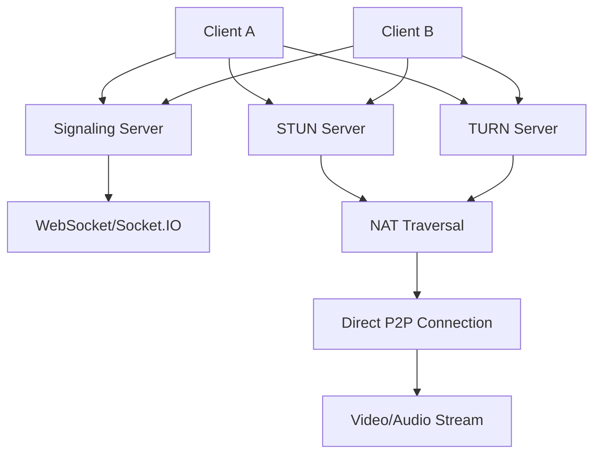

## Introduction: WebRTC Video Chat Architecture

Building a production-ready WebRTC video chat application requires more than just peer connections. This comprehensive guide covers the complete implementation including signaling servers, NAT traversal, advanced media handling, and scalable architecture patterns based on real-world WebRTC samples.

## Core Video Chat Architecture



## Complete Video Chat Implementation

### Example 1: Full-Featured Video Chat Client

**Scenario**: Build a complete video chat application with room management, user controls, and advanced features.

```html
<!DOCTYPE html>
<html lang="en">
<head>
    <meta charset="UTF-8">
    <meta name="viewport" content="width=device-width, initial-scale=1.0">
    <title>WebRTC Video Chat</title>
    <style>
        * {
            margin: 0;
            padding: 0;
            box-sizing: border-box;
        }
        
        body {
            font-family: 'Segoe UI', Tahoma, Geneva, Verdana, sans-serif;
            background: linear-gradient(135deg, #667eea 0%, #764ba2 100%);
            min-height: 100vh;
            display: flex;
            flex-direction: column;
        }
        
        .header {
            background: rgba(0, 0, 0, 0.1);
            color: white;
            padding: 1rem;
            text-align: center;
        }
        
        .main-container {
            flex: 1;
            display: flex;
            flex-direction: column;
            padding: 1rem;
        }
        
        .video-container {
            display: flex;
            justify-content: center;
            align-items: center;
            flex: 1;
            gap: 1rem;
            margin-bottom: 1rem;
        }
        
        .video-wrapper {
            position: relative;
            border-radius: 12px;
            overflow: hidden;
            box-shadow: 0 8px 32px rgba(0, 0, 0, 0.3);
            background: #000;
        }
        
        .local-video {
            width: 300px;
            height: 225px;
        }
        
        .remote-video {
            width: 600px;
            height: 450px;
        }
        
        video {
            width: 100%;
            height: 100%;
            object-fit: cover;
        }
        
        .video-overlay {
            position: absolute;
            bottom: 0;
            left: 0;
            right: 0;
            background: linear-gradient(transparent, rgba(0, 0, 0, 0.7));
            color: white;
            padding: 0.5rem;
            font-size: 0.9rem;
        }
        
        .controls {
            display: flex;
            justify-content: center;
            align-items: center;
            gap: 1rem;
            background: rgba(255, 255, 255, 0.1);
            backdrop-filter: blur(10px);
            border-radius: 50px;
            padding: 1rem 2rem;
            margin: 1rem auto;
            max-width: fit-content;
        }
        
        .control-btn {
            width: 60px;
            height: 60px;
            border-radius: 50%;
            border: none;
            cursor: pointer;
            display: flex;
            align-items: center;
            justify-content: center;
            font-size: 1.5rem;
            transition: all 0.3s ease;
            position: relative;
        }
        
        .control-btn:hover {
            transform: scale(1.1);
        }
        
        .mute-btn { background: #4CAF50; color: white; }
        .mute-btn.muted { background: #f44336; }
        
        .camera-btn { background: #2196F3; color: white; }
        .camera-btn.disabled { background: #666; }
        
        .call-btn { background: #4CAF50; color: white; }
        .call-btn.calling { background: #ff9800; }
        .call-btn.connected { background: #f44336; }
        
        .screen-btn { background: #9C27B0; color: white; }
        .screen-btn.sharing { background: #ff5722; }
        
        .record-btn { background: #FF5722; color: white; }
        .record-btn.recording { 
            background: #d32f2f; 
            animation: pulse 1s infinite;
        }
        
        @keyframes pulse {
            0% { opacity: 1; }
            50% { opacity: 0.7; }
            100% { opacity: 1; }
        }
        
        .room-controls {
            background: rgba(255, 255, 255, 0.9);
            border-radius: 12px;
            padding: 1.5rem;
            margin-bottom: 1rem;
            display: flex;
            gap: 1rem;
            align-items: center;
            justify-content: center;
        }
        
        .room-input {
            padding: 0.75rem;
            border: 2px solid #ddd;
            border-radius: 8px;
            font-size: 1rem;
            width: 200px;
        }
        
        .join-btn {
            background: #4CAF50;
            color: white;
            border: none;
            padding: 0.75rem 1.5rem;
            border-radius: 8px;
            font-size: 1rem;
            cursor: pointer;
            transition: background 0.3s ease;
        }
        
        .join-btn:hover {
            background: #45a049;
        }
        
        .status {
            text-align: center;
            color: white;
            margin: 1rem 0;
            padding: 1rem;
            background: rgba(0, 0, 0, 0.3);
            border-radius: 8px;
        }
        
        .chat-sidebar {
            position: fixed;
            right: -350px;
            top: 0;
            width: 350px;
            height: 100vh;
            background: rgba(255, 255, 255, 0.95);
            backdrop-filter: blur(10px);
            transition: right 0.3s ease;
            display: flex;
            flex-direction: column;
            z-index: 1000;
        }
        
        .chat-sidebar.open {
            right: 0;
        }
        
        .chat-header {
            background: #333;
            color: white;
            padding: 1rem;
            display: flex;
            justify-content: space-between;
            align-items: center;
        }
        
        .chat-messages {
            flex: 1;
            overflow-y: auto;
            padding: 1rem;
        }
        
        .chat-input {
            padding: 1rem;
            border-top: 1px solid #ddd;
            display: flex;
            gap: 0.5rem;
        }
        
        .chat-input input {
            flex: 1;
            padding: 0.5rem;
            border: 1px solid #ddd;
            border-radius: 4px;
        }
        
        .participants {
            background: rgba(255, 255, 255, 0.1);
            backdrop-filter: blur(10px);
            border-radius: 8px;
            padding: 1rem;
            margin-bottom: 1rem;
            color: white;
        }
        
        .participant {
            display: flex;
            align-items: center;
            gap: 0.5rem;
            margin-bottom: 0.5rem;
        }
        
        .participant-status {
            width: 10px;
            height: 10px;
            border-radius: 50%;
            background: #4CAF50;
        }
        
        .participant-status.muted {
            background: #f44336;
        }
        
        .stats-panel {
            position: fixed;
            top: 70px;
            left: 10px;
            background: rgba(0, 0, 0, 0.8);
            color: white;
            padding: 1rem;
            border-radius: 8px;
            font-size: 0.8rem;
            font-family: monospace;
            display: none;
        }
        
        .quality-selector {
            display: flex;
            gap: 0.5rem;
            margin-top: 0.5rem;
        }
        
        .quality-btn {
            padding: 0.25rem 0.5rem;
            border: 1px solid #ccc;
            background: white;
            border-radius: 4px;
            cursor: pointer;
            font-size: 0.8rem;
        }
        
        .quality-btn.active {
            background: #4CAF50;
            color: white;
        }
        
        .effects-panel {
            position: fixed;
            bottom: 120px;
            left: 50%;
            transform: translateX(-50%);
            background: rgba(255, 255, 255, 0.9);
            border-radius: 12px;
            padding: 1rem;
            display: none;
            flex-wrap: wrap;
            gap: 0.5rem;
            max-width: 300px;
        }
        
        .effect-btn {
            padding: 0.5rem 1rem;
            border: 1px solid #ddd;
            background: white;
            border-radius: 20px;
            cursor: pointer;
            font-size: 0.9rem;
            transition: all 0.3s ease;
        }
        
        .effect-btn.active {
            background: #4CAF50;
            color: white;
        }
        
        .notification {
            position: fixed;
            top: 20px;
            right: 20px;
            background: #4CAF50;
            color: white;
            padding: 1rem;
            border-radius: 8px;
            transform: translateX(100%);
            transition: transform 0.3s ease;
            z-index: 1001;
        }
        
        .notification.show {
            transform: translateX(0);
        }
        
        .notification.error {
            background: #f44336;
        }
        
        @media (max-width: 768px) {
            .video-container {
                flex-direction: column;
            }
            
            .remote-video {
                width: 100%;
                max-width: 400px;
                height: 300px;
            }
            
            .local-video {
                width: 150px;
                height: 112px;
            }
            
            .controls {
                flex-wrap: wrap;
            }
            
            .control-btn {
                width: 50px;
                height: 50px;
                font-size: 1.2rem;
            }
        }
    </style>
</head>
<body>
    <div class="header">
        <h1>WebRTC Video Chat</h1>
    </div>
    
    <div class="main-container">
        <div class="room-controls">
            <input type="text" id="roomInput" class="room-input" placeholder="Enter room ID">
            <button id="joinBtn" class="join-btn">Join Room</button>
            <button id="createBtn" class="join-btn">Create Room</button>
            <button id="leaveBtn" class="join-btn" style="background: #f44336; display: none;">Leave Room</button>
        </div>
        
        <div class="participants" id="participants" style="display: none;">
            <h3>Participants</h3>
            <div id="participantsList"></div>
        </div>
        
        <div class="status" id="status">
            Enter a room ID to start video chat
        </div>
        
        <div class="video-container">
            <div class="video-wrapper local-video">
                <video id="localVideo" autoplay muted></video>
                <div class="video-overlay">
                    <span id="localVideoLabel">You (Connecting...)</span>
                </div>
            </div>
            
            <div class="video-wrapper remote-video">
                <video id="remoteVideo" autoplay></video>
                <div class="video-overlay">
                    <span id="remoteVideoLabel">Waiting for participant...</span>
                </div>
            </div>
        </div>
        
        <div class="quality-selector" id="qualitySelector">
            <button class="quality-btn" data-quality="low">Low (480p)</button>
            <button class="quality-btn active" data-quality="medium">Medium (720p)</button>
            <button class="quality-btn" data-quality="high">High (1080p)</button>
        </div>
        
        <div class="controls">
            <button id="muteBtn" class="control-btn mute-btn" title="Mute/Unmute">
                🎤
            </button>
            
            <button id="cameraBtn" class="control-btn camera-btn" title="Camera On/Off">
                📹
            </button>
            
            <button id="callBtn" class="control-btn call-btn" title="Call">
                📞
            </button>
            
            <button id="screenBtn" class="control-btn screen-btn" title="Share Screen">
                🖥️
            </button>
            
            <button id="recordBtn" class="control-btn record-btn" title="Record">
                ⏺️
            </button>
            
            <button id="effectsBtn" class="control-btn" title="Effects" style="background: #FF9800; color: white;">
                ✨
            </button>
            
            <button id="chatBtn" class="control-btn" title="Chat" style="background: #607D8B; color: white;">
                💬
            </button>
            
            <button id="statsBtn" class="control-btn" title="Stats" style="background: #795548; color: white;">
                📊
            </button>
        </div>
    </div>
    
    <!-- Chat Sidebar -->
    <div class="chat-sidebar" id="chatSidebar">
        <div class="chat-header">
            <h3>Chat</h3>
            <button id="closeChatBtn">×</button>
        </div>
        <div class="chat-messages" id="chatMessages"></div>
        <div class="chat-input">
            <input type="text" id="chatInput" placeholder="Type a message...">
            <button id="sendChatBtn">Send</button>
        </div>
    </div>
    
    <!-- Effects Panel -->
    <div class="effects-panel" id="effectsPanel">
        <button class="effect-btn" data-effect="none">No Effect</button>
        <button class="effect-btn" data-effect="blur">Blur Background</button>
        <button class="effect-btn" data-effect="grayscale">Grayscale</button>
        <button class="effect-btn" data-effect="sepia">Sepia</button>
        <button class="effect-btn" data-effect="invert">Invert Colors</button>
        <button class="effect-btn" data-effect="brightness">Bright</button>
    </div>
    
    <!-- Stats Panel -->
    <div class="stats-panel" id="statsPanel">
        <div id="statsContent">Connection stats will appear here...</div>
    </div>
    
    <!-- Notifications -->
    <div class="notification" id="notification"></div>
    
    <script src="/socket.io/socket.io.js"></script>
    <script>
        class VideoChat {
            constructor() {
                this.localVideo = document.getElementById('localVideo');
                this.remoteVideo = document.getElementById('remoteVideo');
                this.statusDiv = document.getElementById('status');
                
                this.socket = null;
                this.localStream = null;
                this.remoteStream = null;
                this.peerConnection = null;
                this.mediaRecorder = null;
                this.recordedChunks = [];
                
                this.roomId = null;
                this.userId = this.generateUserId();
                this.isInitiator = false;
                this.isScreenSharing = false;
                this.isRecording = false;
                this.isMuted = false;
                this.isCameraOff = false;
                
                this.pcConfig = {
                    iceServers: [
                        { urls: 'stun:stun.l.google.com:19302' },
                        { urls: 'stun:stun1.l.google.com:19302' },
                        { 
                            urls: 'turn:your-turn-server.com:3478',
                            username: 'your-username',
                            credential: 'your-password'
                        }
                    ],
                    iceCandidatePoolSize: 10
                };
                
                this.constraints = {
                    video: {
                        width: { min: 640, ideal: 1280, max: 1920 },
                        height: { min: 480, ideal: 720, max: 1080 },
                        frameRate: { min: 15, ideal: 30, max: 60 }
                    },
                    audio: {
                        echoCancellation: true,
                        noiseSuppression: true,
                        autoGainControl: true
                    }
                };
                
                this.init();
            }
            
            async init() {
                await this.setupLocalMedia();
                this.setupEventListeners();
                this.connectToSignalingServer();
            }
            
            generateUserId() {
                return Math.random().toString(36).substr(2, 9);
            }
            
            async setupLocalMedia() {
                try {
                    this.localStream = await navigator.mediaDevices.getUserMedia(this.constraints);
                    this.localVideo.srcObject = this.localStream;
                    
                    document.getElementById('localVideoLabel').textContent = 'You (Connected)';
                    this.updateStatus('Camera and microphone ready');
                    
                } catch (error) {
                    console.error('Failed to get local media:', error);
                    this.showNotification('Failed to access camera/microphone', 'error');
                    this.updateStatus('Failed to access media devices');
                }
            }
            
            connectToSignalingServer() {
                this.socket = io({
                    transports: ['websocket'],
                    upgrade: false
                });
                
                this.socket.on('connect', () => {
                    console.log('Connected to signaling server');
                    this.updateStatus('Connected to server');
                });
                
                this.socket.on('disconnect', () => {
                    console.log('Disconnected from signaling server');
                    this.updateStatus('Disconnected from server');
                });
                
                // Room events
                this.socket.on('room-joined', (data) => {
                    console.log('Joined room:', data);
                    this.roomId = data.roomId;
                    this.updateParticipants(data.participants);
                    this.updateStatus(\`Joined room: \${this.roomId}\`);
                    this.showRoomControls(false);
                });
                
                this.socket.on('room-created', (data) => {
                    console.log('Room created:', data);
                    this.roomId = data.roomId;
                    this.isInitiator = true;
                    this.updateStatus(\`Room created: \${this.roomId} (waiting for participants)\`);
                    this.showRoomControls(false);
                });
                
                this.socket.on('participant-joined', (data) => {
                    console.log('Participant joined:', data);
                    this.updateParticipants(data.participants);
                    this.showNotification(\`\${data.participant.name} joined the room\`);
                    
                    if (!this.isInitiator) {
                        this.createPeerConnection();
                        this.createOffer();
                    }
                });
                
                this.socket.on('participant-left', (data) => {
                    console.log('Participant left:', data);
                    this.updateParticipants(data.participants);
                    this.showNotification(\`\${data.participant.name} left the room\`);
                    
                    if (this.peerConnection) {
                        this.peerConnection.close();
                        this.peerConnection = null;
                    }
                    
                    this.remoteVideo.srcObject = null;
                    document.getElementById('remoteVideoLabel').textContent = 'Waiting for participant...';
                });
                
                // WebRTC signaling
                this.socket.on('offer', async (data) => {
                    console.log('Received offer');
                    if (!this.peerConnection) {
                        this.createPeerConnection();
                    }
                    await this.handleOffer(data.offer);
                });
                
                this.socket.on('answer', async (data) => {
                    console.log('Received answer');
                    await this.handleAnswer(data.answer);
                });
                
                this.socket.on('ice-candidate', async (data) => {
                    console.log('Received ICE candidate');
                    await this.handleIceCandidate(data.candidate);
                });
                
                // Chat events
                this.socket.on('chat-message', (data) => {
                    this.displayChatMessage(data.message, data.sender, false);
                });
                
                // Status updates
                this.socket.on('participant-status', (data) => {
                    this.updateParticipantStatus(data.userId, data.status);
                });
                
                this.socket.on('error', (error) => {
                    console.error('Socket error:', error);
                    this.showNotification(error.message, 'error');
                });
            }
            
            createPeerConnection() {
                this.peerConnection = new RTCPeerConnection(this.pcConfig);
                
                // Add local stream tracks
                if (this.localStream) {
                    this.localStream.getTracks().forEach(track => {
                        this.peerConnection.addTrack(track, this.localStream);
                    });
                }
                
                // Handle remote stream
                this.peerConnection.ontrack = (event) => {
                    console.log('Received remote track:', event.track.kind);
                    
                    if (!this.remoteStream) {
                        this.remoteStream = new MediaStream();
                        this.remoteVideo.srcObject = this.remoteStream;
                    }
                    
                    this.remoteStream.addTrack(event.track);
                    document.getElementById('remoteVideoLabel').textContent = 'Remote participant';
                };
                
                // Handle ICE candidates
                this.peerConnection.onicecandidate = (event) => {
                    if (event.candidate) {
                        this.socket.emit('ice-candidate', {
                            roomId: this.roomId,
                            candidate: event.candidate
                        });
                    }
                };
                
                // Monitor connection state
                this.peerConnection.onconnectionstatechange = () => {
                    console.log('PC connection state:', this.peerConnection.connectionState);
                    this.updateConnectionStatus(this.peerConnection.connectionState);
                };
                
                this.peerConnection.oniceconnectionstatechange = () => {
                    console.log('ICE connection state:', this.peerConnection.iceConnectionState);
                };
                
                console.log('Peer connection created');
            }
            
            async createOffer() {
                try {
                    const offer = await this.peerConnection.createOffer({
                        offerToReceiveAudio: true,
                        offerToReceiveVideo: true
                    });
                    
                    await this.peerConnection.setLocalDescription(offer);
                    
                    this.socket.emit('offer', {
                        roomId: this.roomId,
                        offer: offer
                    });
                    
                    console.log('Created and sent offer');
                    
                } catch (error) {
                    console.error('Failed to create offer:', error);
                    this.showNotification('Failed to create offer', 'error');
                }
            }
            
            async handleOffer(offer) {
                try {
                    await this.peerConnection.setRemoteDescription(offer);
                    
                    const answer = await this.peerConnection.createAnswer();
                    await this.peerConnection.setLocalDescription(answer);
                    
                    this.socket.emit('answer', {
                        roomId: this.roomId,
                        answer: answer
                    });
                    
                    console.log('Created and sent answer');
                    
                } catch (error) {
                    console.error('Failed to handle offer:', error);
                    this.showNotification('Failed to handle offer', 'error');
                }
            }
            
            async handleAnswer(answer) {
                try {
                    await this.peerConnection.setRemoteDescription(answer);
                    console.log('Set remote description from answer');
                    
                } catch (error) {
                    console.error('Failed to handle answer:', error);
                    this.showNotification('Failed to handle answer', 'error');
                }
            }
            
            async handleIceCandidate(candidate) {
                try {
                    await this.peerConnection.addIceCandidate(candidate);
                    console.log('Added ICE candidate');
                    
                } catch (error) {
                    console.error('Failed to add ICE candidate:', error);
                }
            }
            
            // Media controls
            async toggleMute() {
                if (!this.localStream) return;
                
                const audioTrack = this.localStream.getAudioTracks()[0];
                if (audioTrack) {
                    audioTrack.enabled = !audioTrack.enabled;
                    this.isMuted = !audioTrack.enabled;
                    
                    const muteBtn = document.getElementById('muteBtn');
                    muteBtn.classList.toggle('muted', this.isMuted);
                    muteBtn.textContent = this.isMuted ? '🔇' : '🎤';
                    
                    // Notify other participants
                    this.socket.emit('participant-status', {
                        roomId: this.roomId,
                        status: { muted: this.isMuted }
                    });
                }
            }
            
            async toggleCamera() {
                if (!this.localStream) return;
                
                const videoTrack = this.localStream.getVideoTracks()[0];
                if (videoTrack) {
                    videoTrack.enabled = !videoTrack.enabled;
                    this.isCameraOff = !videoTrack.enabled;
                    
                    const cameraBtn = document.getElementById('cameraBtn');
                    cameraBtn.classList.toggle('disabled', this.isCameraOff);
                    cameraBtn.textContent = this.isCameraOff ? '📵' : '📹';
                    
                    // Update local video display
                    if (this.isCameraOff) {
                        this.localVideo.style.background = '#000';
                    } else {
                        this.localVideo.style.background = '';
                    }
                }
            }
            
            async toggleScreenShare() {
                try {
                    if (!this.isScreenSharing) {
                        // Start screen sharing
                        const screenStream = await navigator.mediaDevices.getDisplayMedia({
                            video: { cursor: 'always' },
                            audio: true
                        });
                        
                        const videoTrack = screenStream.getVideoTracks()[0];
                        
                        // Replace video track in peer connection
                        if (this.peerConnection) {
                            const sender = this.peerConnection.getSenders().find(s => 
                                s.track && s.track.kind === 'video'
                            );
                            if (sender) {
                                await sender.replaceTrack(videoTrack);
                            }
                        }
                        
                        // Replace in local stream
                        const oldVideoTrack = this.localStream.getVideoTracks()[0];
                        this.localStream.removeTrack(oldVideoTrack);
                        this.localStream.addTrack(videoTrack);
                        oldVideoTrack.stop();
                        
                        // Handle screen share ending
                        videoTrack.onended = async () => {
                            await this.stopScreenShare();
                        };
                        
                        this.isScreenSharing = true;
                        const screenBtn = document.getElementById('screenBtn');
                        screenBtn.classList.add('sharing');
                        screenBtn.textContent = '🔴';
                        
                        this.showNotification('Screen sharing started');
                        
                    } else {
                        await this.stopScreenShare();
                    }
                    
                } catch (error) {
                    console.error('Screen sharing error:', error);
                    this.showNotification('Failed to share screen', 'error');
                }
            }
            
            async stopScreenShare() {
                try {
                    // Get camera stream back
                    const cameraStream = await navigator.mediaDevices.getUserMedia({
                        video: this.constraints.video,
                        audio: false // Keep existing audio
                    });
                    
                    const videoTrack = cameraStream.getVideoTracks()[0];
                    
                    // Replace track in peer connection
                    if (this.peerConnection) {
                        const sender = this.peerConnection.getSenders().find(s => 
                            s.track && s.track.kind === 'video'
                        );
                        if (sender) {
                            await sender.replaceTrack(videoTrack);
                        }
                    }
                    
                    // Replace in local stream
                    const oldVideoTrack = this.localStream.getVideoTracks()[0];
                    this.localStream.removeTrack(oldVideoTrack);
                    this.localStream.addTrack(videoTrack);
                    oldVideoTrack.stop();
                    
                    this.isScreenSharing = false;
                    const screenBtn = document.getElementById('screenBtn');
                    screenBtn.classList.remove('sharing');
                    screenBtn.textContent = '🖥️';
                    
                    this.showNotification('Screen sharing stopped');
                    
                } catch (error) {
                    console.error('Failed to stop screen sharing:', error);
                    this.showNotification('Failed to stop screen sharing', 'error');
                }
            }
            
            // Recording functionality
            async toggleRecording() {
                if (!this.isRecording) {
                    await this.startRecording();
                } else {
                    await this.stopRecording();
                }
            }
            
            async startRecording() {
                try {
                    // Create combined stream for recording
                    const combinedStream = new MediaStream();
                    
                    // Add local tracks
                    if (this.localStream) {
                        this.localStream.getTracks().forEach(track => {
                            combinedStream.addTrack(track);
                        });
                    }
                    
                    // Add remote tracks
                    if (this.remoteStream) {
                        this.remoteStream.getTracks().forEach(track => {
                            combinedStream.addTrack(track);
                        });
                    }
                    
                    const options = {
                        mimeType: 'video/webm;codecs=vp9,opus',
                        videoBitsPerSecond: 2500000,
                        audioBitsPerSecond: 128000
                    };
                    
                    this.mediaRecorder = new MediaRecorder(combinedStream, options);
                    this.recordedChunks = [];
                    
                    this.mediaRecorder.ondataavailable = (event) => {
                        if (event.data.size > 0) {
                            this.recordedChunks.push(event.data);
                        }
                    };
                    
                    this.mediaRecorder.onstop = () => {
                        this.saveRecording();
                    };
                    
                    this.mediaRecorder.start(1000);
                    this.isRecording = true;
                    
                    const recordBtn = document.getElementById('recordBtn');
                    recordBtn.classList.add('recording');
                    
                    this.showNotification('Recording started');
                    
                } catch (error) {
                    console.error('Failed to start recording:', error);
                    this.showNotification('Failed to start recording', 'error');
                }
            }
            
            async stopRecording() {
                if (this.mediaRecorder && this.mediaRecorder.state !== 'inactive') {
                    this.mediaRecorder.stop();
                    this.isRecording = false;
                    
                    const recordBtn = document.getElementById('recordBtn');
                    recordBtn.classList.remove('recording');
                    
                    this.showNotification('Recording stopped');
                }
            }
            
            saveRecording() {
                if (this.recordedChunks.length === 0) return;
                
                const blob = new Blob(this.recordedChunks, { type: 'video/webm' });
                const url = URL.createObjectURL(blob);
                
                const a = document.createElement('a');
                a.href = url;
                a.download = \`video-chat-\${Date.now()}.webm\`;
                a.click();
                
                URL.revokeObjectURL(url);
                this.recordedChunks = [];
                
                this.showNotification('Recording saved');
            }
            
            // Quality control
            async setVideoQuality(quality) {
                if (!this.localStream) return;
                
                const qualities = {
                    low: { width: 640, height: 480, frameRate: 15 },
                    medium: { width: 1280, height: 720, frameRate: 30 },
                    high: { width: 1920, height: 1080, frameRate: 30 }
                };
                
                const settings = qualities[quality];
                if (!settings) return;
                
                try {
                    const videoTrack = this.localStream.getVideoTracks()[0];
                    if (videoTrack) {
                        await videoTrack.applyConstraints({
                            width: { ideal: settings.width },
                            height: { ideal: settings.height },
                            frameRate: { ideal: settings.frameRate }
                        });
                        
                        // Update UI
                        document.querySelectorAll('.quality-btn').forEach(btn => {
                            btn.classList.remove('active');
                        });
                        document.querySelector(\`[data-quality="\${quality}"]\`).classList.add('active');
                        
                        this.showNotification(\`Video quality set to \${quality}\`);
                    }
                } catch (error) {
                    console.error('Failed to set video quality:', error);
                    this.showNotification('Failed to change video quality', 'error');
                }
            }
            
            // Video effects
            applyVideoEffect(effect) {
                const canvas = document.createElement('canvas');
                const ctx = canvas.getContext('2d');
                
                if (!this.localVideo.videoWidth) return;
                
                canvas.width = this.localVideo.videoWidth;
                canvas.height = this.localVideo.videoHeight;
                
                const applyEffect = () => {
                    ctx.drawImage(this.localVideo, 0, 0, canvas.width, canvas.height);
                    
                    const imageData = ctx.getImageData(0, 0, canvas.width, canvas.height);
                    const data = imageData.data;
                    
                    switch (effect) {
                        case 'grayscale':
                            for (let i = 0; i < data.length; i += 4) {
                                const avg = (data[i] + data[i + 1] + data[i + 2]) / 3;
                                data[i] = avg;     // Red
                                data[i + 1] = avg; // Green
                                data[i + 2] = avg; // Blue
                            }
                            break;
                            
                        case 'sepia':
                            for (let i = 0; i < data.length; i += 4) {
                                const r = data[i];
                                const g = data[i + 1];
                                const b = data[i + 2];
                                
                                data[i] = Math.min(255, (r * 0.393) + (g * 0.769) + (b * 0.189));
                                data[i + 1] = Math.min(255, (r * 0.349) + (g * 0.686) + (b * 0.168));
                                data[i + 2] = Math.min(255, (r * 0.272) + (g * 0.534) + (b * 0.131));
                            }
                            break;
                            
                        case 'invert':
                            for (let i = 0; i < data.length; i += 4) {
                                data[i] = 255 - data[i];       // Red
                                data[i + 1] = 255 - data[i + 1]; // Green
                                data[i + 2] = 255 - data[i + 2]; // Blue
                            }
                            break;
                            
                        case 'brightness':
                            for (let i = 0; i < data.length; i += 4) {
                                data[i] = Math.min(255, data[i] + 50);       // Red
                                data[i + 1] = Math.min(255, data[i + 1] + 50); // Green
                                data[i + 2] = Math.min(255, data[i + 2] + 50); // Blue
                            }
                            break;
                    }
                    
                    if (effect !== 'none') {
                        ctx.putImageData(imageData, 0, 0);
                    }
                    
                    requestAnimationFrame(applyEffect);
                };
                
                if (effect !== 'none') {
                    applyEffect();
                    
                    // Replace video stream with canvas stream
                    const canvasStream = canvas.captureStream(30);
                    const videoTrack = canvasStream.getVideoTracks()[0];
                    
                    if (this.peerConnection) {
                        const sender = this.peerConnection.getSenders().find(s => 
                            s.track && s.track.kind === 'video'
                        );
                        if (sender) {
                            sender.replaceTrack(videoTrack);
                        }
                    }
                }
            }
            
            // Chat functionality
            sendChatMessage(message) {
                if (!message.trim() || !this.socket || !this.roomId) return;
                
                this.socket.emit('chat-message', {
                    roomId: this.roomId,
                    message: message,
                    sender: this.userId
                });
                
                this.displayChatMessage(message, 'You', true);
            }
            
            displayChatMessage(message, sender, isOwn) {
                const chatMessages = document.getElementById('chatMessages');
                
                const messageDiv = document.createElement('div');
                messageDiv.className = \`chat-message \${isOwn ? 'own' : 'other'}\`;
                messageDiv.innerHTML = \`
                    <div class="sender">\${sender}</div>
                    <div class="message">\${this.escapeHtml(message)}</div>
                    <div class="time">\${new Date().toLocaleTimeString()}</div>
                \`;
                
                chatMessages.appendChild(messageDiv);
                chatMessages.scrollTop = chatMessages.scrollHeight;
            }
            
            // Statistics monitoring
            async startStatsMonitoring() {
                if (!this.peerConnection) return;
                
                this.statsInterval = setInterval(async () => {
                    try {
                        const stats = await this.peerConnection.getStats();
                        this.displayConnectionStats(stats);
                    } catch (error) {
                        console.error('Failed to get stats:', error);
                    }
                }, 2000);
            }
            
            stopStatsMonitoring() {
                if (this.statsInterval) {
                    clearInterval(this.statsInterval);
                    this.statsInterval = null;
                }
            }
            
            displayConnectionStats(stats) {
                const statsContent = document.getElementById('statsContent');
                if (!statsContent) return;
                
                let inboundVideo = null;
                let outboundVideo = null;
                let connection = null;
                
                stats.forEach(stat => {
                    if (stat.type === 'inbound-rtp' && stat.mediaType === 'video') {
                        inboundVideo = stat;
                    } else if (stat.type === 'outbound-rtp' && stat.mediaType === 'video') {
                        outboundVideo = stat;
                    } else if (stat.type === 'candidate-pair' && stat.state === 'succeeded') {
                        connection = stat;
                    }
                });
                
                const info = [];
                
                if (outboundVideo) {
                    info.push(\`Sending: \${outboundVideo.frameWidth}x\${outboundVideo.frameHeight} @ \${outboundVideo.framesPerSecond}fps\`);
                    info.push(\`Bitrate: \${Math.round((outboundVideo.bytesSent * 8) / 1000)}kbps\`);
                }
                
                if (inboundVideo) {
                    info.push(\`Receiving: \${inboundVideo.frameWidth}x\${inboundVideo.frameHeight} @ \${inboundVideo.framesPerSecond}fps\`);
                    info.push(\`Packets Lost: \${inboundVideo.packetsLost || 0}\`);
                }
                
                if (connection) {
                    info.push(\`RTT: \${(connection.currentRoundTripTime * 1000).toFixed(2)}ms\`);
                    info.push(\`Connection: \${connection.localCandidateType} -> \${connection.remoteCandidateType}\`);
                }
                
                statsContent.innerHTML = info.join('<br>');
            }
            
            // Room management
            createRoom() {
                if (!this.socket) return;
                
                const roomId = this.generateRoomId();
                this.socket.emit('create-room', {
                    roomId: roomId,
                    userId: this.userId,
                    userName: 'User ' + this.userId.slice(-4)
                });
            }
            
            joinRoom(roomId) {
                if (!this.socket || !roomId.trim()) return;
                
                this.socket.emit('join-room', {
                    roomId: roomId.trim(),
                    userId: this.userId,
                    userName: 'User ' + this.userId.slice(-4)
                });
            }
            
            leaveRoom() {
                if (!this.socket || !this.roomId) return;
                
                this.socket.emit('leave-room', {
                    roomId: this.roomId,
                    userId: this.userId
                });
                
                // Reset state
                if (this.peerConnection) {
                    this.peerConnection.close();
                    this.peerConnection = null;
                }
                
                this.remoteVideo.srcObject = null;
                this.roomId = null;
                this.isInitiator = false;
                
                this.showRoomControls(true);
                this.updateStatus('Left the room');
                document.getElementById('participants').style.display = 'none';
            }
            
            generateRoomId() {
                return Math.random().toString(36).substr(2, 9).toUpperCase();
            }
            
            // UI management
            setupEventListeners() {
                // Room controls
                document.getElementById('createBtn').addEventListener('click', () => {
                    this.createRoom();
                });
                
                document.getElementById('joinBtn').addEventListener('click', () => {
                    const roomId = document.getElementById('roomInput').value;
                    this.joinRoom(roomId);
                });
                
                document.getElementById('leaveBtn').addEventListener('click', () => {
                    this.leaveRoom();
                });
                
                document.getElementById('roomInput').addEventListener('keypress', (e) => {
                    if (e.key === 'Enter') {
                        const roomId = document.getElementById('roomInput').value;
                        this.joinRoom(roomId);
                    }
                });
                
                // Media controls
                document.getElementById('muteBtn').addEventListener('click', () => {
                    this.toggleMute();
                });
                
                document.getElementById('cameraBtn').addEventListener('click', () => {
                    this.toggleCamera();
                });
                
                document.getElementById('screenBtn').addEventListener('click', () => {
                    this.toggleScreenShare();
                });
                
                document.getElementById('recordBtn').addEventListener('click', () => {
                    this.toggleRecording();
                });
                
                // Quality controls
                document.querySelectorAll('.quality-btn').forEach(btn => {
                    btn.addEventListener('click', (e) => {
                        const quality = e.target.dataset.quality;
                        this.setVideoQuality(quality);
                    });
                });
                
                // Effects
                document.getElementById('effectsBtn').addEventListener('click', () => {
                    const panel = document.getElementById('effectsPanel');
                    panel.style.display = panel.style.display === 'flex' ? 'none' : 'flex';
                });
                
                document.querySelectorAll('.effect-btn').forEach(btn => {
                    btn.addEventListener('click', (e) => {
                        const effect = e.target.dataset.effect;
                        this.applyVideoEffect(effect);
                        
                        document.querySelectorAll('.effect-btn').forEach(b => b.classList.remove('active'));
                        e.target.classList.add('active');
                        
                        document.getElementById('effectsPanel').style.display = 'none';
                    });
                });
                
                // Chat
                document.getElementById('chatBtn').addEventListener('click', () => {
                    document.getElementById('chatSidebar').classList.toggle('open');
                });
                
                document.getElementById('closeChatBtn').addEventListener('click', () => {
                    document.getElementById('chatSidebar').classList.remove('open');
                });
                
                document.getElementById('sendChatBtn').addEventListener('click', () => {
                    const input = document.getElementById('chatInput');
                    this.sendChatMessage(input.value);
                    input.value = '';
                });
                
                document.getElementById('chatInput').addEventListener('keypress', (e) => {
                    if (e.key === 'Enter') {
                        this.sendChatMessage(e.target.value);
                        e.target.value = '';
                    }
                });
                
                // Stats
                document.getElementById('statsBtn').addEventListener('click', () => {
                    const panel = document.getElementById('statsPanel');
                    const isVisible = panel.style.display === 'block';
                    panel.style.display = isVisible ? 'none' : 'block';
                    
                    if (!isVisible) {
                        this.startStatsMonitoring();
                    } else {
                        this.stopStatsMonitoring();
                    }
                });
            }
            
            showRoomControls(show) {
                const controls = document.querySelector('.room-controls');
                const joinBtn = document.getElementById('joinBtn');
                const createBtn = document.getElementById('createBtn');
                const leaveBtn = document.getElementById('leaveBtn');
                
                if (show) {
                    joinBtn.style.display = 'inline-block';
                    createBtn.style.display = 'inline-block';
                    leaveBtn.style.display = 'none';
                } else {
                    joinBtn.style.display = 'none';
                    createBtn.style.display = 'none';
                    leaveBtn.style.display = 'inline-block';
                }
            }
            
            updateParticipants(participants) {
                const participantsDiv = document.getElementById('participants');
                const listDiv = document.getElementById('participantsList');
                
                if (participants.length > 1) {
                    participantsDiv.style.display = 'block';
                    
                    listDiv.innerHTML = '';
                    participants.forEach(p => {
                        const div = document.createElement('div');
                        div.className = 'participant';
                        div.innerHTML = \`
                            <div class="participant-status \${p.muted ? 'muted' : ''}"></div>
                            <span>\${p.name} \${p.id === this.userId ? '(You)' : ''}</span>
                        \`;
                        listDiv.appendChild(div);
                    });
                } else {
                    participantsDiv.style.display = 'none';
                }
            }
            
            updateParticipantStatus(userId, status) {
                // Update participant status in UI
                console.log('Participant status update:', userId, status);
            }
            
            updateStatus(message) {
                this.statusDiv.textContent = message;
            }
            
            updateConnectionStatus(state) {
                const statusColors = {
                    'new': '#666',
                    'connecting': '#ff9800',
                    'connected': '#4CAF50',
                    'disconnected': '#f44336',
                    'failed': '#d32f2f',
                    'closed': '#666'
                };
                
                this.statusDiv.style.borderLeft = \`4px solid \${statusColors[state] || '#666'}\`;
                
                if (state === 'connected') {
                    this.updateStatus('Connected to peer');
                } else if (state === 'connecting') {
                    this.updateStatus('Connecting to peer...');
                } else if (state === 'disconnected') {
                    this.updateStatus('Peer disconnected');
                }
            }
            
            showNotification(message, type = 'success') {
                const notification = document.getElementById('notification');
                notification.textContent = message;
                notification.className = \`notification \${type}\`;
                notification.classList.add('show');
                
                setTimeout(() => {
                    notification.classList.remove('show');
                }, 3000);
            }
            
            escapeHtml(text) {
                const div = document.createElement('div');
                div.textContent = text;
                return div.innerHTML;
            }
            
            // Cleanup
            cleanup() {
                this.stopStatsMonitoring();
                
                if (this.localStream) {
                    this.localStream.getTracks().forEach(track => track.stop());
                }
                
                if (this.peerConnection) {
                    this.peerConnection.close();
                }
                
                if (this.socket) {
                    this.socket.disconnect();
                }
            }
        }
        
        // Initialize video chat when page loads
        document.addEventListener('DOMContentLoaded', () => {
            if (!navigator.mediaDevices || !window.RTCPeerConnection) {
                alert('Your browser does not support WebRTC');
                return;
            }
            
            window.videoChat = new VideoChat();
            
            // Handle page unload
            window.addEventListener('beforeunload', () => {
                if (window.videoChat) {
                    window.videoChat.cleanup();
                }
            });
        });
    </script>
</body>
</html>
```

### Example 2: Signaling Server Implementation

**Scenario**: Node.js signaling server with Socket.IO for room management and WebRTC coordination.

```javascript
// server.js - WebRTC Signaling Server
const express = require('express');
const http = require('http');
const socketIo = require('socket.io');
const cors = require('cors');
const path = require('path');

class WebRTCSignalingServer {
    constructor(port = 3000) {
        this.port = port;
        this.app = express();
        this.server = http.createServer(this.app);
        this.io = socketIo(this.server, {
            cors: {
                origin: "*",
                methods: ["GET", "POST"]
            },
            transports: ['websocket', 'polling']
        });
        
        this.rooms = new Map();
        this.users = new Map();
        
        this.setupExpress();
        this.setupSocketHandlers();
    }
    
    setupExpress() {
        this.app.use(cors());
        this.app.use(express.json());
        this.app.use(express.static(path.join(__dirname, 'public')));
        
        // API endpoints
        this.app.get('/api/rooms', (req, res) => {
            const roomsList = Array.from(this.rooms.entries()).map(([id, room]) => ({
                id: id,
                participants: room.participants.size,
                created: room.created
            }));
            
            res.json(roomsList);
        });
        
        this.app.get('/api/rooms/:roomId', (req, res) => {
            const room = this.rooms.get(req.params.roomId);
            if (!room) {
                return res.status(404).json({ error: 'Room not found' });
            }
            
            res.json({
                id: req.params.roomId,
                participants: Array.from(room.participants.values()),
                created: room.created
            });
        });
        
        this.app.post('/api/rooms', (req, res) => {
            const roomId = this.generateRoomId();
            const room = this.createRoom(roomId);
            
            res.json({
                roomId: roomId,
                created: room.created
            });
        });
        
        // Health check
        this.app.get('/health', (req, res) => {
            res.json({
                status: 'healthy',
                rooms: this.rooms.size,
                users: this.users.size,
                uptime: process.uptime()
            });
        });
    }
    
    setupSocketHandlers() {
        this.io.on('connection', (socket) => {
            console.log('New client connected:', socket.id);
            
            // Store socket connection
            this.users.set(socket.id, {
                socketId: socket.id,
                userId: null,
                userName: null,
                roomId: null,
                connectedAt: new Date()
            });
            
            // Room management
            socket.on('create-room', (data) => {
                this.handleCreateRoom(socket, data);
            });
            
            socket.on('join-room', (data) => {
                this.handleJoinRoom(socket, data);
            });
            
            socket.on('leave-room', (data) => {
                this.handleLeaveRoom(socket, data);
            });
            
            // WebRTC signaling
            socket.on('offer', (data) => {
                this.handleOffer(socket, data);
            });
            
            socket.on('answer', (data) => {
                this.handleAnswer(socket, data);
            });
            
            socket.on('ice-candidate', (data) => {
                this.handleIceCandidate(socket, data);
            });
            
            // Chat and messaging
            socket.on('chat-message', (data) => {
                this.handleChatMessage(socket, data);
            });
            
            socket.on('participant-status', (data) => {
                this.handleParticipantStatus(socket, data);
            });
            
            // Disconnect handling
            socket.on('disconnect', () => {
                this.handleDisconnect(socket);
            });
            
            // Error handling
            socket.on('error', (error) => {
                console.error('Socket error:', error);
            });
        });
    }
    
    createRoom(roomId) {
        const room = {
            id: roomId,
            participants: new Map(),
            created: new Date(),
            settings: {
                maxParticipants: 10,
                recordingEnabled: false,
                chatEnabled: true
            },
            metadata: {
                messageCount: 0,
                lastActivity: new Date()
            }
        };
        
        this.rooms.set(roomId, room);
        console.log('Room created:', roomId);
        
        return room;
    }
    
    handleCreateRoom(socket, data) {
        try {
            const { roomId, userId, userName } = data;
            
            if (this.rooms.has(roomId)) {
                socket.emit('error', { message: 'Room already exists' });
                return;
            }
            
            const room = this.createRoom(roomId);
            
            // Add creator to room
            const participant = {
                socketId: socket.id,
                userId: userId,
                userName: userName,
                joinedAt: new Date(),
                isCreator: true,
                status: {
                    muted: false,
                    videoOff: false,
                    screenSharing: false
                }
            };
            
            room.participants.set(socket.id, participant);
            
            // Update user info
            const user = this.users.get(socket.id);
            if (user) {
                user.userId = userId;
                user.userName = userName;
                user.roomId = roomId;
            }
            
            // Join socket room
            socket.join(roomId);
            
            socket.emit('room-created', {
                roomId: roomId,
                participants: Array.from(room.participants.values())
            });
            
            console.log(\`User \${userName} created room \${roomId}\`);
            
        } catch (error) {
            console.error('Error creating room:', error);
            socket.emit('error', { message: 'Failed to create room' });
        }
    }
    
    handleJoinRoom(socket, data) {
        try {
            const { roomId, userId, userName } = data;
            
            const room = this.rooms.get(roomId);
            if (!room) {
                socket.emit('error', { message: 'Room not found' });
                return;
            }
            
            if (room.participants.size >= room.settings.maxParticipants) {
                socket.emit('error', { message: 'Room is full' });
                return;
            }
            
            // Check if user is already in room
            const existingParticipant = Array.from(room.participants.values())
                .find(p => p.userId === userId);
            
            if (existingParticipant) {
                socket.emit('error', { message: 'User already in room' });
                return;
            }
            
            const participant = {
                socketId: socket.id,
                userId: userId,
                userName: userName,
                joinedAt: new Date(),
                isCreator: false,
                status: {
                    muted: false,
                    videoOff: false,
                    screenSharing: false
                }
            };
            
            room.participants.set(socket.id, participant);
            room.metadata.lastActivity = new Date();
            
            // Update user info
            const user = this.users.get(socket.id);
            if (user) {
                user.userId = userId;
                user.userName = userName;
                user.roomId = roomId;
            }
            
            // Join socket room
            socket.join(roomId);
            
            // Notify all participants
            const participants = Array.from(room.participants.values());
            
            socket.emit('room-joined', {
                roomId: roomId,
                participants: participants
            });
            
            socket.to(roomId).emit('participant-joined', {
                roomId: roomId,
                participant: participant,
                participants: participants
            });
            
            console.log(\`User \${userName} joined room \${roomId}\`);
            
        } catch (error) {
            console.error('Error joining room:', error);
            socket.emit('error', { message: 'Failed to join room' });
        }
    }
    
    handleLeaveRoom(socket, data) {
        try {
            const { roomId, userId } = data;
            
            const room = this.rooms.get(roomId);
            if (!room) {
                return;
            }
            
            const participant = room.participants.get(socket.id);
            if (!participant) {
                return;
            }
            
            // Remove participant from room
            room.participants.delete(socket.id);
            room.metadata.lastActivity = new Date();
            
            // Update user info
            const user = this.users.get(socket.id);
            if (user) {
                user.roomId = null;
            }
            
            // Leave socket room
            socket.leave(roomId);
            
            // Notify remaining participants
            const participants = Array.from(room.participants.values());
            
            socket.to(roomId).emit('participant-left', {
                roomId: roomId,
                participant: participant,
                participants: participants
            });
            
            // Delete room if empty
            if (room.participants.size === 0) {
                this.rooms.delete(roomId);
                console.log('Room deleted:', roomId);
            }
            
            console.log(\`User \${participant.userName} left room \${roomId}\`);
            
        } catch (error) {
            console.error('Error leaving room:', error);
        }
    }
    
    handleOffer(socket, data) {
        try {
            const { roomId, offer } = data;
            
            // Broadcast offer to other participants in room
            socket.to(roomId).emit('offer', {
                offer: offer,
                from: socket.id
            });
            
            console.log('Offer sent in room:', roomId);
            
        } catch (error) {
            console.error('Error handling offer:', error);
            socket.emit('error', { message: 'Failed to handle offer' });
        }
    }
    
    handleAnswer(socket, data) {
        try {
            const { roomId, answer } = data;
            
            // Broadcast answer to other participants in room
            socket.to(roomId).emit('answer', {
                answer: answer,
                from: socket.id
            });
            
            console.log('Answer sent in room:', roomId);
            
        } catch (error) {
            console.error('Error handling answer:', error);
            socket.emit('error', { message: 'Failed to handle answer' });
        }
    }
    
    handleIceCandidate(socket, data) {
        try {
            const { roomId, candidate } = data;
            
            // Broadcast ICE candidate to other participants in room
            socket.to(roomId).emit('ice-candidate', {
                candidate: candidate,
                from: socket.id
            });
            
            console.log('ICE candidate sent in room:', roomId);
            
        } catch (error) {
            console.error('Error handling ICE candidate:', error);
        }
    }
    
    handleChatMessage(socket, data) {
        try {
            const { roomId, message, sender } = data;
            
            const room = this.rooms.get(roomId);
            if (!room) {
                socket.emit('error', { message: 'Room not found' });
                return;
            }
            
            const participant = room.participants.get(socket.id);
            if (!participant) {
                socket.emit('error', { message: 'Not in room' });
                return;
            }
            
            room.metadata.messageCount++;
            room.metadata.lastActivity = new Date();
            
            // Broadcast message to other participants
            socket.to(roomId).emit('chat-message', {
                message: message,
                sender: participant.userName,
                timestamp: new Date()
            });
            
            console.log(\`Chat message in room \${roomId}: \${message}\`);
            
        } catch (error) {
            console.error('Error handling chat message:', error);
        }
    }
    
    handleParticipantStatus(socket, data) {
        try {
            const { roomId, status } = data;
            
            const room = this.rooms.get(roomId);
            if (!room) return;
            
            const participant = room.participants.get(socket.id);
            if (!participant) return;
            
            // Update participant status
            Object.assign(participant.status, status);
            room.metadata.lastActivity = new Date();
            
            // Broadcast status update
            socket.to(roomId).emit('participant-status', {
                userId: participant.userId,
                status: participant.status
            });
            
        } catch (error) {
            console.error('Error handling participant status:', error);
        }
    }
    
    handleDisconnect(socket) {
        try {
            console.log('Client disconnected:', socket.id);
            
            const user = this.users.get(socket.id);
            if (user && user.roomId) {
                // Handle leaving room
                this.handleLeaveRoom(socket, {
                    roomId: user.roomId,
                    userId: user.userId
                });
            }
            
            // Remove user
            this.users.delete(socket.id);
            
        } catch (error) {
            console.error('Error handling disconnect:', error);
        }
    }
    
    generateRoomId() {
        return Math.random().toString(36).substr(2, 9).toUpperCase();
    }
    
    // Cleanup unused rooms
    cleanupRooms() {
        const now = new Date();
        const maxAge = 24 * 60 * 60 * 1000; // 24 hours
        
        for (const [roomId, room] of this.rooms.entries()) {
            if (room.participants.size === 0 && 
                (now - room.metadata.lastActivity) > maxAge) {
                this.rooms.delete(roomId);
                console.log('Cleaned up inactive room:', roomId);
            }
        }
    }
    
    // Statistics and monitoring
    getServerStats() {
        return {
            rooms: {
                total: this.rooms.size,
                active: Array.from(this.rooms.values()).filter(r => r.participants.size > 0).length,
                participants: Array.from(this.rooms.values())
                    .reduce((sum, room) => sum + room.participants.size, 0)
            },
            users: {
                connected: this.users.size
            },
            uptime: process.uptime()
        };
    }
    
    start() {
        this.server.listen(this.port, () => {
            console.log(\`WebRTC Signaling Server listening on port \${this.port}\`);
            console.log(\`Health check: http://localhost:\${this.port}/health\`);
        });
        
        // Start cleanup interval
        setInterval(() => {
            this.cleanupRooms();
        }, 60 * 60 * 1000); // Every hour
        
        // Log stats periodically
        setInterval(() => {
            const stats = this.getServerStats();
            console.log('Server stats:', stats);
        }, 5 * 60 * 1000); // Every 5 minutes
    }
}

// Start server
if (require.main === module) {
    const server = new WebRTCSignalingServer(process.env.PORT || 3000);
    server.start();
    
    // Graceful shutdown
    process.on('SIGINT', () => {
        console.log('Shutting down server...');
        process.exit(0);
    });
}

module.exports = WebRTCSignalingServer;
```

### Example 3: STUN/TURN Server Configuration

**Scenario**: Configure COTURN server for NAT traversal and create adaptive ICE configuration.

```bash
#!/bin/bash
# setup-coturn.sh - COTURN STUN/TURN Server Setup

# Install COTURN
sudo apt-get update
sudo apt-get install -y coturn

# Create configuration
sudo tee /etc/turnserver.conf << EOF
# STUN/TURN server configuration for WebRTC

# Listening port for STUN/TURN
listening-port=3478

# Listening port for STUN/TURN over TLS/DTLS
tls-listening-port=5349

# Relay ports for media traffic
min-port=49152
max-port=65535

# Server verbosity
verbose

# Use fingerprint in TURN message
fingerprint

# Use long-term credential mechanism
lt-cred-mech

# Realm for long-term credentials
realm=webrtc.example.com

# Static users for long-term credentials
user=webrtc:password123
user=guest:guest123

# Enable STUN
stun-only

# Total quota in KB
total-quota=1000

# Per-user quota in KB  
user-quota=100

# Maximum allocation time in seconds
max-bps=64000

# Certificate files for TLS
cert=/etc/ssl/certs/turn.crt
pkey=/etc/ssl/private/turn.key

# Database for user management
userdb=/var/db/turndb

# Log file
log-file=/var/log/turnserver.log

# Enable authentication
secure-stun

# Deny access to private IP ranges
denied-peer-ip=10.0.0.0-10.255.255.255
denied-peer-ip=192.168.0.0-192.168.255.255
denied-peer-ip=172.16.0.0-172.31.255.255
denied-peer-ip=127.0.0.0-127.255.255.255
denied-peer-ip=169.254.0.0-169.254.255.255

# Allow loopback for testing
allow-loopback-peers

EOF

# Create SSL certificates
sudo mkdir -p /etc/ssl/certs /etc/ssl/private
sudo openssl req -x509 -newkey rsa:4096 -keyout /etc/ssl/private/turn.key \
    -out /etc/ssl/certs/turn.crt -days 365 -nodes \
    -subj "/C=US/ST=State/L=City/O=Organization/CN=webrtc.example.com"

sudo chmod 600 /etc/ssl/private/turn.key

# Start and enable COTURN service
sudo systemctl enable coturn
sudo systemctl start coturn

# Configure firewall
sudo ufw allow 3478/tcp
sudo ufw allow 3478/udp
sudo ufw allow 5349/tcp
sudo ufw allow 5349/udp
sudo ufw allow 49152:65535/udp

echo "COTURN server configured and started"
echo "STUN/TURN endpoints:"
echo "  STUN: stun:your-server.com:3478"
echo "  TURN: turn:your-server.com:3478"
echo "  TURNS: turns:your-server.com:5349"
```

```javascript
// adaptive-ice-config.js - Intelligent ICE Configuration
class AdaptiveICEConfiguration {
    constructor() {
        this.defaultConfig = {
            iceServers: [
                { urls: 'stun:stun.l.google.com:19302' },
                { urls: 'stun:stun1.l.google.com:19302' }
            ],
            iceCandidatePoolSize: 10,
            bundlePolicy: 'max-bundle',
            rtcpMuxPolicy: 'require'
        };
        
        this.networkInfo = null;
        this.previousConnections = new Map();
    }
    
    async getOptimalConfiguration(options = {}) {
        // Detect network conditions
        await this.detectNetworkConditions();
        
        // Build configuration based on network type
        const config = await this.buildConfiguration(options);
        
        // Add analytics and monitoring
        this.addAnalytics(config);
        
        return config;
    }
    
    async detectNetworkConditions() {
        try {
            // Use WebRTC Network Information API if available
            if ('connection' in navigator) {
                this.networkInfo = {
                    effectiveType: navigator.connection.effectiveType,
                    downlink: navigator.connection.downlink,
                    rtt: navigator.connection.rtt,
                    type: navigator.connection.type
                };
            }
            
            // Perform basic connectivity test
            const stunResult = await this.testSTUNConnectivity();
            this.networkInfo = { ...this.networkInfo, ...stunResult };
            
            console.log('Network conditions detected:', this.networkInfo);
            
        } catch (error) {
            console.error('Failed to detect network conditions:', error);
            this.networkInfo = { type: 'unknown' };
        }
    }
    
    async testSTUNConnectivity() {
        return new Promise((resolve) => {
            const pc = new RTCPeerConnection({
                iceServers: [{ urls: 'stun:stun.l.google.com:19302' }]
            });
            
            const startTime = Date.now();
            let resolved = false;
            
            pc.onicecandidate = (event) => {
                if (event.candidate && !resolved) {
                    resolved = true;
                    const rtt = Date.now() - startTime;
                    
                    resolve({
                        stunConnectivity: true,
                        stunRTT: rtt,
                        candidateType: event.candidate.type,
                        protocol: event.candidate.protocol
                    });
                    
                    pc.close();
                }
            };
            
            // Create a dummy offer to trigger ICE gathering
            pc.createDataChannel('test');
            pc.createOffer()
                .then(offer => pc.setLocalDescription(offer))
                .catch(() => {
                    if (!resolved) {
                        resolved = true;
                        resolve({
                            stunConnectivity: false,
                            error: 'Failed to create offer'
                        });
                        pc.close();
                    }
                });
            
            // Timeout after 10 seconds
            setTimeout(() => {
                if (!resolved) {
                    resolved = true;
                    resolve({
                        stunConnectivity: false,
                        error: 'Timeout'
                    });
                    pc.close();
                }
            }, 10000);
        });
    }
    
    async buildConfiguration(options) {
        const config = { ...this.defaultConfig };
        
        // Determine if TURN is needed
        const needsTURN = this.requiresTURN();
        
        if (needsTURN || options.forceTURN) {
            config.iceServers = await this.getTURNServers();
        }
        
        // Adjust for network conditions
        this.adjustForNetworkConditions(config);
        
        // Apply user preferences
        this.applyUserPreferences(config, options);
        
        return config;
    }
    
    requiresTURN() {
        if (!this.networkInfo) return true;
        
        // Check for corporate firewall/NAT
        const indicators = [
            this.networkInfo.stunConnectivity === false,
            this.networkInfo.stunRTT > 2000,
            this.networkInfo.type === 'cellular' && this.networkInfo.effectiveType === 'slow-2g'
        ];
        
        return indicators.some(Boolean);
    }
    
    async getTURNServers() {
        // Production TURN servers with authentication
        const turnServers = [
            {
                urls: 'turn:turn1.example.com:3478',
                username: 'webrtc-user',
                credential: await this.getTURNCredentials('turn1.example.com')
            },
            {
                urls: 'turns:turn1.example.com:5349',
                username: 'webrtc-user',
                credential: await this.getTURNCredentials('turn1.example.com')
            },
            {
                urls: 'turn:turn2.example.com:3478',
                username: 'webrtc-user',
                credential: await this.getTURNCredentials('turn2.example.com')
            }
        ];
        
        // Include public STUN servers as backup
        const stunServers = [
            { urls: 'stun:stun.l.google.com:19302' },
            { urls: 'stun:stun1.l.google.com:19302' },
            { urls: 'stun:stun2.l.google.com:19302' },
            { urls: 'stun:stun.cloudflare.com:3478' }
        ];
        
        return [...turnServers, ...stunServers];
    }
    
    async getTURNCredentials(server) {
        try {
            // In production, fetch time-limited credentials from your auth server
            const response = await fetch('/api/turn-credentials', {
                method: 'POST',
                headers: { 'Content-Type': 'application/json' },
                body: JSON.stringify({ server: server })
            });
            
            const data = await response.json();
            return data.credential;
            
        } catch (error) {
            console.error('Failed to get TURN credentials:', error);
            return 'fallback-password'; // Static fallback
        }
    }
    
    adjustForNetworkConditions(config) {
        if (!this.networkInfo) return;
        
        // Adjust based on connection quality
        if (this.networkInfo.effectiveType === 'slow-2g' || this.networkInfo.downlink < 0.15) {
            // Poor connection - be more aggressive with ICE
            config.iceCandidatePoolSize = 20;
            config.iceTransportPolicy = 'relay'; // Force TURN
            
        } else if (this.networkInfo.effectiveType === '4g' || this.networkInfo.downlink > 1.0) {
            // Good connection - optimize for speed
            config.iceCandidatePoolSize = 5;
            config.bundlePolicy = 'max-bundle';
            
        } else {
            // Default settings for moderate connections
            config.iceCandidatePoolSize = 10;
        }
        
        // Adjust for high RTT networks
        if (this.networkInfo.rtt > 500) {
            config.iceGatheringState = 'complete'; // Wait for all candidates
        }
    }
    
    applyUserPreferences(config, options) {
        // Privacy settings
        if (options.enhancedPrivacy) {
            config.iceTransportPolicy = 'relay'; // Only use TURN servers
        }
        
        // Performance settings
        if (options.lowLatency) {
            config.iceCandidatePoolSize = 0; // Don't pre-gather
        }
        
        // Reliability settings
        if (options.maxReliability) {
            config.iceCandidatePoolSize = 25;
            config.iceServers = config.iceServers.concat([
                { urls: 'stun:stun3.l.google.com:19302' },
                { urls: 'stun:stun4.l.google.com:19302' }
            ]);
        }
        
        // Bandwidth constraints
        if (options.limitBandwidth) {
            config.bundlePolicy = 'max-bundle';
            config.rtcpMuxPolicy = 'require';
        }
    }
    
    addAnalytics(config) {
        // Wrap ICE servers for analytics
        config.iceServers = config.iceServers.map(server => ({
            ...server,
            _analytics: {
                id: this.generateServerId(server.urls),
                attempts: 0,
                successes: 0,
                failures: 0
            }
        }));
    }
    
    generateServerId(urls) {
        return btoa(urls).replace(/[^a-zA-Z0-9]/g, '').substring(0, 8);
    }
    
    // Connection result feedback for future optimization
    recordConnectionResult(config, result) {
        const connectionData = {
            config: config,
            result: result,
            networkInfo: this.networkInfo,
            timestamp: new Date(),
            duration: result.connectionTime,
            success: result.success
        };
        
        // Store for machine learning optimization
        this.previousConnections.set(
            this.generateConfigHash(config), 
            connectionData
        );
        
        // Send analytics to server
        this.sendAnalytics(connectionData);
    }
    
    generateConfigHash(config) {
        const str = JSON.stringify(config, Object.keys(config).sort());
        return btoa(str).substring(0, 16);
    }
    
    async sendAnalytics(data) {
        try {
            await fetch('/api/webrtc-analytics', {
                method: 'POST',
                headers: { 'Content-Type': 'application/json' },
                body: JSON.stringify({
                    networkInfo: data.networkInfo,
                    configHash: this.generateConfigHash(data.config),
                    success: data.success,
                    duration: data.duration,
                    timestamp: data.timestamp
                })
            });
        } catch (error) {
            console.error('Failed to send analytics:', error);
        }
    }
}

// Usage example
async function createOptimalPeerConnection(options = {}) {
    const iceConfig = new AdaptiveICEConfiguration();
    const config = await iceConfig.getOptimalConfiguration(options);
    
    console.log('Using ICE configuration:', config);
    
    const pc = new RTCPeerConnection(config);
    
    // Monitor connection success for feedback
    let connectionStartTime = Date.now();
    
    pc.onconnectionstatechange = () => {
        if (pc.connectionState === 'connected') {
            const connectionTime = Date.now() - connectionStartTime;
            iceConfig.recordConnectionResult(config, {
                success: true,
                connectionTime: connectionTime
            });
        } else if (pc.connectionState === 'failed') {
            const connectionTime = Date.now() - connectionStartTime;
            iceConfig.recordConnectionResult(config, {
                success: false,
                connectionTime: connectionTime
            });
        }
    };
    
    return pc;
}

// Export for use in video chat application
window.createOptimalPeerConnection = createOptimalPeerConnection;
```

## Advanced Video Chat Features

### 1. Video Recording with Multiple Streams
```javascript
class MultiStreamRecorder {
    constructor() {
        this.recordedStreams = new Map();
        this.mixedRecorder = null;
    }
    
    async startRecording(localStream, remoteStream) {
        // Record individual streams
        await this.recordIndividualStreams(localStream, remoteStream);
        
        // Create mixed recording
        await this.createMixedRecording(localStream, remoteStream);
    }
    
    async recordIndividualStreams(localStream, remoteStream) {
        // Local stream recording
        if (localStream) {
            const localRecorder = new MediaRecorder(localStream, {
                mimeType: 'video/webm;codecs=vp9,opus'
            });
            
            this.recordedStreams.set('local', {
                recorder: localRecorder,
                chunks: []
            });
            
            localRecorder.ondataavailable = (event) => {
                this.recordedStreams.get('local').chunks.push(event.data);
            };
            
            localRecorder.start(1000);
        }
        
        // Remote stream recording
        if (remoteStream) {
            const remoteRecorder = new MediaRecorder(remoteStream, {
                mimeType: 'video/webm;codecs=vp9,opus'
            });
            
            this.recordedStreams.set('remote', {
                recorder: remoteRecorder,
                chunks: []
            });
            
            remoteRecorder.ondataavailable = (event) => {
                this.recordedStreams.get('remote').chunks.push(event.data);
            };
            
            remoteRecorder.start(1000);
        }
    }
    
    async createMixedRecording(localStream, remoteStream) {
        // Create canvas for mixing video streams
        const canvas = document.createElement('canvas');
        canvas.width = 1280;
        canvas.height = 720;
        const ctx = canvas.getContext('2d');
        
        const localVideo = document.createElement('video');
        const remoteVideo = document.createElement('video');
        
        localVideo.srcObject = localStream;
        remoteVideo.srcObject = remoteStream;
        
        await Promise.all([
            new Promise(resolve => localVideo.onloadedmetadata = resolve),
            new Promise(resolve => remoteVideo.onloadedmetadata = resolve)
        ]);
        
        // Mix audio streams
        const audioCtx = new AudioContext();
        const mixedAudio = audioCtx.createMediaStreamDestination();
        
        if (localStream.getAudioTracks().length > 0) {
            const localAudioSource = audioCtx.createMediaStreamSource(localStream);
            localAudioSource.connect(mixedAudio);
        }
        
        if (remoteStream.getAudioTracks().length > 0) {
            const remoteAudioSource = audioCtx.createMediaStreamSource(remoteStream);
            remoteAudioSource.connect(mixedAudio);
        }
        
        // Create mixed stream
        const canvasStream = canvas.captureStream(30);
        const mixedStream = new MediaStream([
            ...canvasStream.getVideoTracks(),
            ...mixedAudio.stream.getAudioTracks()
        ]);
        
        // Start mixed recording
        this.mixedRecorder = new MediaRecorder(mixedStream, {
            mimeType: 'video/webm;codecs=vp9,opus',
            videoBitsPerSecond: 2500000
        });
        
        this.recordedStreams.set('mixed', {
            recorder: this.mixedRecorder,
            chunks: []
        });
        
        this.mixedRecorder.ondataavailable = (event) => {
            this.recordedStreams.get('mixed').chunks.push(event.data);
        };
        
        // Render mixed video
        const renderFrame = () => {
            ctx.fillStyle = '#000';
            ctx.fillRect(0, 0, canvas.width, canvas.height);
            
            // Draw remote video (main)
            ctx.drawImage(remoteVideo, 0, 0, canvas.width, canvas.height);
            
            // Draw local video (picture-in-picture)
            const pipWidth = 320;
            const pipHeight = 240;
            const pipX = canvas.width - pipWidth - 20;
            const pipY = 20;
            
            ctx.strokeStyle = '#fff';
            ctx.lineWidth = 2;
            ctx.strokeRect(pipX, pipY, pipWidth, pipHeight);
            ctx.drawImage(localVideo, pipX, pipY, pipWidth, pipHeight);
            
            requestAnimationFrame(renderFrame);
        };
        
        localVideo.play();
        remoteVideo.play();
        this.mixedRecorder.start(1000);
        renderFrame();
    }
    
    stopRecording() {
        this.recordedStreams.forEach((stream, key) => {
            stream.recorder.stop();
        });
    }
    
    downloadRecordings() {
        this.recordedStreams.forEach((stream, key) => {
            const blob = new Blob(stream.chunks, { type: 'video/webm' });
            const url = URL.createObjectURL(blob);
            
            const a = document.createElement('a');
            a.href = url;
            a.download = `${key}-recording-${Date.now()}.webm`;
            a.click();
            
            URL.revokeObjectURL(url);
        });
    }
}
```

## Best Practices for Production

### 1. Performance Optimization
- Use efficient video codecs (VP9, AV1)
- Implement adaptive bitrate based on network conditions
- Optimize for mobile devices with lower resolution fallbacks
- Implement efficient screen sharing with optimized frame rates

### 2. Security Considerations
- Always use HTTPS for WebRTC applications
- Implement proper TURN server authentication
- Validate all signaling messages
- Use DTLS for secure data channels

### 3. Error Handling and Recovery
- Implement automatic reconnection logic
- Handle ICE connection failures gracefully
- Provide fallback options for unsupported browsers
- Monitor connection quality and adjust accordingly

### 4. Scalability Patterns
- Use load balancing for signaling servers
- Implement room-based scaling strategies
- Consider SFU/MCU for multi-party calls
- Optimize bandwidth usage for mobile networks

## Conclusion

Building production-ready WebRTC video chat applications requires careful consideration of signaling architecture, NAT traversal, media handling, and user experience. This comprehensive implementation provides a solid foundation that can be extended with additional features like recording, effects, and multi-party support.

The key to successful WebRTC video chat lies in robust signaling, intelligent ICE configuration, comprehensive error handling, and continuous optimization based on real-world usage patterns.