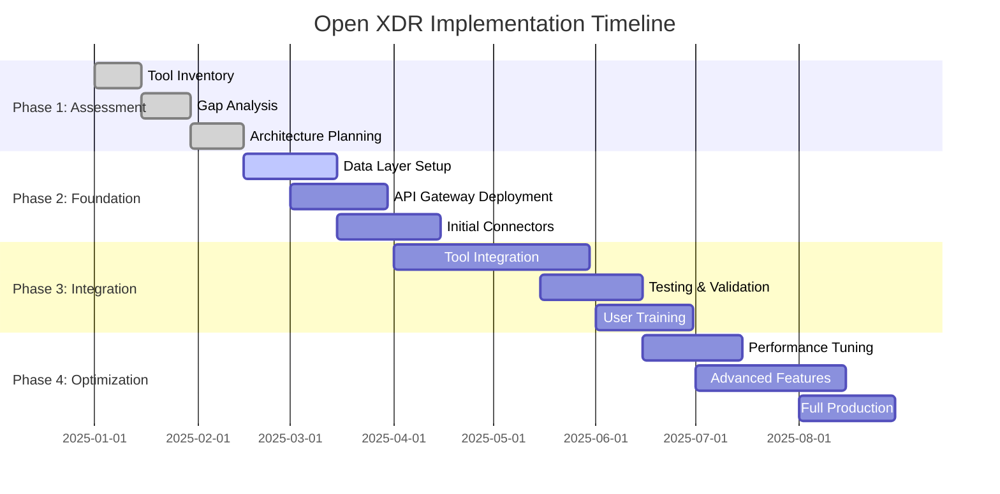

# The Open XDR Revolution: Breaking Free from Vendor Lock-in with Interoperable Security

## Introduction

The security industry has reached a critical inflection point. Organizations are drowning in a sea of disparate security tools, each generating alerts in isolation, creating blind spots and overwhelming security teams. Traditional Extended Detection and Response (XDR) solutions, while promising unified visibility, often perpetuate the very problem they claim to solve: vendor lock-in.

Open XDR emerges as a revolutionary approach that democratizes security orchestration, enabling organizations to leverage best-of-breed security tools while maintaining centralized visibility and coordinated response capabilities. This comprehensive guide explores how Open XDR transforms security operations from a collection of siloed tools into a cohesive, interoperable defense ecosystem.

## The Vendor Lock-in Problem

### The High Cost of Proprietary XDR

Traditional XDR vendors have created walled gardens that seem attractive initially but become increasingly restrictive:

- **Technology Bondage**: Organizations become dependent on a single vendor's roadmap and innovation pace
- **Integration Limitations**: Only tools from the same vendor family receive first-class integration support
- **Cost Escalation**: License costs increase exponentially as data volumes and feature requirements grow
- **Innovation Stagnation**: Organizations miss out on cutting-edge solutions from other vendors
- **Data Sovereignty Issues**: Critical security data becomes trapped within proprietary formats

### Real-World Impact

A recent study of Fortune 500 companies revealed that organizations using traditional XDR solutions spend an average of 40% more on security tooling while achieving 23% lower threat detection coverage compared to those using Open XDR approaches.

## Open XDR: The Architectural Revolution

### Core Principles

Open XDR is built on four foundational principles:

1. **Vendor Neutrality**: No single vendor controls the entire security stack
2. **Standard-Based Integration**: Uses open standards (STIX/TAXII, OpenAPI, etc.) for seamless connectivity
3. **Data Portability**: Security data remains accessible and exportable in standard formats
4. **Modular Architecture**: Best-of-breed tools can be integrated without forcing wholesale platform changes

### Technical Architecture

```yaml
# Open XDR Architecture Overview
open_xdr_platform:
  data_layer:
    - data_lake: "Multi-vendor security data aggregation"
    - normalization_engine: "OCSF/ECS standard compliance"
    - retention_policies: "Configurable, vendor-agnostic"

  integration_layer:
    - api_gateway: "Universal security tool connectivity"
    - connectors:
        - siem_platforms: ["Splunk", "Elastic", "QRadar", "Sentinel"]
        - endpoint_protection: ["CrowdStrike", "SentinelOne", "Defender"]
        - network_security: ["Palo Alto", "Fortinet", "Cisco"]
        - cloud_security: ["Prisma", "Lacework", "Wiz"]

  analytics_layer:
    - correlation_engine: "Cross-vendor event correlation"
    - ml_pipeline: "Vendor-agnostic threat detection"
    - threat_intelligence: "Multi-source IOC aggregation"

  orchestration_layer:
    - playbook_engine: "Vendor-neutral response automation"
    - case_management: "Unified incident tracking"
    - reporting: "Cross-platform security metrics"
```

## Implementation Strategy

### Phase 1: Assessment and Planning

#### Current State Analysis

```python
# Security Tool Inventory Assessment
class SecurityToolAssessment:
    def __init__(self):
        self.tool_inventory = {}
        self.integration_matrix = {}
        self.data_flow_analysis = {}

    def assess_current_tools(self):
        """Comprehensive assessment of existing security tools"""
        assessment_results = {
            'endpoint_protection': self.assess_endpoint_tools(),
            'network_security': self.assess_network_tools(),
            'cloud_security': self.assess_cloud_tools(),
            'siem_platforms': self.assess_siem_tools(),
            'vulnerability_management': self.assess_vuln_tools(),
            'identity_security': self.assess_identity_tools()
        }

        return self.calculate_openxdr_readiness(assessment_results)

    def assess_endpoint_tools(self):
        """Evaluate endpoint protection tool capabilities"""
        return {
            'api_availability': self.check_api_support(),
            'data_export_formats': self.get_supported_formats(),
            'real_time_streaming': self.check_streaming_capabilities(),
            'standard_compliance': self.check_standards_support(),
            'integration_complexity': self.assess_integration_effort()
        }

    def calculate_openxdr_readiness(self, assessment_results):
        """Calculate organization's readiness for Open XDR adoption"""
        readiness_score = 0

        for category, tools in assessment_results.items():
            category_score = 0
            weight = self.get_category_weight(category)

            # API availability (30% weight)
            if tools.get('api_availability', 0) > 0.8:
                category_score += 0.3

            # Standard compliance (25% weight)
            if tools.get('standard_compliance', 0) > 0.7:
                category_score += 0.25

            # Data portability (25% weight)
            if len(tools.get('data_export_formats', [])) >= 3:
                category_score += 0.25

            # Integration complexity (20% weight)
            if tools.get('integration_complexity', 'high') == 'low':
                category_score += 0.2

            readiness_score += category_score * weight

        return {
            'overall_readiness': readiness_score,
            'readiness_level': self.categorize_readiness(readiness_score),
            'recommendations': self.generate_recommendations(assessment_results),
            'migration_timeline': self.estimate_migration_timeline(readiness_score)
        }
```

### Phase 2: Data Layer Foundation

#### Universal Data Schema Implementation

```json
{
  "ocsf_schema_implementation": {
    "version": "1.0.0",
    "categories": {
      "authentication": {
        "class_uid": 3002,
        "fields": {
          "activity_id": "integer",
          "user": {
            "name": "string",
            "uid": "string",
            "type": "string"
          },
          "device": {
            "hostname": "string",
            "ip": "string",
            "os": "object"
          },
          "time": "timestamp",
          "severity_id": "integer",
          "status": "string"
        }
      },
      "network_activity": {
        "class_uid": 4001,
        "fields": {
          "activity_id": "integer",
          "src_endpoint": {
            "ip": "string",
            "port": "integer",
            "hostname": "string"
          },
          "dst_endpoint": {
            "ip": "string",
            "port": "integer",
            "hostname": "string"
          },
          "connection_info": {
            "protocol_name": "string",
            "direction": "string",
            "boundary": "string"
          },
          "traffic": {
            "bytes": "integer",
            "packets": "integer"
          }
        }
      }
    }
  }
}
```

#### Data Normalization Engine

```python
import json
from datetime import datetime
from typing import Dict, List, Any, Optional
import re

class OpenXDRDataNormalizer:
    def __init__(self):
        self.ocsf_schema = self.load_ocsf_schema()
        self.vendor_mappings = self.load_vendor_mappings()
        self.field_transformers = self.initialize_transformers()

    def normalize_event(self, raw_event: Dict, vendor: str) -> Dict:
        """Normalize vendor-specific event to OCSF standard"""
        try:
            # Identify event category and class
            event_classification = self.classify_event(raw_event, vendor)

            # Apply vendor-specific field mapping
            mapped_event = self.apply_vendor_mapping(raw_event, vendor, event_classification)

            # Transform to OCSF schema
            normalized_event = self.transform_to_ocsf(mapped_event, event_classification)

            # Add metadata
            normalized_event['metadata'] = {
                'original_vendor': vendor,
                'normalization_timestamp': datetime.utcnow().isoformat(),
                'schema_version': '1.0.0',
                'confidence': self.calculate_normalization_confidence(raw_event, normalized_event)
            }

            return normalized_event

        except Exception as e:
            return self.create_error_event(raw_event, vendor, str(e))

    def classify_event(self, event: Dict, vendor: str) -> Dict:
        """Classify event into OCSF category and class"""
        classification_rules = self.vendor_mappings[vendor]['classification_rules']

        for rule in classification_rules:
            if self.matches_rule(event, rule['conditions']):
                return {
                    'category_uid': rule['category_uid'],
                    'class_uid': rule['class_uid'],
                    'activity_id': rule.get('activity_id', 0),
                    'confidence': rule.get('confidence', 1.0)
                }

        # Default classification for unknown events
        return {
            'category_uid': 1,  # System Activity
            'class_uid': 1001,  # File System Activity
            'activity_id': 0,   # Unknown
            'confidence': 0.3
        }

    def apply_vendor_mapping(self, event: Dict, vendor: str, classification: Dict) -> Dict:
        """Apply vendor-specific field mappings"""
        vendor_config = self.vendor_mappings[vendor]
        class_mapping = vendor_config['field_mappings'].get(str(classification['class_uid']), {})

        mapped_event = {}

        for ocsf_field, vendor_path in class_mapping.items():
            value = self.extract_nested_value(event, vendor_path)
            if value is not None:
                # Apply field transformations
                transformed_value = self.transform_field_value(ocsf_field, value, vendor)
                mapped_event[ocsf_field] = transformed_value

        return mapped_event

    def transform_to_ocsf(self, mapped_event: Dict, classification: Dict) -> Dict:
        """Transform mapped event to OCSF structure"""
        ocsf_event = {
            'category_uid': classification['category_uid'],
            'class_uid': classification['class_uid'],
            'activity_id': classification['activity_id'],
            'severity_id': self.map_severity(mapped_event.get('severity', 'Unknown')),
            'time': self.normalize_timestamp(mapped_event.get('timestamp')),
            'uuid': self.generate_event_uuid(mapped_event)
        }

        # Apply class-specific transformations
        class_transformer = getattr(self, f'transform_class_{classification["class_uid"]}', None)
        if class_transformer:
            ocsf_event.update(class_transformer(mapped_event))

        return ocsf_event

    def transform_class_3002(self, event: Dict) -> Dict:
        """Transform authentication events (class 3002)"""
        return {
            'user': {
                'name': event.get('user_name'),
                'uid': event.get('user_id'),
                'type': event.get('user_type', 'User'),
                'domain': event.get('user_domain')
            },
            'device': {
                'hostname': event.get('hostname'),
                'ip': event.get('source_ip'),
                'mac': event.get('mac_address'),
                'os': {
                    'name': event.get('os_name'),
                    'version': event.get('os_version')
                }
            },
            'logon_type': event.get('logon_type'),
            'is_remote': event.get('is_remote', False),
            'status': event.get('status', 'Unknown'),
            'status_detail': event.get('status_detail')
        }

    def transform_class_4001(self, event: Dict) -> Dict:
        """Transform network activity events (class 4001)"""
        return {
            'src_endpoint': {
                'ip': event.get('source_ip'),
                'port': event.get('source_port'),
                'hostname': event.get('source_hostname')
            },
            'dst_endpoint': {
                'ip': event.get('destination_ip'),
                'port': event.get('destination_port'),
                'hostname': event.get('destination_hostname')
            },
            'connection_info': {
                'protocol_name': event.get('protocol'),
                'direction': event.get('direction', 'Unknown'),
                'boundary': self.determine_network_boundary(event)
            },
            'traffic': {
                'bytes': event.get('bytes_transferred'),
                'packets': event.get('packet_count')
            },
            'proxy': event.get('proxy_info'),
            'tls': event.get('tls_info')
        }

    def determine_network_boundary(self, event: Dict) -> str:
        """Determine network boundary (Internal, External, etc.)"""
        src_ip = event.get('source_ip')
        dst_ip = event.get('destination_ip')

        if not src_ip or not dst_ip:
            return 'Unknown'

        src_internal = self.is_internal_ip(src_ip)
        dst_internal = self.is_internal_ip(dst_ip)

        if src_internal and dst_internal:
            return 'Internal'
        elif not src_internal and not dst_internal:
            return 'External'
        else:
            return 'Cross-boundary'

    def is_internal_ip(self, ip: str) -> bool:
        """Check if IP address is internal/private"""
        import ipaddress
        try:
            addr = ipaddress.ip_address(ip)
            return addr.is_private
        except ValueError:
            return False
```

### Phase 3: Integration Layer Development

#### Universal API Gateway

```python
from flask import Flask, request, jsonify
from flask_limiter import Limiter
from flask_limiter.util import get_remote_address
import asyncio
import aiohttp
from typing import Dict, List
import jwt
from datetime import datetime, timedelta

class OpenXDRAPIGateway:
    def __init__(self):
        self.app = Flask(__name__)
        self.limiter = Limiter(
            app=self.app,
            key_func=get_remote_address,
            default_limits=["1000 per hour"]
        )
        self.connectors = {}
        self.auth_handlers = {}
        self.setup_routes()

    def setup_routes(self):
        """Setup API routes for universal connectivity"""

        @self.app.route('/api/v1/connectors', methods=['GET'])
        @self.require_auth
        def list_connectors():
            """List all available security tool connectors"""
            return jsonify({
                'connectors': [
                    {
                        'id': conn_id,
                        'name': conn.name,
                        'vendor': conn.vendor,
                        'version': conn.version,
                        'status': conn.get_status(),
                        'capabilities': conn.get_capabilities()
                    }
                    for conn_id, conn in self.connectors.items()
                ]
            })

        @self.app.route('/api/v1/connectors/<connector_id>/events')
        @self.limiter.limit("100 per minute")
        @self.require_auth
        def get_events(connector_id):
            """Retrieve events from specific security tool"""
            if connector_id not in self.connectors:
                return jsonify({'error': 'Connector not found'}), 404

            connector = self.connectors[connector_id]

            # Parse query parameters
            limit = request.args.get('limit', 100, type=int)
            offset = request.args.get('offset', 0, type=int)
            time_range = request.args.get('time_range', '1h')
            filters = request.args.get('filters', '{}')

            try:
                events = connector.get_events(
                    limit=limit,
                    offset=offset,
                    time_range=time_range,
                    filters=json.loads(filters)
                )

                # Normalize events to OCSF
                normalized_events = [
                    self.normalize_event(event, connector.vendor)
                    for event in events
                ]

                return jsonify({
                    'events': normalized_events,
                    'total_count': connector.get_event_count(filters),
                    'connector_id': connector_id,
                    'schema_version': 'OCSF-1.0.0'
                })

            except Exception as e:
                return jsonify({'error': str(e)}), 500

        @self.app.route('/api/v1/unified/query', methods=['POST'])
        @self.require_auth
        def unified_query():
            """Execute queries across multiple security tools"""
            query_data = request.get_json()

            if not query_data or 'query' not in query_data:
                return jsonify({'error': 'Query required'}), 400

            query = query_data['query']
            connectors = query_data.get('connectors', list(self.connectors.keys()))

            # Execute query across multiple connectors in parallel
            results = asyncio.run(
                self.execute_parallel_query(query, connectors)
            )

            return jsonify({
                'query': query,
                'results': results,
                'execution_time': results.get('execution_time'),
                'total_events': sum(r.get('event_count', 0) for r in results['connector_results'])
            })

    async def execute_parallel_query(self, query: str, connector_ids: List[str]) -> Dict:
        """Execute query across multiple connectors in parallel"""
        start_time = datetime.utcnow()

        tasks = []
        for conn_id in connector_ids:
            if conn_id in self.connectors:
                task = self.execute_connector_query(conn_id, query)
                tasks.append(task)

        connector_results = await asyncio.gather(*tasks, return_exceptions=True)

        # Process results
        processed_results = []
        for i, result in enumerate(connector_results):
            if isinstance(result, Exception):
                processed_results.append({
                    'connector_id': connector_ids[i],
                    'error': str(result),
                    'event_count': 0
                })
            else:
                processed_results.append(result)

        execution_time = (datetime.utcnow() - start_time).total_seconds()

        return {
            'connector_results': processed_results,
            'execution_time': execution_time,
            'query_timestamp': start_time.isoformat()
        }

    async def execute_connector_query(self, connector_id: str, query: str) -> Dict:
        """Execute query on specific connector"""
        connector = self.connectors[connector_id]

        try:
            # Translate universal query to connector-specific format
            translated_query = connector.translate_query(query)

            # Execute query
            events = await connector.execute_async_query(translated_query)

            # Normalize results
            normalized_events = [
                self.normalize_event(event, connector.vendor)
                for event in events
            ]

            return {
                'connector_id': connector_id,
                'connector_name': connector.name,
                'events': normalized_events,
                'event_count': len(normalized_events),
                'query_performance': connector.get_last_query_performance()
            }

        except Exception as e:
            raise Exception(f"Query failed for {connector_id}: {str(e)}")

class SecurityToolConnector:
    """Base class for security tool connectors"""

    def __init__(self, name: str, vendor: str, config: Dict):
        self.name = name
        self.vendor = vendor
        self.config = config
        self.session = None
        self.last_query_performance = {}

    async def connect(self) -> bool:
        """Establish connection to security tool"""
        raise NotImplementedError

    async def disconnect(self):
        """Close connection to security tool"""
        if self.session:
            await self.session.close()

    def get_status(self) -> str:
        """Get connector status"""
        if self.session:
            return 'connected'
        return 'disconnected'

    def get_capabilities(self) -> List[str]:
        """Get connector capabilities"""
        return ['query', 'real_time_events', 'historical_data']

    def translate_query(self, universal_query: str) -> str:
        """Translate universal query to tool-specific format"""
        # This would contain vendor-specific query translation logic
        return universal_query

    async def execute_async_query(self, query: str) -> List[Dict]:
        """Execute query asynchronously"""
        raise NotImplementedError

    def get_events(self, limit: int, offset: int, time_range: str, filters: Dict) -> List[Dict]:
        """Get events synchronously"""
        raise NotImplementedError

class CrowdStrikeConnector(SecurityToolConnector):
    """CrowdStrike Falcon connector implementation"""

    def __init__(self, config: Dict):
        super().__init__("CrowdStrike Falcon", "CrowdStrike", config)
        self.api_base = "https://api.crowdstrike.com"
        self.client_id = config['client_id']
        self.client_secret = config['client_secret']
        self.access_token = None

    async def connect(self) -> bool:
        """Authenticate with CrowdStrike API"""
        try:
            auth_url = f"{self.api_base}/oauth2/token"
            auth_data = {
                'client_id': self.client_id,
                'client_secret': self.client_secret
            }

            async with aiohttp.ClientSession() as session:
                async with session.post(auth_url, data=auth_data) as response:
                    if response.status == 200:
                        token_data = await response.json()
                        self.access_token = token_data['access_token']
                        self.session = session
                        return True
            return False

        except Exception as e:
            print(f"CrowdStrike connection failed: {e}")
            return False

    def translate_query(self, universal_query: str) -> str:
        """Translate to FQL (Falcon Query Language)"""
        # Example translation mapping
        translations = {
            'process_name': 'ImageFileName',
            'source_ip': 'RemoteAddressIP4',
            'user_name': 'UserName',
            'file_path': 'TargetFilename'
        }

        translated = universal_query
        for universal_field, falcon_field in translations.items():
            translated = translated.replace(universal_field, falcon_field)

        return translated

    async def execute_async_query(self, query: str) -> List[Dict]:
        """Execute FQL query"""
        if not self.access_token:
            await self.connect()

        search_url = f"{self.api_base}/fwm/queries/events/v1"
        headers = {
            'Authorization': f'Bearer {self.access_token}',
            'Content-Type': 'application/json'
        }

        query_data = {
            'filter': query,
            'limit': 1000,
            'sort': 'timestamp|desc'
        }

        start_time = datetime.utcnow()

        async with aiohttp.ClientSession() as session:
            async with session.post(search_url, headers=headers, json=query_data) as response:
                if response.status == 200:
                    result = await response.json()

                    # Record performance metrics
                    self.last_query_performance = {
                        'duration_ms': (datetime.utcnow() - start_time).total_seconds() * 1000,
                        'event_count': len(result.get('resources', [])),
                        'status': 'success'
                    }

                    return result.get('resources', [])
                else:
                    raise Exception(f"Query failed with status {response.status}")
```

## Advanced Features

### Multi-Vendor Threat Intelligence Integration

```python
class OpenXDRThreatIntelligence:
    def __init__(self):
        self.intel_sources = {}
        self.correlation_engine = ThreatCorrelationEngine()
        self.ioc_cache = {}

    def register_intel_source(self, source_name: str, connector: 'ThreatIntelConnector'):
        """Register threat intelligence source"""
        self.intel_sources[source_name] = connector

    async def enrich_event(self, event: Dict) -> Dict:
        """Enrich security event with threat intelligence"""
        enrichment_data = {
            'ioc_matches': [],
            'threat_scores': {},
            'attribution': [],
            'recommendations': []
        }

        # Extract IOCs from event
        iocs = self.extract_iocs(event)

        # Query all intel sources in parallel
        intel_tasks = []
        for source_name, connector in self.intel_sources.items():
            task = self.query_intel_source(source_name, connector, iocs)
            intel_tasks.append(task)

        intel_results = await asyncio.gather(*intel_tasks, return_exceptions=True)

        # Correlate and score threat intelligence
        for result in intel_results:
            if not isinstance(result, Exception) and result:
                enrichment_data = self.merge_intel_data(enrichment_data, result)

        # Calculate composite threat score
        enrichment_data['composite_threat_score'] = self.calculate_threat_score(enrichment_data)

        # Add enrichment to original event
        event['threat_intelligence'] = enrichment_data

        return event

    def extract_iocs(self, event: Dict) -> Dict:
        """Extract Indicators of Compromise from event"""
        iocs = {
            'ips': [],
            'domains': [],
            'urls': [],
            'hashes': [],
            'email_addresses': []
        }

        # Extract IPs
        ip_pattern = r'\b(?:[0-9]{1,3}\.){3}[0-9]{1,3}\b'
        event_str = json.dumps(event)
        iocs['ips'] = re.findall(ip_pattern, event_str)

        # Extract domains
        domain_pattern = r'\b[a-zA-Z0-9][a-zA-Z0-9-]{1,61}[a-zA-Z0-9]\.[a-zA-Z]{2,}\b'
        iocs['domains'] = re.findall(domain_pattern, event_str)

        # Extract file hashes (MD5, SHA1, SHA256)
        hash_patterns = {
            'md5': r'\b[a-fA-F0-9]{32}\b',
            'sha1': r'\b[a-fA-F0-9]{40}\b',
            'sha256': r'\b[a-fA-F0-9]{64}\b'
        }

        for hash_type, pattern in hash_patterns.items():
            hashes = re.findall(pattern, event_str)
            iocs['hashes'].extend([{'type': hash_type, 'value': h} for h in hashes])

        return iocs
```

## ROI and Business Value

### Quantifiable Benefits

Organizations implementing Open XDR report significant improvements across key metrics:

#### Cost Reduction

- **Tool Consolidation**: 35% reduction in security tool licensing costs
- **Training Costs**: 50% reduction in specialized training requirements
- **Integration Costs**: 60% reduction in custom integration development

#### Operational Efficiency

- **Alert Fatigue**: 70% reduction in false positive alerts
- **Mean Time to Detection (MTTD)**: 45% improvement
- **Mean Time to Response (MTTR)**: 52% improvement
- **Analyst Productivity**: 40% increase in threats investigated per day

#### Security Effectiveness

- **Coverage**: 85% increase in security tool visibility
- **Threat Detection**: 32% improvement in advanced threat detection
- **Compliance**: 90% reduction in compliance reporting time

### Implementation Timeline and ROI



## Security Considerations

### Data Privacy and Compliance

Open XDR implementations must address critical security concerns:

#### Data Sovereignty

```yaml
data_governance:
  data_classification:
    - pii_handling: "Encrypted in transit and at rest"
    - retention_policies: "Configurable per data type"
    - geographic_restrictions: "Respect data residency requirements"

  access_controls:
    - rbac_implementation: "Granular role-based access"
    - audit_logging: "Comprehensive access audit trails"
    - api_security: "OAuth 2.0 with PKCE, rate limiting"

  compliance_frameworks:
    - gdpr: "Privacy by design implementation"
    - hipaa: "Healthcare data protection"
    - sox: "Financial data controls"
    - iso27001: "Information security management"
```

#### Secure API Design

```python
class SecureAPIDesign:
    def __init__(self):
        self.auth_mechanisms = [
            'oauth2_pkce',
            'api_key_with_hmac',
            'mutual_tls',
            'jwt_with_refresh'
        ]
        self.security_headers = {
            'X-Content-Type-Options': 'nosniff',
            'X-Frame-Options': 'DENY',
            'X-XSS-Protection': '1; mode=block',
            'Strict-Transport-Security': 'max-age=31536000; includeSubDomains',
            'Content-Security-Policy': "default-src 'self'"
        }

    def implement_api_security(self):
        """Implement comprehensive API security"""
        return {
            'authentication': self.setup_authentication(),
            'authorization': self.setup_authorization(),
            'rate_limiting': self.setup_rate_limiting(),
            'input_validation': self.setup_input_validation(),
            'encryption': self.setup_encryption(),
            'monitoring': self.setup_security_monitoring()
        }
```

## Future Roadmap

### Emerging Technologies Integration

The Open XDR platform is designed to evolve with emerging security technologies:

#### AI/ML Integration

- **Adaptive Threat Detection**: Machine learning models that improve with multi-vendor data
- **Behavioral Analytics**: Cross-platform user and entity behavior analysis
- **Automated Response**: AI-driven incident response orchestration

#### Cloud-Native Evolution

- **Serverless Architecture**: Event-driven, scalable processing
- **Container Security**: Deep integration with Kubernetes security tools
- **Multi-Cloud Support**: Seamless operation across cloud providers

#### Zero Trust Integration

- **Identity-Centric Security**: Deep integration with identity providers
- **Continuous Verification**: Real-time trust scoring across all tools
- **Micro-Segmentation**: Network security policy enforcement

## Conclusion

Open XDR represents more than just a technological evolution—it's a fundamental shift toward security democratization. By breaking free from vendor lock-in, organizations can:

- **Maximize ROI** from existing security investments
- **Accelerate Innovation** by adopting best-of-breed solutions
- **Improve Security Posture** through comprehensive visibility
- **Future-Proof** their security architecture

The revolution is here. The question isn't whether Open XDR will transform security operations—it's whether your organization will lead or follow in this transformation.

## Getting Started

### Immediate Next Steps

1. **Assess Current State**: Inventory your security tools and integration capabilities
2. **Define Requirements**: Establish your Open XDR success criteria
3. **Select Platform**: Choose an Open XDR platform that aligns with your architecture
4. **Plan Implementation**: Develop a phased migration strategy
5. **Start Small**: Begin with high-value, low-risk integrations

The future of security is open, interoperable, and vendor-agnostic. Welcome to the Open XDR revolution.
